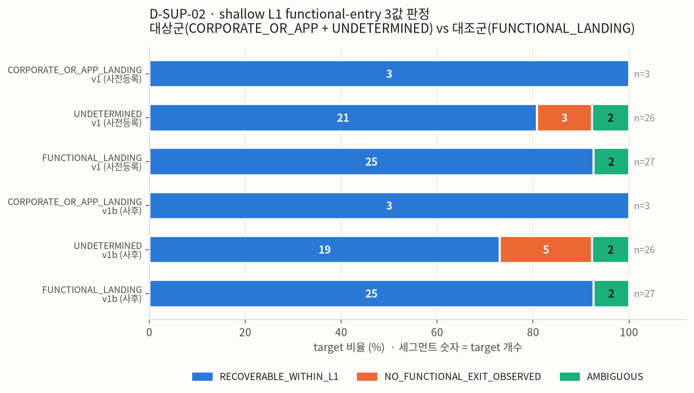
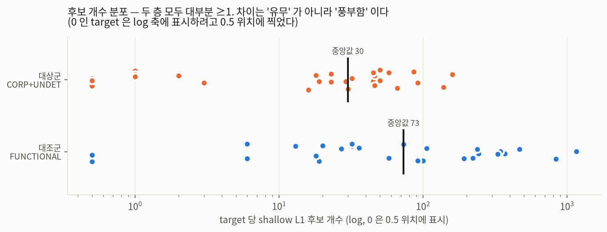
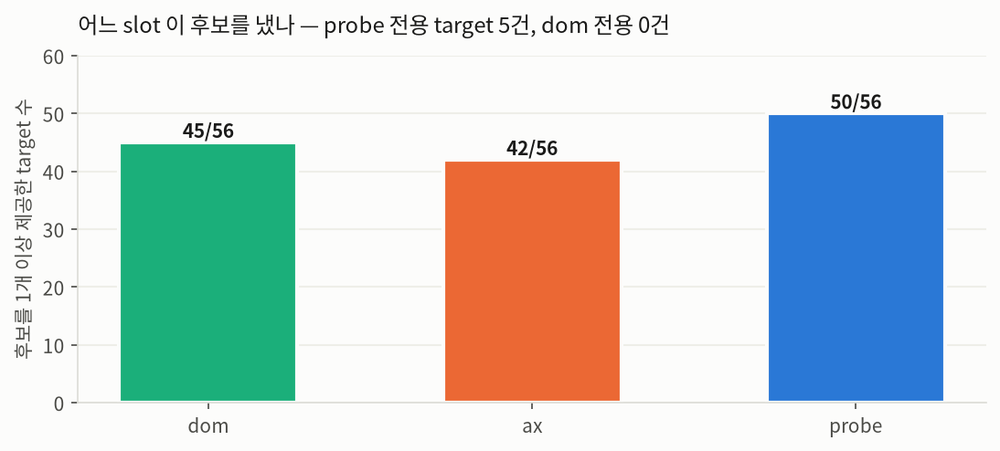

# D-SUP-02 — shallow L1 functional-entry recoverability

> **inquiry_kind**: `DIRECTOR_SUPPLEMENTAL` (Research Director 보충질의)
> **지위**: `NON_CANONICAL`. 기존 D autonomous research queue 와 **별개**이며, 기존 RQ 의
> 우선순위·판정·산출물을 **바꾸지 않는다**. 기존 D 산출물은 한 글자도 수정하지 않았다.
> 이 문서와 충돌하는 기존 판정이 있다면 그것은 **superseding finding 이 아니라 병기**다
> (§13 참조).

| 항목 | 값 |
|---|---|
| RQ | D-SUP-02 |
| hypothesis_id | `H-SUP02-L1-RECOVERABILITY` |
| depends_on | RQ-D14 (strata 제공) |
| MLflow run_id | `658526a810ed4b15ac15306fa6d16eaf` (experiment `LA_01_FRAME`) |
| rule version | `DSUP02_L1_v1` (primary) · `DSUP02_L1_v1b` (사후 민감도) |
| seed | 20260827 |
| **VERDICT** | **SUPPORTED** (단, §7 의 대조군 병기 없이는 무의미하다) |

---

## 1. 연구질문

RQ-D14 에서 `CORPORATE_OR_APP_LANDING` 또는 `UNDETERMINED` 로 분류된 target 에 대해,
**frozen DOM/AX evidence 만으로 shallow L1 functional-entry candidate 가 존재하는가?**

출력은 3값으로만 한다: `RECOVERABLE_WITHIN_L1` / `NO_FUNCTIONAL_EXIT_OBSERVED` / `AMBIGUOUS`.
이 세 값 외의 라벨은 만들지 않았고, 어느 archetype 인지도 정하지 않았다.

## 2. 경쟁가설 3개와 판정

| id | 가설 | 판정 | 근거 |
|---|---|---|---|
| **H1** | 대상 target 대부분은 L1 안에서 기능면으로 회복 가능한 후보를 갖는다 | **SUPPORTED** | 24/29 (82.8%, Wilson95 [65.5%, 92.4%]) 가 `RECOVERABLE_WITHIN_L1`. 사후 보수변형 v1b 에서도 22/29 (75.9%) |
| **H2** | 대상 target 대부분은 관측 가능한 기능 출구가 없다 | **REFUTED** | 3/29 (10.3%) 만 `NO_FUNCTIONAL_EXIT_OBSERVED`. v1b 에서도 5/29 (17.2%) |
| **H3** | frozen evidence 만으로는 판정이 불가능하다 | **NOT_SUPPORTED (부분적으로만 참)** | 2/29 (6.9%) 만 `AMBIGUOUS`, 그것도 전부 **퇴화 캡처** 때문이지 evidence 종류의 한계 때문이 아니다 |

**그러나 H1 의 "SUPPORTED" 는 판별력 주장이 아니다.** §7 을 반드시 같이 읽어라.

## 3. 입력 (frozen)

| 입력 | 경로 | sha256 |
|---|---|---|
| strata | `research_d/results/RQ_D14_frame_validity.json` | `ee4cc0e989ba72ed615293d51f41575e4308360e30bb4338eadfebcc2e739966` |
| 관측표 | `research_d/results/D_OBSERVATION_TABLE_v2.csv` | `c39c10f09f7a6a7603409550eb331612eb44634eb98ec387a604aa5221351e6b` |
| raw frozen evidence | `.agent_worktrees/claude_b_e001_worker_0{1,2,3,4}/artifacts/e001_w0*/evidence/<run_dir>/<observation_id>/l0a/{dom.html,ax.json,probe.json}` | manifest pointer (업로드 안 함) |
| Region 정의 참조 | `SSOTV2/01_REPRESENTATIVE_FUNCTION_MAPPING_DT_v2.1.md` §5 | 읽기 전용 |
| 코드 | `research_d/tools/dsup02_l1_recoverability.py` | `fbc05263a2da5934ba9d518df22b3752337f15859265df1d91766f4473cd14a3` |
| 결과 | `research_d/results/DSUP02_l1_recoverability.json` | `dedd7c0087f042f26cdba105570d93df68c2963f756de2a5ef676293130b7f3d` |

`dom.html` 은 전부 `tools/html_decode.py::parse_html()` 로 읽었다 (바이트를 lxml 에 직접 넘기면
한글이 mojibake 가 되는, D 가 이미 겪은 결함을 피한다).

**research firewall**: holdout label · `LABEL_SPLIT_FROZEN*` · `HOLDOUT_FOR_C*` · `RAW_L1~L4*` ·
`PACKET_L*` · `*_OVERLAP*` · `PRECEDENCE_CONTESTED*` · `CALIBRATION_FOR_B*` · `**/control/**` ·
B/C 의 target-level holdout error report — **하나도 열지 않았다.** 이 분석이 연 파일은
위 표의 l0a slot 3개와 `research_d/results` 뿐이다. **live navigation 없음, REAL_TARGET 접속 없음,
네트워크 접근 없음.** 어떤 후보도 클릭하지 않았다.

## 4. 분석단위 · N · missing

- **분석단위**: target (`wtg`). 관측 slot 이 아니라 target 이다.
- **N**: `in_mart==1` 인 56 target 전수. RQ-D14 `per_target` 과 56/56 조인 성공.
  - **대상군 29** = `CORPORATE_OR_APP_LANDING` 3 + `UNDETERMINED` 26
  - **대조군 27** = `FUNCTIONAL_LANDING`
- **missing**:
  - target 누락 **0건** (56/56 evidence 경로 해석 성공)
  - `probe.json` 부재 **2건** (`64d30ef262d8782d` 신한 SOL뱅크, `ef06dc942ef3ccc9` 롯데하이마트) — 둘 다 대조군, 둘 다 퇴화 캡처
  - `dom.html` 파싱 실패 **0건**
  - 세 slot 이 모두 없는 target (R0 발동) **0건**

---

## 5. 후보 조작화 정의 (전문)

### 5.1 유도 근거 — SSOT §5 의 Region 정의

`01_REPRESENTATIVE_FUNCTION_MAPPING_DT_v2.1.md` §5 Stage 3 branch tree 는 7 archetype 각각의
**Region** 을 이렇게 정의한다:

| Branch | Region 원문 요지 |
|---|---|
| Q QUERY | 검색 입력 control 이 **사용 가능한 상태로 노출** |
| C CONTENT_OPEN | content card/link **list 가 노출** |
| I ITEM_DETAIL | individual item/product **card or link list** |
| P PLACE_LOOKUP | place search control **또는** place list |
| M COMMUNICATION_ENTRY | thread/post list **또는** compose-entry control |
| F FINANCIAL_ACTION_ENTRY | balance/transfer/payment/auth **function entry control** |
| U UTILITY_ENTRY | function surface **entry control** |

즉 SSOT 에서 Region 은 **기능 면(surface) 또는 그 면을 여는 entry control** 이다.
D-SUP-02 는 이 7개 정의의 **합집합** 을 archetype 을 특정하지 않은 채 쓴다.

### 5.2 정의

> target T 의 frozen L0-A evidence 안에서 관측된 노드 x 가 (a)·(b)·(c) 를 모두 만족하면
> x 는 T 의 **shallow L1 functional-entry candidate** 다.

**(a) FORM** — x 는 다음 중 하나다.
- (a1) 이동형 링크: `<a href>` 이거나 AX `role=link` 이면서 href 존재
- (a2) 조작형 control: AX role ∈ {`button`, `searchbox`, `combobox`, `textbox`, `menuitem`,
  `tab`, `checkbox`, `radio`, `slider`, `spinbutton`} 이거나 DOM 태그가 `<button>` /
  `<input type=search|text|submit>` / `[role=button]` / `[role=searchbox]`
- (a3) probe slot 이 이미 후보로 표기한 노드: `raw_features.primary_action_candidates[]` ·
  `raw_features.region_signals.search_inputs[]`

**(b) FUNCTION VOCABULARY** — x 의 **표면 문자열** 중 하나 이상이 §5.3 의 7개 region 어휘군에
매칭된다. 표면 문자열은 visible_text / anchor text / AX accessible name / `aria-label` /
`title` / `alt` / `placeholder` / `nearby_heading` / href 의 path+query(percent-decode 후) 다.
href 매칭은 path segment 또는 query key/value 토큰 단위로 한다.
- **예외 (b\*)**: FORM 이 (a2) 의 searchbox/combobox/`input[type=search]` 이거나 probe
  `region_signals.search_inputs` 항목이면, SSOT Q-Region 정의("검색 입력 control 이 사용 가능한
  상태로 노출")가 **control 존재 자체로 충족**되므로 어휘 매칭 없이 통과한다.

**(c) EXCLUSION** — §6 의 제외규칙 중 어느 하나에도 걸리지 않는다.

**"shallow / L1" 의 뜻**
- *shallow* = L0-A 랜딩 화면에 직접 노출된 노드만 본다. 하위 페이지를 크롤하지 않는다.
- *L1* = 그 후보를 **한 번 누르면 도달할 다음 한 면**. 실제 도달 여부는 검증하지 않는다.
- 따라서 candidate 는 **존재 주장(existence claim)** 이지 **도달 주장(reachability claim)이 아니다.**

**중복 제거**: (정규화 표면 문자열, 정규화 href) 쌍으로 dedup. slot provenance 는 집합으로 보존.

### 5.3 REGION_VOCAB (7군)

| region | 대표 어휘 (전문은 결과 JSON `definitions.region_vocab`) |
|---|---|
| `Q_QUERY` | 검색, 검색하기, 통합검색, 찾아보기, search, find, query / path: search·find·q·query·sch |
| `C_CONTENT` | 뉴스, 기사, 영상, 방송, 프로그램, 다시보기, 웹툰, 음악, 드라마, 스포츠, 문화 …, news·article·video·watch·vod·webtoon·live |
| `I_ITEM` | 상품, 제품, 쇼핑, 카테고리, 베스트, 기획전, 세일, 장바구니, 스토어, 몰, 주문, 랭킹 …, product·goods·shop·category·cart·mall |
| `P_PLACE` | 지도, 길찾기, 매장찾기, 센터찾기, 지점, 영업점, 대리점, 주변, 현위치 …, map·place·branch·location·nearby |
| `M_COMMUNICATION` | 게시판, 커뮤니티, 댓글, 글쓰기, 채팅, 메시지, 1:1문의, 상담, 후기, 리뷰 …, board·community·forum·post·chat·review·qna |
| `F_FINANCE` | 이체, 송금, 계좌, 잔액, 결제, 납부, 청구, 카드, 대출, 예적금, 환전, 충전, 본인인증 …, transfer·account·balance·pay·loan·wallet |
| `U_UTILITY` | 예약, 예매, 신청, 접수, 발급, 조회, 배송조회, 계산기, 요금, 등록, 견적, 수리 …, reservation·apply·issue·track·ticket·repair |

어휘는 SSOT §4 Stage 2 feature 목록에서 유도하고, **stratum 을 나누지 않은** pooled 56행
`D_TEXT_CORPUS_v2` nav/button 텍스트 빈도조사로 한국어 표면형을 보강했다. 조사 후 어휘는 고정했다.

---

## 6. 제외규칙 (전문)

제외는 **어휘 매칭보다 먼저** 적용된다. (예: "뉴스룸" 은 E4 에 걸리므로 C 어휘 "뉴스" 로
승격되지 않는다.) 규칙은 결과를 보기 전에 고정했고, 결과를 본 뒤 **primary 규칙은 수정하지 않았다.**

| id | 이름 | 내용 |
|---|---|---|
| **E1** | APP_INSTALL | 표면어: 앱 다운로드/앱다운로드/앱설치/앱으로 보기/앱 열기/App Store/Google Play/플레이스토어/원스토어/갤럭시스토어/download the app/get the app · host: play.google.com, apps.apple.com, itunes.apple.com, onelink.me, app.link, appsflyer.com, adjust.com, onestore.co.kr, galaxystore.samsung.com |
| **E2** | EXTERNAL_SNS | 표면어: 페이스북/인스타그램/유튜브/트위터/카카오채널/네이버 밴드/링크드인/틱톡/공유하기/URL 복사/SNS/share · host: facebook.com, instagram.com, twitter.com, x.com, youtube.com, youtu.be, tiktok.com, linkedin.com, threads.net, band.us, pf.kakao.com, story.kakao.com, blog.naver.com, post.naver.com, cafe.naver.com, plus.google.com |
| **E3** | LEGAL_POLICY | 이용약관/약관/개인정보/개인정보처리방침/청소년보호/저작권/이메일무단수집/사이트맵/웹접근성/법적고지/terms/privacy/policy/legal/copyright/sitemap/accessibility/cookie |
| **E4** | CORPORATE_IR_RECRUIT | 회사소개/기업정보/브랜드스토리/연혁/비전/미션/CEO/윤리경영/지속가능경영/ESG/기업지배구조/사회공헌/오시는 길/채용/인재채용/인재상/직무소개/투자정보/IR/공시/보도자료/뉴스룸/광고문의/제휴문의/입점문의/파트너 신청/배달파트너/가맹문의/about/company/corporate/careers/recruit/investor/press/newsroom/sustainability · path: /about /company /corporate /ir /careers /recruit /press /newsroom /esg |
| **E5** | SUPPORT_META | 고객센터/고객지원/자주묻는질문/FAQ/공지사항/이용안내/도움말/help/support center/notice/announcement |
| **E6** | UI_CHROME | 닫기/열기/펼치기/접기/이전/다음/확인/취소/뒤로가기/나중에/상단으로/메뉴/전체메뉴/사이드 메뉴/전체삭제/검색어 지우기/검색어 삭제/검색영역 닫기/배너/자동재생/정지/재생/스킵/본문 바로가기/팝업 닫기/오늘 하루/홈/한국어/English/close/open/prev/next/skip/back/menu/toggle/more/expand/collapse/scroll to top |
| **E7** | NON_NAVIGATIONAL_HREF | scheme ∈ {mailto, tel, sms, javascript, data, blob} 또는 href ∈ {"", "#"}. **(a1) 링크에만** 적용 — (a2) 조작형 control 은 href 없이도 후보가 될 수 있다 |
| **E8** | OFF_HOST | href 의 registrable domain(eTLD+1 근사) 이 landing 의 것과 다르고, 그 domain 문자열이 RQ-D14 `a_matched_alias` 를 포함하지 않으면 제외. 같은 서비스의 다른 서브도메인·형제 도메인은 후보로 남는다 |
| **E9** | AUTH_ONLY (**제외 아님 — WEAK 분리**) | 로그인/로그아웃/회원가입/가입하기/마이페이지/내정보/login/logout/sign in/sign up/join/mypage. SSOT F-Region 은 auth entry control 을 Region 으로 인정하지만 §5 Branch M 이 "로그인 버튼 **존재**만으로 endpoint 처리하지 않는다" 고 못박는다. 로그인은 거의 모든 랜딩에 있어 판별력이 없으므로 **primary count 에서 빼고** 민감도(S3)에만 쓴다 |

**제외규칙의 방향성**: E4·E5·E9 는 의도적으로 **보수적**이다. 후보를 **과소계수**하는 방향이며,
그럼에도 대상군이 대부분 `RECOVERABLE` 로 나오면 그 결론은 보수적 방향에서 안전하다.

---

## 7. 3값 판정규칙 (전문 · 사전 고정)

입력: target 당 후보 개수 `n_cand` (E1~E9 통과, dedup 후), evidence 가용성 플래그.

```
R0  evidence 부재 : dom.html · ax.json · probe.json 이 모두 없으면 → AMBIGUOUS (EVIDENCE_ABSENT)
R1  퇴화 캡처     : computed_css == 3 bytes AND dom_body_empty == 1 이면
                    후보 개수와 무관하게      → AMBIGUOUS (DEGENERATE_CAPTURE)
R2  후보 >= 1     :                          → RECOVERABLE_WITHIN_L1
R3  후보 == 0     :                          → NO_FUNCTIONAL_EXIT_OBSERVED
우선순위 R0 > R1 > R2 > R3
```

사전 고정 민감도 임계 (**primary 는 R2 의 `>=1` 이며 아래가 이를 대체하지 않는다**):
`S1` n_cand≥3 · `S2` probe 에서 `viewport_visible AND hittable` 인 후보 ≥1 · `S3` WEAK(E9) 포함 시 ≥1.

**이 규칙은 결과를 보고 바꾸지 않았다.** 결과를 본 뒤 만든 것은 §10 의 사후 변형 `v1b` 뿐이고,
v1b 도 R0~R3 자체는 손대지 않았다(어휘·제외 사전만 패치). primary 판정은 v1 이다.

---

## 8. 결과 — 3값 (분모 병기)

### 8.1 primary (v1, 퇴화 격리) — **29건 기준**

| 판정 | k / 29 | 비율 | Wilson 95% |
|---|---|---|---|
| `RECOVERABLE_WITHIN_L1` | **24** | **82.8%** | [65.5%, 92.4%] |
| `NO_FUNCTIONAL_EXIT_OBSERVED` | 3 | 10.3% | [3.6%, 26.4%] |
| `AMBIGUOUS` | 2 | 6.9% | [1.9%, 22.0%] |

### 8.2 stratum 별 (n=3 층은 과해석 금지)

| identity_class | n | RECOVERABLE | NO_EXIT | AMBIGUOUS | RECOVERABLE Wilson 95% |
|---|---|---|---|---|---|
| `CORPORATE_OR_APP_LANDING` | **3** | 3 (100%) | 0 | 0 | **[43.9%, 100%]** ← n=3, 폭이 56%p 다. **결론을 걸지 마라** |
| `UNDETERMINED` | 26 | 21 (80.8%) | 3 (11.5%) | 2 (7.7%) | [62.1%, 91.5%] |
| `FUNCTIONAL_LANDING` (대조) | 27 | 25 (92.6%) | 0 (0%) | 2 (7.4%) | [76.6%, 97.9%] |

### 8.3 56건 기준

| 판정 | k / 56 | 비율 | Wilson 95% |
|---|---|---|---|
| `RECOVERABLE_WITHIN_L1` | 49 | 87.5% | [76.4%, 93.8%] |
| `NO_FUNCTIONAL_EXIT_OBSERVED` | 3 | 5.4% | [1.8%, 14.6%] |
| `AMBIGUOUS` | 4 | 7.1% | [2.8%, 17.0%] |

### 8.4 퇴화 캡처 포함/제외 병기

퇴화 관측 4건: `64d30ef262d8782d` 신한 SOL뱅크 · `ef06dc942ef3ccc9` 롯데하이마트 (둘 다 대조군,
`probe.json` 부재) · `95967b50683649f2` NH스마트뱅킹 · `fb3d1841dddfd982` NH콕뱅크 (둘 다 대상군).

| 버전 | 대상 29 R/NE/AMB | 대조 27 R/NE/AMB |
|---|---|---|
| **퇴화 격리 (primary, R1 on)** | **24 / 3 / 2** | **25 / 0 / 2** |
| 퇴화 포함 (R1 off) | 26 / 3 / 0 | 25 / 2 / 0 |

**퇴화 포함 버전은 쓰지 마라 — 그것이 R1 이 존재하는 이유다.** 포함 버전에서 신한 SOL뱅크와
롯데하이마트는 `NO_FUNCTIONAL_EXIT_OBSERVED` 가 되는데, 이건 "기능 출구가 없다" 가 아니라
"캡처가 빈 껍데기라 아무것도 못 봤다" 이다. 반대로 NH스마트뱅킹·NH콕뱅크는 `dom_body_empty==1`
인데도 **probe slot 이 계좌조회·예금/신탁조회·펀드조회·대출조회·환율조회 등 23개 후보를 잡았다.**
같은 "퇴화" 플래그가 두 target 에서는 정보 소실을, 다른 두 target 에서는 소실 아님을 뜻한다.

## 9. 대조군 대비 — **이 절이 §8 의 의미를 결정한다**

| | 대상군 29 | 대조군 27 | 차이 |
|---|---|---|---|
| `RECOVERABLE_WITHIN_L1` 비율 (v1) | 82.8% | 92.6% | **−9.8%p** |
| 같은 지표 (v1b 사후) | 75.9% | 92.6% | −16.7%p |
| Fisher exact (퇴화 제외, R vs NE) | 24:3 vs 25:0 | | p = 0.236 |
| 후보 개수 중앙값 | **30** | **73** | Mann-Whitney U p = **0.017** |
| 후보 개수 평균 | 38.8 | 186.8 | |
| 후보 개수 최댓값 | 160 | 1160 | |

**해석**: "얕은 진입 후보가 존재하는가" 라는 **이진 지표는 두 층을 거의 구분하지 못한다**
(82.8% vs 92.6%, Fisher p=0.24). 대조군 없이 "대상군의 83%에 얕은 진입 후보가 있다" 만 보면
frame 이 틀렸다는 인상을 주지만, **대조군도 93% 다.** 존재 자체는 거의 모든 랜딩의 성질이다.
두 층을 실제로 가르는 것은 **유무가 아니라 풍부함**이다 — 후보 개수 중앙값 30 vs 73 (p=0.017),
평균은 5배 차이다. 이는 D-SUP-02 의 이진 지표가 RQ-D14 의 `identity_class` 를 **대체할 수 없다**는
뜻이다.




## 10. 사후 적대적 변형 `DSUP02_L1_v1b` (POST_HOC · 전수 적용 · primary 대체 아님)

v1 결과를 낸 뒤 **판정을 좌우하는 소수후보 target (n_cand ≤ 6) 을 전수 손 감사**했다. 어휘 누수
3종이 나왔고 **전부 후보를 과대계수하는 방향**이었다:

| 누수 | 사례 |
|---|---|
| L1 쿠키동의 배너 컨트롤이 후보로 샘 | 밴드 `쿠키 설정` → `U_UTILITY:text:설정` · Netflix `설정 저장`, `쿠키 목록 검색` |
| L2 언어·표시설정 combobox 가 (b\*) 예외로 통과 | Instagram `표시 언어 변경` (role=combobox, 어휘 매칭 0인데 통과) |
| L3 앱스토어 링크가 `I_ITEM:스토어` 로 통과 | 에이닷 전화 `애플 스토어에서 다운로드` |

`v1b` 는 이 셋만 패치한다: **P1** E3 에 쿠키/동의 어휘 추가 · **P2** E6 에 언어/지역 어휘 추가 ·
**P3** E1 에 앱스토어 표면형 추가 · **P4** `U_UTILITY` 에서 `설정` 삭제 · **P5** `I_ITEM` 에서
`스토어` 삭제(path `store` 는 유지) · **P6** (b\*) 예외를 `role=searchbox` / `input[type=search]`
로 한정. **56 target 전수에 동일 적용**했다 — 소수후보 target 만 손보면 보정이 한 방향으로만
작동해 편향되기 때문이다.

| | 대상 29 | 대조 27 |
|---|---|---|
| v1b RECOVERABLE | 22 (75.9%, Wilson [57.9%, 87.8%]) | 25 (92.6%) |
| v1b NO_EXIT | 5 (17.2%) | 0 (0%) |
| v1b AMBIGUOUS | 2 (6.9%) | 2 (7.4%) |

**뒤집힌 target 2건뿐**: 밴드(1→0 후보), Instagram(1→0 후보). 둘 다 대상군. 대조군은 **불변**.
→ **H1·H2 의 결론은 v1↔v1b 에서 유지된다.**

## 11. slot 별 후보 출처 — D-RQ-D10 slot 불일치의 직접 확인

| slot | 후보를 1개 이상 낸 target | 후보 노드 수(상한추정) |
|---|---|---|
| `probe.json` | **50 / 56** | 2,433 |
| `dom.html` | 45 / 56 | 2,780 |
| `ax.json` | 42 / 56 | 1,898 |

- **`probe` 전용 target 5건** — `95967b50683649f2` NH스마트뱅킹, `fb3d1841dddfd982` NH콕뱅크,
  `a215c45b2cc585ca` 에이닷 전화, `5beeafeac2e27eae` TikTok, `65f15ce8fee25b24` 밴드.
  이 5건은 `dom.html`·`ax.json` 에서 후보가 0인데 `probe.json` 에서만 나왔다.
- **`dom` 전용 target 0건.**

이는 D-RQ-D10 이 확인한 "`dom.html` 이 렌더 전 SPA shell 인 경우가 있다 (dom→probe median 1.79s)"
를 **후보 탐색 수준에서 직접 재현한 것**이다. 특히 NH스마트뱅킹/NH콕뱅크는 `dom_body_empty==1`
이면서도 probe 에서 23개 후보(계좌조회·펀드조회·대출조회·환율조회·너도나도 환전신청 …)가 나왔다.
**dom slot 하나만 보고 "기능 출구 없음" 을 판정하면 최소 5/56 에서 틀린다.**



**주의 (dedup 한계)**: cross-slot dedup 은 (표면문자열, href) 로 하는데 같은 노드라도 slot 마다
표면문자열 구성이 달라(probe 는 `nearby_heading` 을 붙이고 ax 는 computed name 을 쓴다) 병합이
잘 되지 않는다. 따라서 결과 JSON 의 `candidate_level_slot_exclusive` 는 **상한(과대추정)** 이다.
slot 기여 판단은 위 target-level 지표로 하라.

## 12. 민감도

| 지표 | 대상 29 | 대조 27 |
|---|---|---|
| primary `n_cand ≥ 1` | 82.8% | 92.6% |
| `S1` n_cand ≥ 3 | 75.9% | 92.6% |
| `S2` probe 에서 visible AND hittable 후보 ≥1 | **41.4%** | **51.9%** |
| `S3` WEAK(E9 auth) 포함 시 ≥1 | 89.7% | 92.6% |

`S2` 가 흥미롭다 — **"보이면서 누를 수 있는" 후보로 한정하면 두 층 모두 절반 아래로 떨어진다**
(41.4% vs 51.9%). 다만 `S2` 는 probe slot 에만 존재하는 필드에 의존하므로 dom/ax 전용 후보를
구조적으로 0으로 세며, 이 숫자는 **하한**이다. 여기에 결론을 걸지 않는다.

## 13. target 별 상위 후보 예시 (대상군 29, RECOVERABLE 24건)

| class | service | prior_archetype | n_cand | slot | 상위 후보 (텍스트) | href/role | region hits |
|---|---|---|---|---|---|---|---|
| UNDET | emart24 | ITEM_DETAIL | 160 | ax,dom,probe | `1+1 콘돔)레드컨테이너…6,000` | `/goods/event?category_seq=1` | I_ITEM, U_UTILITY |
| UNDET | 롯데백화점 | ITEM_DETAIL | 139 | ax,dom,probe | `부가부 베이비페어 최대 혜택…카드 할인` | `lotteon.com/display/plan…` | F_FINANCE, I_ITEM |
| UNDET | 다이소 | ITEM_DETAIL | 92 | ax,dom,probe | `매장 검색` | `/cs/shop` | I_ITEM, Q_QUERY |
| UNDET | CU | ITEM_DETAIL | 86 | ax,dom,probe | `생활편의 서비스` | `/service/index.do?…` | C_CONTENT, I_ITEM, U_UTILITY |
| UNDET | 토스 | FINANCIAL_ACTION_ENTRY | 66 | ax,dom,probe | `다른 투자자들과 실시간으로 의견을…` | `/service/securities#4` | F_FINANCE, M_COMMUNICATION |
| UNDET | 캐시워크 | UTILITY_ENTRY | 58 | ax,dom,probe | `추천수` | (control) | I_ITEM, M_COMM, U_UTILITY |
| UNDET | 티맵 | PLACE_LOOKUP | 50 | ax,dom,probe | `티맵 서비스` | `/service/place` | P_PLACE, U_UTILITY |
| UNDET | 네이버지도 | PLACE_LOOKUP | 50 | ax,dom,probe | `…네이버 광고 검색 상품` | `/service/map` | I_ITEM, P_PLACE, Q_QUERY |
| UNDET | 이마트 | ITEM_DETAIL | 46 | dom,probe | `가을 햇꽃게 (100g) 할인율 50%…` | (card) | F_FINANCE, I_ITEM |
| **CORP** | **카카오T** | PLACE_LOOKUP | 45 | ax,dom,probe | `선불충전금 현황` | (control) | F_FINANCE |
| **CORP** | **탑마트** | ITEM_DETAIL | 44 | ax,dom,probe | `+ 더보기` | `/shopping/eventBoardList` | I_ITEM, U_UTILITY |
| **CORP** | **GS25** | ITEM_DETAIL | 32 | ax,dom,probe | `온라인몰 편의점 결제` | (control) | F_FINANCE, I_ITEM |
| UNDET | Chrome | QUERY | 30 | ax,dom,probe | `카드 뒤집기` | (control) | F_FINANCE, Q_QUERY |
| UNDET | KB Pay | FINANCIAL_ACTION_ENTRY | 29 | ax,dom,probe | `기업공용카드 등록 시 유의사항` | (control) | F_FINANCE, U_UTILITY |
| UNDET | 배달의민족 | ITEM_DETAIL | 3 | ax,dom,probe | `기업용 상품권 구매하기` | `gift-pc.baemin.com/buy-gift-…` | I_ITEM |
| UNDET | 에이닷 전화 | UTILITY_ENTRY | 2 | **probe only** | `검색` | (searchbox) | Q_QUERY |
| UNDET | TikTok | CONTENT_OPEN | 1 | **probe only** | `검색` | (searchbox) | Q_QUERY |

전체 29건 + 대조 27건의 상위 3후보·근거어휘·slot 은 결과 JSON `per_target[].top_candidates` 에 있다.

**이 표의 위양성을 숨기지 않는다**: `Chrome — 카드 뒤집기 → F_FINANCE:카드` 와
`롯데홈쇼핑 — 조직문화 → C_CONTENT:문화`, `카카오톡 — account & support → F_FINANCE:account`
는 부분문자열 매칭 위양성이다. 세 target 모두 n_cand 가 16~30 이라 `≥1` 판정은 바뀌지 않지만,
**후보 개수 자체는 위양성으로 부풀려져 있다** (→ §15 limitation).

## 14. 반례

### (i) `FUNCTIONAL_LANDING` 인데 얕은 진입 후보가 없는 target — **실질 0건**

대조군 27건 중 `RECOVERABLE_WITHIN_L1` 이 아닌 것은 **2건뿐이고 둘 다 퇴화 캡처**다:

| wtg | service | 사유 | slot 상태 |
|---|---|---|---|
| `64d30ef262d8782d` | 신한 SOL뱅크 | `AMBIGUOUS` / DEGENERATE_CAPTURE | dom OK(빈 body), ax OK(0 노드), **probe ABSENT** |
| `ef06dc942ef3ccc9` | 롯데하이마트 | `AMBIGUOUS` / DEGENERATE_CAPTURE | 동일 |

즉 **frame 이 FUNCTIONAL 이라 부른 target 중 "진짜로 후보가 없는" 사례는 0건**이다.
이 반례군의 부재는 조작화가 대조군에서 무너지지 않았다는 증거다.

### (ii) `CORPORATE_OR_APP` 인데 후보가 풍부한 target — **3/3 전부**

`CORPORATE_OR_APP_LANDING` 3건은 전부 `RECOVERABLE`, 후보 개수 45(카카오T) / 44(탑마트) /
32(GS25). **가장 강한 반례는 GS25 와 탑마트다** — RQ-D14 가 "기업/앱 랜딩" 으로 분류한
편의점·마트 랜딩에서 `온라인몰 편의점 결제`, `/shopping/eventBoardList` 같은 I_ITEM/F_FINANCE
Region 후보가 30~44개 관측된다. 다만 **n=3, Wilson [43.9%, 100%]** 이라 "CORPORATE 층은 전부
회복 가능하다" 는 주장은 **이 데이터로 지지할 수 없다.**

### (iii) 대상군에서 진짜 출구가 없는 3건 (H2 를 지지하는 유일한 사례군)

| service | n_cand | 손 감사 결과 |
|---|---|---|
| 쿠팡이츠 | 0 | 링크가 배달파트너 신청(E4)·사장님 입점 문의(E4)·브랜드 스토리(E4)·앱 다운로드(E1) **뿐**. 진짜로 기능 출구가 없다 |
| 컴포즈커피 | 0 | `브랜드 홈페이지`(`/index1`) / `창업 홈페이지` + 캡차 컨트롤. **위음성 가능** — §15 참조 |
| 모니모 | 0 | 앱 다운로드(E1)·약관(E3)·공지/고객센터(E5)·`공동인증서`. **위음성 가능** — §15 참조 |

## 15. 이 inquiry 가 답하지 않는 것

1. **후보가 실제로 작동하는지** — 어떤 후보도 누르지 않았다. live navigation 없음, REAL_TARGET
   접속 없음. 후보는 **존재 주장**이지 **도달 주장이 아니다.**
2. **후보가 어느 archetype 의 Region 인지** — 정하지 않는다. `region_class_hits` 는 7개 Region
   정의의 **다중 라벨 힌트**일 뿐 archetype 판정이 아니다. 한 후보가 3~4개 region 에 동시
   매칭되는 것이 정상이다.
3. **대표기능 gold label** — 만들지 않았다. "이 target 의 대표기능은 X 다" 라고 말하지 않는다.
4. **frame 을 고쳐야 하는지** — **A 의 권한이다.** 이 문서는 threshold 도 GO/NO-GO 도
   제안하지 않는다.
5. **RQ-D14 의 `identity_class` 가 맞는지 틀린지** — 판정하지 않는다. §16 참조.

## 16. RQ-D14 / RF001-A 를 반박하는가 — **반박하지 않는다**

- **RQ-D14 반박 아님.** RQ-D14 는 "이 랜딩이 무엇의 얼굴인가(identity)" 를 묻고, D-SUP-02 는
  "그 랜딩에서 한 발 더 갈 데가 보이는가(exit)" 를 묻는다. **다른 술어다.** 어떤 랜딩이
  CORPORATE 성격이면서 동시에 기능면 링크를 갖는 것은 모순이 아니다. 실제로 이 지표는
  `identity_class` 를 거의 구분하지 못한다(82.8% vs 92.6%, Fisher p=0.24) — 즉 **RQ-D14 를
  대체할 수 없고, 대체하려는 시도도 아니다.**
- **RF001-A 반박 아님.** RF001-A 는 rule DT 의 archetype 매핑을 다루고 D-SUP-02 는 archetype 을
  **정하지 않는다**. 교차 판정 자체를 하지 않았다.
- **기존 D 산출물을 수정하지 않았다.** superseding finding 없음.
- **다만 §11 은 기존 D-RQ-D10 을 강화한다** (반박이 아니라 독립 재현): dom slot 단독 판단은
  최소 5/56 에서 후보를 놓친다.

## 17. VERDICT

**`SUPPORTED`** — 대상군 29건 중 24건(82.8%, Wilson95 [65.5%, 92.4%])에서 shallow L1
functional-entry 후보가 관측됐다. 사후 보수변형 v1b 에서도 22건(75.9%)으로 유지된다.
H1 지지 · H2 반박 · H3 미지지.

**단, 이 SUPPORTED 는 "존재" 에 대한 것이지 "판별력" 에 대한 것이 아니다.**
대조군 `FUNCTIONAL_LANDING` 도 92.6% 로 사실상 같다. 이 이진 지표는 두 층을 구분하지 못한다.

## 18. Limitation

1. **존재 ≠ 도달.** 후보는 클릭되지 않았다. `RECOVERABLE_WITHIN_L1` 은 "회복된다" 가 아니라
   "회복 후보가 보인다" 다.
2. **어휘사전은 연구자가 만들었다.** 상한 없는 재현율을 주장하지 않는다. 부분문자열 매칭
   위양성이 확인됐다(§13: 카드 뒤집기, 조직문화, account & support) — **후보 개수는 부풀려져
   있다**. `≥1` 판정에 미친 영향은 §10 의 손 감사로 2건(밴드·Instagram)까지 좁혔으나,
   n_cand 가 큰 target 은 손 감사하지 않았다 (그쪽은 위양성이 몇 개든 판정이 안 바뀐다).
3. **위음성도 있다.** 확인된 near-miss 2건: 컴포즈커피 `브랜드 홈페이지`(`/index1` — 기능면
   진입일 수 있으나 기능어휘 없음), 모니모 `공동인증서`(SSOT F-Region 의 auth entry 로 볼
   여지가 있으나 어휘 미등재). **위양성·위음성 어느 쪽도 0으로 가정하지 않는다.**
4. **probe 절단.** `primary_action_candidates` 가 200개에서 cap 된 target 이 7건 있다. 후보
   개수의 **상단이 censored** 다 (`≥1` 규칙에는 무영향, 개수 비교 §9 에는 보수적으로 작용).
5. **텍스트 corpus 절단.** `D_TEXT_CORPUS_v2` 의 surface 별 상한(nav_links 40, buttons 30 …)은
   어휘 빈도조사 단계에만 영향을 줬고, 본 분석은 raw evidence 를 직접 읽었다.
6. **n=3 stratum.** `CORPORATE_OR_APP_LANDING` 의 Wilson CI 는 [43.9%, 100%] 로 폭이 56%p 다.
   이 층에 대한 어떤 방향성 결론도 이 데이터로는 불가능하다.
7. **퇴화 4건의 이질성.** 같은 `computed_css==3 AND dom_body_empty==1` 플래그가 2건에서는
   완전 정보소실(probe 도 부재), 2건에서는 정보 보존(probe 가 23후보 확보)을 뜻한다.
   퇴화 플래그는 **정보소실의 신뢰할 만한 지표가 아니다.**
8. **cross-slot dedup 약함** (§11 주의) — candidate-level slot exclusive 수치는 상한이다.
9. **인과 없음.** 전부 관측이며 개입이 없다. `identity_class` 는 처치가 아니다.
10. **`v1b` 는 사후다.** primary 를 대체하지 않으며 사전등록 지위를 갖지 않는다.

## 19. 이 결과가 만드는 추가 연구질문

- **RQ-D-SUP-02a**: 후보 **개수**(중앙값 30 vs 73, p=0.017)가 `identity_class` 보다 나은
  연속 지표인가? 이진 존재는 판별력이 없었지만 개수는 유의했다 — 단 §18-2 의 위양성 때문에
  개수 지표는 먼저 **정밀도 감사**가 필요하다.
- **RQ-D-SUP-02b**: `S2`(visible AND hittable) 로 좁히면 두 층 모두 41~52% 로 떨어진다.
  probe 에만 존재하는 이 필드를 dom/ax 에서 재구성할 수 있는가? 없으면 S2 는 slot 편향 지표다.
- **RQ-D-SUP-02c**: probe 전용 후보 5건이 전부 SPA(NH×2, 에이닷, TikTok, 밴드)다.
  SPA 여부가 slot 불일치를 예측하는가? (D-RQ-D10 과 결합)
- **RQ-D-SUP-02d**: 쿠팡이츠형(모든 링크가 B2B 모집·앱설치) 랜딩이 몇 개나 되는가?
  `E4` 히트 40건 / `E1` 히트 14건 같은 **제외 프로파일** 자체가 identity 신호일 수 있다.
- **RQ-D-SUP-02e**: 퇴화 플래그를 `computed_css` 대신 `probe_present AND n_pac>0` 로
  재정의하면 퇴화 4건이 2건으로 줄어드는가? (§18-7)

---

### 산출물

| 파일 | 내용 |
|---|---|
| `research_d/tools/dsup02_l1_recoverability.py` | 분석 코드 (v1 + v1b + figures) |
| `research_d/results/DSUP02_l1_recoverability.json` | 전체 결과 (per_target 56, 정의 전문, zero-candidate 감사) |
| `research_d/results/DSUP02_FINDINGS.md` | 이 문서 |
| `research_d/figures/DSUP02_verdict_by_stratum.png` | 3값 판정 구성 (stratum × rule variant) |
| `research_d/figures/DSUP02_candidate_distribution.png` | 후보 개수 분포 (log, 대상 vs 대조) |
| `research_d/figures/DSUP02_slot_provenance.png` | slot 별 후보 기여 |
| `notebooks/d_research/DSUP02_l1_recoverability.ipynb` | 재현 노트북 (Restart→Run All 검증) |
