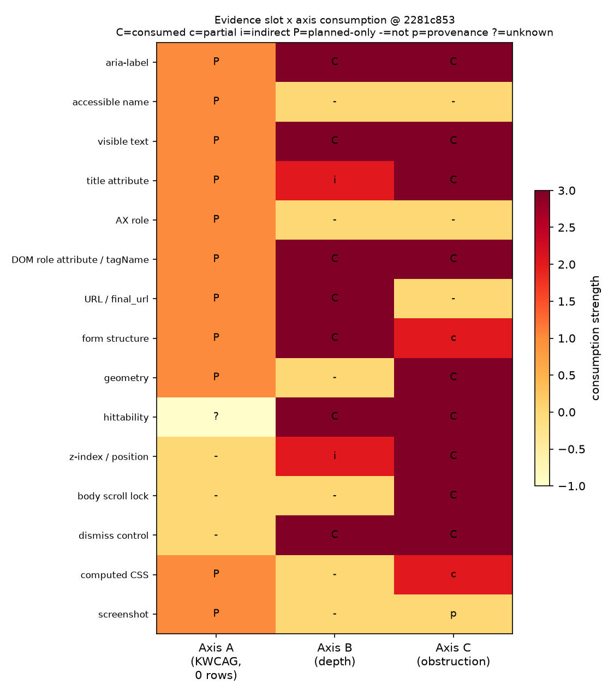
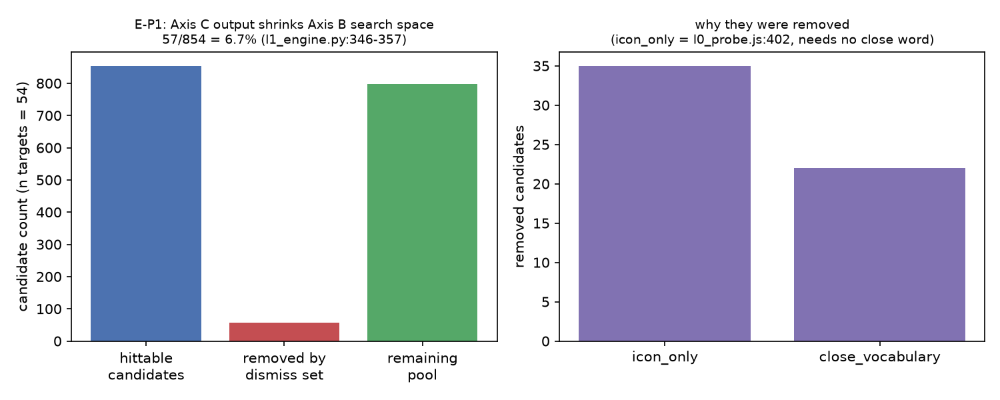
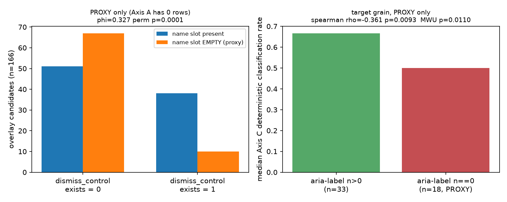

# D-PILOT-E — Evidence Slot Dependency Matrix

| | |
|---|---|
| child_id | `D-PILOT-E` (parent `RQ-D-PILOT-001`) |
| hypothesis_id | `H-PILOT-E-SLOT-DEPENDENCY` |
| MLflow run_id | `5f34b7743437412b9e18f7026422a3f2` (exp `LA_04_DIAGNOSTIC_PILOT_RESEARCH`, parent `27d10a01df5442b681ee73062e01c123`) |
| authority | **NON_CANONICAL** — construct 결정은 A 권한. threshold·GO/NO-GO 없음. causal claim 없음. |
| seed | `20260827` |
| **verdict** | **`SUPPORTED`** |
| axis_a_status | `0_rows_proxy_only` |

---

## 1. 연구질문

> Axis A(KWCAG) · Axis B(depth) · Axis C(obstruction) 이 공유하는 raw evidence slot 은 무엇이며, 그 공유가 planned association 에서 correlated measurement error 를 만들 수 있는 pair 는 어디인가

SSOT 00 v2.1 §3 은 세 축을 **독립 측정축**으로 규정하고, §3 말미와 §16 은 세 축을 단일 composite
점수로 합치는 것을 금지한다. 이 문서는 그 전제가 **정의 수준이 아니라 측정 공정(evidence slot) 수준에서**
성립하는지를 본다.

## 2. 왜 중요한가

- **D-VRC-003-A** 가 제기했다: 접근성 텍스트를 archetype 분류 feature 로 쓰면 접근성이 나쁜 페이지에서
  Axis A 와 RF detector 가 **동시에** 무너진다.
- **RF2-F** 가 그것을 측정했다: H3 후보에서 φ(확정, aria 빈칸) = −0.224 (perm p 0.087), 확정률 aria 빈칸 3/20 vs 있음 13/36.
- **A 가 `D-R0-74-1` 로 '축 간 공유 evidence slot 감도분석' 을 `before_results=true` 로 사전등록**했다.

E 는 그 문제를 한 detector 가 아니라 **전 축 · 전 slot** 으로 확장한다. 공유 slot 이 있으면 §12 의
planned association(Spearman / Kruskal–Wallis / joint plot)에서 관측되는 상관의 일부가 **실체적 연관이
아니라 공통 측정오차**일 수 있고, 이 자료로는 둘을 가르지 못한다는 것이 이 RQ 의 핵심 리스크다.

## 3. 입력

### 3.1 SSOT (우선)

`/home/sieg/projects-wsl/ProjectFinal/SSOTV2/00_SSOT_v2.1_POST_PILOT_RECOVERY.md`  
sha256 `1a4f6e75ccf70b2eaeddcad43c27c2cb5b3c93db1520760aa1850c63524a4ea3`  
읽은 절: §3 · §4 · §5 · §8 · §9 · §10 · §11 · §12 · §15 · §16

| 절 | 이 RQ 에 준 것 |
|---|---|
| §3 | 세 축의 정의와 산출 목록. Axis B 의 'scroll, text typing, redirect, passive wait, popup dismissal 은 depth 에 합산하지 않음'. Axis C 의 5요소(OverlayCoverage / PrimaryActionOcclusion / body scroll lock / dismiss control presence·visibility·actionability / forced dismissal count / interrupt type). '세 축은 서로 합산해 단일 고령친화 점수로 만들지 않는다'. |
| §5 | L0 evidence 목록 = rendered DOM · AX tree(CDP) · computed CSS · geometry · viewport screenshot · full-page screenshot · JS probe raw features · manifest/hash provenance. **행렬의 행 후보는 여기서 나온다.** |
| §8 | Depth detector 요구사항. §8.1 region signal type = DOM_AX_ROLE / FORM_STRUCTURE / URL_PATTERN / (MEDIA_STATE, GATE_SIGNAL). §8.4 partial depth. |
| §9 | KWCAG evaluator 4단계(Applicability / **Required evidence slots** / Expectation / Outcome), 자동화 우선순위 1 browser-native·AX → 2 geometry·CSS → 3 semantic text → 4 VLM → 5 Human. |
| §10 | Obstruction detector — page-level OverlayCoverage 는 기존 evidence 재사용, interrupt semantic 은 deterministic → text/NLP → VLM → abstain. |
| §12 | 분석 계획 — Spearman / Kruskal–Wallis / permutation / Fisher, 그리고 joint plot(x=ExcessDepth, y=OlderRelevantKWCAGFailRate, size=OverlayCoverage). **이 joint plot 이 곧 planned association 이며 이 RQ 의 대상이다.** |
| §15 · §16 | REAL_START_READY 조건, claim boundary — 단일 composite senior accessibility score 금지. |

### 3.2 코드 (exact SHA `2281c853950d0c475c5d2c1678680b971c2804f4`, 읽기 전용 `git show`)

- `research/landing_accessibility/src/landing_accessibility/engine/l0_probe.js`
- `research/landing_accessibility/src/landing_accessibility/engine/l0_collector.py`
- `research/landing_accessibility/src/landing_accessibility/engine/l1_engine.py (Axis B 소비지점 확인용)`
- `research/landing_accessibility/src/landing_accessibility/engine/depth.py (endpoint_status 매핑 확인용)`
- `research/landing_accessibility/src/landing_accessibility/engine/gate_classifier.py (gate 신호 소비 확인용)`

`l0_probe.js` 와 `l0_collector.py` 가 1차 자료다. Axis B 의 소비지점은 이 두 파일에서 끝나지 않고
`l1_engine.py` / `depth.py` / `gate_classifier.py` 로 이어지므로 그 셋을 **소비지점 확인 목적으로만** 함께 읽었다.

### 3.3 데이터

| 파일 | sha256 | n |
|---|---|---|
| `D_OBSERVATION_TABLE_v2.csv` | `c39c10f09f7a6a7603409550eb331612eb44634eb98ec387a604aa5221351e6b` | |
| `fact_landing_observation.json` | `4ed58b66e002d25ce324efa720462bef45dec2826b68ab7babbb3335cb06fa8c` | |
| `fact_interrupt_element.json` | `caebf1a4344a0b96d793b2f14418c14ece7c3ebef788e8eb7033eb678093dbf6` | |
| `fact_task_entry.json` | `61bb7051045ab27ddc5b8105728b64c3f0df1c69c3f278d14087789fbcad0064` | |
| `fact_criterion_result.json` | `4f53cda18c2baa0c0354bb5f9a3ecbe5ed12ab4d8e11ba873c2f11161202b945` | |
| `00_SSOT_v2.1_POST_PILOT_RECOVERY.md` | `1a4f6e75ccf70b2eaeddcad43c27c2cb5b3c93db1520760aa1850c63524a4ea3` | |
| raw L0 probe.json (E001 evidence, read-only) | (manifest 참조) | 54 files |

`input_snapshot_sha_NEW` = `NOT_APPLICABLE_frozen_only` — 형제 child A/B/C/D 가 기다리는 새 diagnostic
pilot capture 는 **아직 존재하지 않는다.** E 는 frozen evidence + SSOT 정의만으로 답한다.

### 3.4 firewall

`not_opened` — 아래 목록의 어떤 파일도 **열지 않았다**:

- `holdout label` — not_opened, 열지 않았다
- `LABEL_SPLIT_FROZEN*` — not_opened, 열지 않았다
- `HOLDOUT_FOR_C*` — not_opened, 열지 않았다
- `RAW_L1~L4*` — not_opened, 열지 않았다
- `PACKET_L*` — not_opened, 열지 않았다
- `*_OVERLAP*` — not_opened, 열지 않았다
- `PRECEDENCE_CONTESTED*` — not_opened, 열지 않았다
- `CALIBRATION_FOR_B*` — not_opened, 열지 않았다
- `**/control/**` — not_opened, 열지 않았다

네트워크 없음 · gold label 생성 없음 · REAL_TARGET 접속 없음 · 7 archetype 변경 없음 · SSOT 변경 없음 ·
production/control/engine/mart/raw evidence 수정 없음(raw·mart 는 읽기만) · 기존 D 산출물 수정 없음.

---

## 4. slot × 축 행렬 (전문)

상태 어휘:

| 값 | 뜻 |
|---|---|
| `CONSUMED` | 그 축의 산출값이 이 slot 을 실제로 읽는다 (@SHA 코드 라인 있음) |
| `CONSUMED_PARTIAL` | 일부 하위신호만 읽는다 |
| `CONSUMED_INDIRECT` | 다른 축의 산출을 경유해서만 영향을 받는다 |
| `PLANNED_ONLY` | SSOT 가 그 축에 요구하지만 @SHA 에 소비 코드가 **없다** |
| `NOT_CONSUMED` | @SHA 에 소비 코드가 없고 SSOT 도 요구하지 않는다 |
| `PROVENANCE_ONLY` | 증거로 저장되지만 어떤 파생값에도 들어가지 않는다 |
| `UNKNOWN` | 판단 근거가 없다 (이유를 적었다) |

> **Axis A 의 모든 cell 이 `PLANNED_ONLY` 이거나 `NOT_CONSUMED` 다.** @`2281c853` engine 디렉터리에
> KWCAG/criterion evaluator 모듈이 **존재하지 않고**, `fact_criterion_result.json` 은 **0행**이다.
> 따라서 Axis A cell 은 '측정 공정이 무엇을 읽는가' 가 아니라 'SSOT 가 무엇을 읽으라고 했는가' 다.

### 요약

| | 값 |
|---|---|
| slot 수 | 15 |
| **2개 이상 축이 실제로 소비하는 slot** | **8** |
| Axis A 의 `PLANNED_ONLY` 를 공유로 세면 | 11 |
| 한 축 이하만 닿는 slot | 4 |

실제 공유 (≥2 축이 `CONSUMED*`):

- aria-label (DOM attribute)
- visible text (textContent / innerText)
- title attribute
- DOM role attribute / tagName
- form structure (form / submit / autocomplete / label[for])
- hittability (document.elementFromPoint)
- z-index / position (fixed·sticky)
- dismiss control (Axis C 파생이면서 Axis B 입력)

Axis A 의 planned 소비를 포함하면 추가로: URL / final_url, computed CSS (color / background / contrast / font), geometry (getBoundingClientRect box / viewport coverage)

한 축 이하: accessible name (AX tree, CDP computed), AX role (CDP), body scroll lock, screenshot (viewport / full-page / dismiss before-after)

### 행렬 본문

#### `aria-label (DOM attribute)`

*captured_at*: l0_probe.js:173 accessible_name_sources.aria_label; :206 overlay aria_modal 인접 :216 overlay aria_label; :288 primary_action_candidates.aria_label; :350/:360/:364 gate_signals 가 aria-label 을 읽음; :394 dismiss control accessible_name_source

| 축 | status | consumer | 근거 |
|---|---|---|---|
| **Axis A** | `PLANNED_ONLY` | KWCAG accessible-name 계열 criterion (레이블 제공 / 대체 텍스트 / 명확한 지시사항) | SSOT 00 §9 '각 criterion 은 raw evidence 와 exact evaluator version 을 연결한다' + §9 자동화 우선순위 1 browser-native/AX. @2281c85 engine/ 에 KWCAG evaluator 모듈이 **없다** (engine/ 파일목록에 kwcag/criterion evaluator 부재; fact_criterion_result.json = 0행). |
| **Axis B** | `CONSUMED` | TaskStep.accessible_name; endpoint_status(gate 경유); activation 후보 제외(dismiss 경유) | l0_collector.py:353 accessible_name=aria_label or visible_text; l1_engine.py:505-506 동일식; l0_probe.js:360/:364 identity/otp count 가 aria-label 매칭 → gate_classifier.py:89 _IDENTITY_STRUCTURAL → depth.gate_outcome → endpoint_status; l1_engine.py:346-357 dismiss selector 집합에 든 후보를 activation 후보에서 제외 |
| **Axis C** | `CONSUMED` | interrupt 의미분류(final_label); dismiss_control_exists/visible/accessible_name | l0_collector.py:267-272 classify_interrupt 가 accessible_text+aria_label 을 _LABEL_RULES 에 넣음; l0_probe.js:394 name=aria-label\|\|title\|\|textContent → :400 matches_close_vocabulary, :402 icon_only → :409 filter; l0_collector.py:669-671 dismiss_control_accessible_name |

#### `accessible name (AX tree, CDP computed)`

*captured_at*: l0_collector.py:404-434 _ax_tree (Accessibility.getFullAXTree); :505 l0a/ax.json 저장; :424-426 name / name_computed 로 NAME_ABSENT 와 NULL 구분 보존

| 축 | status | consumer | 근거 |
|---|---|---|---|
| **Axis A** | `PLANNED_ONLY` | SSOT §9 자동화 우선순위 1(browser-native/AX) 이 지정한 Axis A 1차 증거 | SSOT 00 §5 L0 evidence 목록 'Accessibility Tree via browser/CDP'; §9. 소비 코드 부재(위와 동일). |
| **Axis B** | `NOT_CONSUMED` | — | l1_engine.py:317-331 _observe 는 PROBE_JS 재평가 + page.content() 만 쓴다. ax.json 을 읽는 경로가 없다. SSOT §8.1 은 DOM_AX_ROLE region signal 을 요구하므로 이는 SSOT 대비 **미구현 gap** 이다. |
| **Axis C** | `NOT_CONSUMED` | — | l0_collector.py:258-282 classify_interrupt 는 probe raw feature 만 본다. |

#### `visible text (textContent / innerText)`

*captured_at*: l0_probe.js:117 contrast 텍스트노드; :179 accessible_name_sources.visible_text; :214 overlay accessible_text; :289 primary_action_candidates.visible_text; :332 body.innerText(4000자 상한) → :353 gate_signals.visible_text; :394 dismiss name fallback

| 축 | status | consumer | 근거 |
|---|---|---|---|
| **Axis A** | `PLANNED_ONLY` | 명도대비 대상 텍스트, 레이블/대체텍스트 criterion | l0_probe.js:111 '임계값 비교 없음' — verdict 층이 분리되어 있고 @SHA 에 존재하지 않는다. |
| **Axis B** | `CONSUMED` | TaskStep.accessible_name fallback; gate 종류 판별 → endpoint_status | l0_collector.py:353-354; l1_engine.py:505-506; gate_classifier.py:70-88 _LOGIN_TEXT/_IDENTITY_TEXT/_CARRIER_TEXT 정규식이 :111 GateSignals.text(=probe gate_signals.visible_text) 에 걸림 → depth.py:48-75 gate_outcome → endpoint_status |
| **Axis C** | `CONSUMED` | interrupt final_label; dismiss control 어휘매칭 | l0_collector.py:114-121 _LABEL_RULES + :267-272; l0_probe.js:394/:400 |

#### `title attribute`

*captured_at*: l0_probe.js:175 accessible_name_sources.title; :394 dismiss name 2순위; :107 document.title(viewport 메타)

| 축 | status | consumer | 근거 |
|---|---|---|---|
| **Axis A** | `PLANNED_ONLY` | accessible name 계산 소스 | SSOT §9. 소비 코드 부재. |
| **Axis B** | `CONSUMED_INDIRECT` | activation 후보 제외 (title 로 이름이 생긴 control 이 dismiss 로 잡히면 Axis B 후보에서 빠진다) | l0_probe.js:394 name 에 title 포함 → :400/:409 dismiss 후보 확정 → l1_engine.py:346-357 제외. primary_action_candidates 자체에는 title 필드가 없다(l0_probe.js:286-302). |
| **Axis C** | `CONSUMED` | dismiss_control accessible_name_source | l0_probe.js:394 |

#### `AX role (CDP)`

*captured_at*: l0_collector.py:414-418 role 추출, :416 role in (None,'none','InlineTextBox') 제외; :505 ax.json

| 축 | status | consumer | 근거 |
|---|---|---|---|
| **Axis A** | `PLANNED_ONLY` | role/name/state 기반 criterion | SSOT §5 · §9. 소비 코드 부재. |
| **Axis B** | `NOT_CONSUMED` | — | SSOT §8.1 이 DOM_AX_ROLE 를 region signal type 으로 명시했으나 l1_engine.py:201-218 detect_area_signal 은 region_signals(declared_regions / search_inputs) 만 읽는다. AX role 경로 미구현. |
| **Axis C** | `NOT_CONSUMED` | — | 소비 코드 부재. |

#### `DOM role attribute / tagName`

*captured_at*: l0_probe.js:143-144 target_size 질의; :158 role; :169-172 accessible_name_sources 질의; :225 [role=dialog],[role=alertdialog]; :277-278 primary action 질의; :287 role; :393 dismiss 질의

| 축 | status | consumer | 근거 |
|---|---|---|---|
| **Axis A** | `PLANNED_ONLY` | target size / name 대상 집합 정의 | l0_probe.js:143-144 는 Axis A 의 target_size raw feature 대상 집합을 role 로 고른다. 판정층 부재. |
| **Axis B** | `CONSUMED` | activation 후보 집합; TaskStep.control_role | l0_probe.js:277-278 [role=button],[role=link],[role=tab] 포함; l0_collector.py:352 control_role=role or tag; l1_engine.py:504 |
| **Axis C** | `CONSUMED` | modal 후보 sources; dismiss control 집합 | l0_probe.js:224-226 dialog_element/role_dialog/aria_modal; l0_collector.py:275-279 modal_like; l0_probe.js:393 |

#### `URL / final_url`

*captured_at*: l0_probe.js:94 · :108 final_url; l0_collector.py:498 final_url=page.url; :557

| 축 | status | consumer | 근거 |
|---|---|---|---|
| **Axis A** | `PLANNED_ONLY` | 관측 provenance (criterion 판정의 대상 식별) | SSOT §5 manifest/hash provenance. 판정 소비 없음. |
| **Axis B** | `CONSUMED` | state_key(상태전이 식별); TaskStep.url; replay 검증 | l1_engine.py:194-197 state_key(url,dom); :502 step url; :522 expected_url_tail; :790 replay 대조. SSOT §8.1 URL_PATTERN. |
| **Axis C** | `NOT_CONSUMED` | — | 소비 코드 부재. |

#### `form structure (form / submit / autocomplete / label[for])`

*captured_at*: l0_probe.js:180 labelled_by_for; :316-326 search_inputs(in_form, has_submit); :344-345 autocompleteCount; :354-372 gate 구조신호; :413 form[method=dialog]

| 축 | status | consumer | 근거 |
|---|---|---|---|
| **Axis A** | `PLANNED_ONLY` | 레이블 제공 criterion (label[for] / autocomplete) | l0_probe.js:180 이 그 자리를 만들어 두었으나 판정층 부재. |
| **Axis B** | `CONSUMED` | QUERY archetype 의 area_signal; gate 구조신호 → endpoint_status | l1_engine.py:208-212 (visible ∧ in_form ∧ has_submit); gate_classifier.py:69 _LOGIN_STRUCTURAL · :89 _IDENTITY_STRUCTURAL ← l0_probe.js:354-372 |
| **Axis C** | `CONSUMED_PARTIAL` | dismiss method DIALOG_CLOSE 경로 | l0_probe.js:393 form[method=dialog] button · :413 has_form_method_dialog → l0_collector.py:707-712 DIALOG_CLOSE |

#### `geometry (getBoundingClientRect box / viewport coverage)`

*captured_at*: l0_probe.js:31-36 box(); :46-52 intersectArea/viewportBox; :147-164 target_size; :218-219 viewport_overlap/coverage; l0_collector.py:88-95 computed_css box

| 축 | status | consumer | 근거 |
|---|---|---|---|
| **Axis A** | `PLANNED_ONLY` | target size(2.5.x 계열) criterion, 명도대비 대상의 위치 | l0_probe.js:141 'target size raw feature — CSS px, DPR 곱하지 않음'; :7 '가져오지 않은 것: KWCAG 임계값 비교(required)'. SSOT §9 자동화 우선순위 2(deterministic geometry/CSS). |
| **Axis B** | `NOT_CONSUMED` | — | l0_collector.py:304-316 min4_sort_key 가 area_css_px2 를 tie-break 키에서 **의도적으로 제외** ([V2-C010b 시정]: '관측 잡음이 있는 면적을 정렬 키로 쓰면 순서가 잡음을 따라간다'). l1_engine.py 전체에 box/coverage/area 참조 없음(grep 확인). |
| **Axis C** | `CONSUMED` | OverlayCoverage, PrimaryActionOcclusion, blocks_primary_action, max_overlay_coverage | l0_collector.py:250-255 _overlap; :627-637 occlusion/blocking; :575-577 max_overlay_coverage; :582 max_primary_action_occlusion. SSOT §10. |

#### `hittability (document.elementFromPoint)`

*captured_at*: l0_probe.js:54-62 hittable(); :220 overlay hittable; :301 primary action hittable; :313/:324 region hittable; :406 dismiss control hittable; l0_collector.py:98-111 _DISMISS_STATE_JS

| 축 | status | consumer | 근거 |
|---|---|---|---|
| **Axis A** | `UNKNOWN` | — | SSOT §9 는 criterion 별 required evidence slot 을 evaluator 가 선언하라고만 하고 목록을 고정하지 않았다. evaluator 가 없으므로 Axis A 가 hittability 를 요구하는지 알 수 없다 — 추측으로 채우지 않는다. |
| **Axis B** | `CONSUMED` | activation 후보 필터, area_signal(HITTABLE), forced_dismissal 실행 가능성 | l1_engine.py:354 c.get('hittable') 필터; :202 'PRESENT ∧ HITTABLE ∧ NO_FURTHER_ACTIVATION'; :726 dismiss blocker 도 hittable 만 클릭. SSOT §8.1. |
| **Axis C** | `CONSUMED` | dismiss_control_visible, best control 선택, dismiss_succeeded | l0_collector.py:641-643 best=첫 hittable; :652 visible_flag 에 hittable 포함; :701 control 선택; :723-726 dismiss 성공판정 |

#### `z-index / position (fixed·sticky)`

*captured_at*: l0_probe.js:195-199 z/fixed/backdrop 후보조건; :209-211; :227-231 body * 스캔; :386-390 dismiss 컨테이너 스캔

| 축 | status | consumer | 근거 |
|---|---|---|---|
| **Axis A** | `NOT_CONSUMED` | — | SSOT §9 에 해당 요구 없음. |
| **Axis B** | `CONSUMED_INDIRECT` | activation 후보 제외 집합의 **경계**를 정한다 | l0_probe.js:386-390 이 fixed/sticky/z>=100 컨테이너 전부를 dismiss 스캔 대상으로 삼고, 그 안에서 나온 selector 가 l1_engine.py:346-357 에서 Axis B 후보를 깎는다. |
| **Axis C** | `CONSUMED` | modal/overlay 후보 자격, BANNER 라벨 | l0_probe.js:199 '!sources.length && !fixed && !(z>=100) → return'; l0_collector.py:280-281 position_sticky/fixed → BANNER |

#### `body scroll lock`

*captured_at*: l0_probe.js:235-244 body_scroll_lock{body_overflow, body_position, html_overflow, locked}

| 축 | status | consumer | 근거 |
|---|---|---|---|
| **Axis A** | `NOT_CONSUMED` | — | SSOT §9 에 해당 요구 없음. |
| **Axis B** | `NOT_CONSUMED` | — | SSOT §3 · §8.2 가 scroll 을 depth 합산에서 제외한다. l1_engine.py 는 body_scroll_lock 을 읽지 않는다(grep 확인). |
| **Axis C** | `CONSUMED` | blocks_primary_action, SSOT §3 Axis C 핵심 5요소 중 하나 | l0_collector.py:620 scroll_locked; :636 (scroll_locked ∧ coverage>=0.5) → blocking. SSOT §3 Axis C 'body scroll lock'. |

#### `dismiss control (Axis C 파생이면서 Axis B 입력)`

*captured_at*: l0_probe.js:377-418 dismiss_control_candidates (컨테이너별 목록)

| 축 | status | consumer | 근거 |
|---|---|---|---|
| **Axis A** | `NOT_CONSUMED` | — | SSOT §9 에 해당 요구 없음. |
| **Axis B** | `CONSUMED` | activation 후보 집합에서의 **제외**; forced_dismissal_count | l1_engine.py:346-357 dismiss_selectors 에 든 selector 를 후보에서 뺀다(주석 :337-339 'popup 의 닫기 control 은 후보가 아니다'); :717-735 _dismiss_blockers → forced_dismissal_count. SSOT §3 'popup dismissal 은 depth 에 합산하지 않음'. |
| **Axis C** | `CONSUMED` | dismiss_control_exists/visible/accessible_name/width/height, dismiss_persistence_hint, dismiss_succeeded, dismiss_failure_mode | l0_collector.py:639-674; :679-748. SSOT §3 Axis C 'dismiss control presence/visibility/actionability'. |

#### `computed CSS (color / background / contrast / font)`

*captured_at*: l0_probe.js:64-89 lum/effectiveBg/contrastRatio; :111-139 contrast raw feature; l0_collector.py:69-96 _COMPUTED_CSS_PROPERTIES + _COMPUTED_CSS_JS → :508-510 computed_css.json

| 축 | status | consumer | 근거 |
|---|---|---|---|
| **Axis A** | `PLANNED_ONLY` | 명도대비 criterion | l0_probe.js:5-8 '가져온 것: 상대휘도/명도대비 산식 … 가져오지 않은 것: KWCAG 임계값 비교(required), large_text 분류, 판정 문자열'; :111 '임계값 비교 없음'. 판정층 @SHA 부재. |
| **Axis B** | `NOT_CONSUMED` | — | l1_engine.py 에 color/contrast/font 참조 없음(grep 확인). |
| **Axis C** | `CONSUMED_PARTIAL` | 가시성(display/visibility/opacity) 판정만. 색/대비는 쓰지 않는다. | l0_probe.js:38-44 visible(); l0_collector.py:624 'if not cand.get("visible"): continue'; :648-651 dismiss_control_visible |

#### `screenshot (viewport / full-page / dismiss before-after)`

*captured_at*: l0_collector.py:512-517 screen_initial/screen_fullpage; :692-695 · :739-743 l0c before/after

| 축 | status | consumer | 근거 |
|---|---|---|---|
| **Axis A** | `PLANNED_ONLY` | SSOT §9 자동화 우선순위 4 (VLM) 및 5 (Human Final) | SSOT §5 'viewport screenshot / full-page screenshot'; §9. 소비 코드 부재. |
| **Axis B** | `NOT_CONSUMED` | — | l1_engine.py:124 TaskStep.screenshot_path 는 provenance 필드이며 어떤 판정에도 들어가지 않는다. |
| **Axis C** | `PROVENANCE_ONLY` | — | l0_collector.py:723-726 판정은 DOM 상태로; 스크린샷은 :693 · :739 저장만 |

---

## 5. 2개 이상 축이 공유하는 slot — 메커니즘과 방향

방향이 왜 중요한가: 두 축의 오차가 **같은 방향(same)** 이면 planned association 의 상관계수를
부풀리고, **반대(opposite)** 면 상관을 지운다. `unknown` 이면 이 자료로는 부호를 정할 수 없다는 뜻이다.

### E-P1 — Axis C → Axis B (dismiss control 이 activation 후보를 깎는다)

- **shared_slots**: `dismiss control`, `aria-label`, `title`, `visible text`, `hittability`, `z-index/position`
- **mechanism**: l0_probe.js:391-409 는 fixed/sticky/z>=100 컨테이너 안의 button/link 중 matches_close_vocabulary(:400) 또는 icon_only(:402) 인 것을 dismiss control 후보로 남긴다. l1_engine.py:346-357 은 그 selector 집합을 Axis B 의 activation 후보에서 뺀다. 따라서 Axis C 의 dismiss detector 가 false positive 를 내면 Axis B 의 탐색공간이 그만큼 줄고, false negative 를 내면 Axis B 가 닫기버튼을 activation 으로 밟는다.
- **direction**: `same` — 이름 slot(aria-label/title/visible text)이 빈약해지면 icon_only(:402) 가 더 자주 참이 되어 dismiss 후보가 **늘고**(Axis C 과탐), 같은 증가분이 Axis B 후보에서 **빠진다**. 즉 두 축의 오차가 같은 원인에서 같은 부호로 생긴다 — Axis C 는 장애물을 과대, Axis B 는 깊이를 과대.
- **measurable_now**: `yes` — probe raw feature 로 제외 수를 그대로 재계산할 수 있다. Axis A 는 실측이 없어 proxy 로만.
- **risk_level**: `HIGH`
- **what_would_falsify_it**: 제외된 후보가 전부 실제 닫기 control 로 확인되면(즉 href 없는 순수 close control), 그리고 제외 후에도 activation pool 이 비지 않으면 이 pair 의 실효 위험은 사라진다.

### E-P2 — Axis A ↔ Axis C (accessible name slot 공유)

- **shared_slots**: `aria-label`, `visible text`, `title`, `DOM role`
- **mechanism**: Axis A 의 name 계열 criterion(SSOT §9)과 Axis C 의 두 산출 — interrupt final_label (l0_collector.py:267-272) 및 dismiss_control_* (l0_probe.js:394-402) — 이 **같은 세 문자열 소스**를 읽는다. 페이지가 접근가능한 이름을 제공하지 않으면 Axis A 는 FAIL 방향, Axis C 는 '분류불가/닫기control 없음' 방향으로 동시에 움직인다.
- **direction**: `same` — 같은 방향으로 '나쁨' 이 커진다. 다만 Axis C 쪽 결과는 두 갈래다: (a) 이름이 없어 어휘매칭 실패 → dismiss_control_exists=0 (장애물이 더 나빠 보임), (b) 이름이 없고 아이콘만 있어 icon_only 발동 → dismiss 후보 과탐 (장애물이 덜 나빠 보임). 두 갈래가 같은 slot 결핍에서 갈라지므로 Axis C 오차의 부호가 페이지마다 뒤집힐 수 있다 — 이것이 이 pair 를 단순한 same 이 아니라 'same-in-cause, mixed-in-sign' 로 만든다.
- **measurable_now**: `proxy_only` — fact_criterion_result 0행 → Axis A 실측 없음. dom_aria_label_n==0 을 proxy 로만 쓴다.
- **risk_level**: `HIGH`
- **what_would_falsify_it**: Axis A evaluator 가 생산된 뒤, aria-label 빈약 층과 충분 층에서 Axis C 의 분류확정률·dismiss_control_exists 가 차이 없음이 확인되면 반박된다.

### E-P3 — Axis A ↔ Axis B (accessible name + form structure + gate 텍스트)

- **shared_slots**: `aria-label`, `visible text`, `form structure`, `DOM role`
- **mechanism**: Axis B 의 endpoint_status 는 gate 종류 판별에 의존하고(depth.py:48-75), 그 판별 입력은 gate_classifier.py:70-88 의 텍스트 정규식 + :69/:89 의 구조신호다. 구조신호 중 identity_number_input_count 와 otp_input_count 는 l0_probe.js:357-364 에서 **aria-label 을 직접 읽는다**. 즉 로그인/본인인증 화면이 접근가능한 이름을 주지 않으면 Axis A 는 FAIL 방향, Axis B 는 gate UNDETERMINED → endpoint 미승격 방향으로 함께 움직인다.
- **direction**: `same` — gate_classifier 는 모호하면 UNDETERMINED 로 abstain 하고(:22-23, :29-36) endpoint 로 올리지 않는다. 따라서 이름 slot 결핍 → Axis A FAIL↑ 와 Axis B '깊이 미확정/미도달'↑ 가 같은 방향이다.
- **measurable_now**: `no` — Axis A 0행이고 Axis B 도 NED/IED/MPFED 가 59/59 전부 None(RQ-D6)이라 **양쪽 다 변량이 없다**. endpoint_status 만 31행 있으나 endpoint_reached 는 31/31 이 0 이다.
- **risk_level**: `MEDIUM_UNMEASURED`
- **what_would_falsify_it**: gate 판별이 aria-label 없이 password/tel autocomplete 같은 브라우저-네이티브 구조신호만으로 동일한 판별을 낸다면(예: aria-label 필드를 ablation 해도 gate_kind 분포가 불변) 반박된다.

### E-P4 — Axis B ↔ Axis C (hittability 공유)

- **shared_slots**: `hittability`, `z-index/position`
- **mechanism**: hittable() 은 요소 중심점의 elementFromPoint 결과가 그 요소(또는 그 후손/조상)인지로 정의된다(l0_probe.js:54-62). 오버레이가 떠 있으면 그 아래의 모든 control 이 hittable=false 가 된다. Axis B 는 hittable 인 후보만 activation 대상으로 삼고(l1_engine.py:354), Axis C 는 hittable 로 dismiss_control_visible 과 dismiss_succeeded 를 정한다(l0_collector.py:641-643, :652, :723-726). 같은 오버레이가 두 축의 값을 동시에 결정한다.
- **direction**: `same` — 오버레이가 hit-test 를 가로채면 Axis C 는 '장애물 있음' 을, Axis B 는 '후보 없음/경로 못 감' 을 동시에 기록한다. 이 상관은 **실체적 상관(진짜 장애물이 진짜로 경로를 막는다)과 측정오차 상관(중심점 한 점 hit-test 의 실패)이 같은 자리에서 겹친다** — 둘을 이 자료로는 못 가른다.
- **measurable_now**: `partial` — hittable 분포는 잴 수 있으나 Axis B 산출(NED/MPFED)이 전부 None 이라 결과쪽 변량이 없다.
- **risk_level**: `MEDIUM`
- **what_would_falsify_it**: 중심점 hit-test 대신 다점 hit-test(예: 요소 내 5점)로 바꿨을 때 Axis B 후보수와 Axis C dismiss_control_visible 이 서로 다른 방향으로 움직이면, 공유는 있어도 오차상관은 측정방식의 산물이 아니라는 뜻이 된다.

### E-P5 — Axis A ↔ Axis C (geometry 공유)

- **shared_slots**: `geometry (box/coverage)`
- **mechanism**: Axis A 의 target size raw feature(l0_probe.js:147-164)와 Axis C 의 OverlayCoverage/PrimaryActionOcclusion(l0_collector.py:250-255, :627-637)이 같은 getBoundingClientRect 산출을 쓴다. 레이아웃이 아직 안정되지 않은 상태에서 캡처되면(SETTLE_MS=400, l0_collector.py:63) 두 축의 기하값이 같은 시점 오차를 공유한다.
- **direction**: `unknown` — 레이아웃 미안정의 부호가 정해져 있지 않다 — 늦게 뜨는 배너는 coverage 를 과소, collapse 전 컨테이너는 과대로 만든다. 방향을 정하려면 시점별 재캡처가 필요한데 frozen evidence 는 단일 시점뿐이다.
- **measurable_now**: `no` — 단일 시점 캡처라 시점 오차의 부호를 식별할 수 없다. Axis A 는 0행.
- **risk_level**: `LOW_UNMEASURED`
- **what_would_falsify_it**: 동일 target 을 여러 SETTLE_MS 로 재수집해 두 축의 기하값이 서로 다른 시점민감도를 보이면 반박.

---

## 6. 정량화

### 6.1 E-P1 — Axis C 산출이 Axis B 탐색공간을 깎는다 (**통계가 아니라 코드경로**)

`l1_engine.py:346-357` 은 `dismiss_control_candidates` 의 selector 집합에 든 후보를 Axis B 의
activation 후보에서 **뺀다**. 그 dismiss 후보는 `l0_probe.js:400`(닫기 어휘 매칭) 또는 `:402`(icon_only)
로 정해지며, 두 조건 모두 이름 slot(`aria-label` ‖ `title` ‖ `textContent`)에 의존한다.

| 지표 | 값 | 분모 / grain |
|---|---|---|
| hittable primary_action_candidate | **854** | target(in_mart==1, probe 보유) 54개 합 |
| 그중 Axis B pool 에서 제거됨 | **57** (6.67%) | Wilson95 [0.0519, 0.0855] |
| 영향받은 target | **31 / 54** | target |
| **제거로 pool 이 0이 된 target** | **5 / 54** | Wilson95 [0.0402, 0.1991] |
| 제거 근거 `icon_only` (닫기 어휘 **없이**) | 35 / 57 | 제거된 후보 |
| 제거 근거 `close_vocabulary` | 22 / 57 | 제거된 후보 |
| 제거된 후보 중 `href` 보유(=네비게이션 링크) | **27 / 57** | Wilson95 [0.3499, 0.6008] |
| 제거된 후보의 이름 slot: 없음 / aria-label / visible text | 23 / 18 / 16 | 제거된 후보 |

실제 사례(probe 원본에서 확인): Costco 로고 `a[href="/"]`, 쿠팡이츠 헤더 로고 `a[href=coupangeats.com]`,
`aria-label="메뉴"` 버튼, `aria-label="슬라이드 2"` 캐러셀 버튼 — 전부 `icon_only` 로 dismiss control 에
잡혀 Axis B 후보에서 빠졌다. **이것이 오분류라고 단정하지 않는다** (닫기 역할의 앵커도 존재한다).
단정할 수 있는 것은 하나다: **Axis C detector 의 산출이 Axis B 의 탐색공간을 결정한다.**

### 6.2 Axis A **proxy** 정량 — interrupt grain

> ⚠️ **모든 수치가 proxy 다.** Axis A 는 `fact_criterion_result` 0행이므로 실측이 존재하지 않는다.
> `name_slot_empty` = overlay 의 `accessible_text` 와 `aria_label` 이 **둘 다** 비어 있음.
> `l0_collector.py:267-269` 가 두 필드를 이어붙여 `_LABEL_RULES` 에 넣으므로, 이 조건은
> 'Axis C 의 의미분류가 읽을 이름 slot 이 없다' 와 정확히 같다. **KWCAG 판정이 아니다.**

grain: `visible modal/overlay candidate that reached the text-rule branch (viewport_overlap>0)`, n = **166** (전체 visible overlay 235, mart interrupt row 235)

| name slot | `dismiss_control_exists=0` | `=1` | 계 |
|---|---|---|---|
| 있음 | 51 | 67 | 118 |
| **비었음 (proxy)** | 38 | 10 | 48 |

**φ(name slot 비었음, dismiss control 없음) = `+0.3268`, permutation p = `0.0001` (n=166, 20000 perm) [PROXY]**

| name slot | `AMBIGUOUS` | `DETERMINISTIC` |
|---|---|---|
| 있음 | 23 | 95 |
| **비었음 (proxy)** | 15 | 33 |

φ(name slot 비었음, `AMBIGUOUS`) = `+0.1269`, perm p = `0.0693` [PROXY] — 약하고 유의하지 않다.  
φ(name slot 비었음, `final_label=UNKNOWN`) = `+0.1269`, perm p = `0.0663` [PROXY]

**읽기**: 이름 slot 이 비면 Axis C 의 *의미분류* 는 약하게만 흔들리지만, *dismiss control 존재 판정* 은
강하게 흔들린다(φ=+0.33). 두 산출 모두 SSOT §3 이 Axis C 의 핵심 요소로 지정한 것들이다.
그리고 그 이름 slot 은 SSOT §9 가 Axis A 의 1차 증거로 지정한 바로 그 slot 이다.

### 6.3 Axis A **proxy** 정량 — target grain

`proxyA_poor = (dom_aria_label_n == 0)` — **proxy 이며 Axis A 측정치가 아니다.**
n = 56, proxyA_poor = **20 (0.3571, Wilson95 [0.2446, 0.4881])**

| 결과변수 | 축 | 통계 | 값 | p | n |
|---|---|---|---|---|---|
| `axisB_has_task_entry` [PROXY] | B | φ | `0.0696` | `0.7716` | 56 |
| `axisB_auth_gate_before_endpoint` [PROXY] | B | φ | `0.0256` | `0.8491` | 31 |
| `axisB_forced_dismissal_gt0` [PROXY] | B | φ | `-0.169` | `0.3688` | 56 |
| `axisC_blocking_modal_gt0` [PROXY] | C | φ | `0.0301` | `0.7972` | 56 |
| `axisC_primary_action_visible_initial` [PROXY] | C | φ | `0.0598` | `0.7253` | 54 |
| `axisC_body_scroll_locked` [PROXY] | C | φ | `-0.065` | `0.5143` | 54 |
| `axisC_max_overlay_coverage` [PROXY] | C | Spearman ρ (MWU p) | `+0.0060` (MWU `0.9718`) | `0.9653` | poor 20 / ok 36 |
| `axisC_deterministic_rate` [PROXY] | C | Spearman ρ (MWU p) | `-0.3609` (MWU `0.0110`) | `0.0093` | poor 18 / ok 33 |
| `axisC_dismiss_exists_rate` [PROXY] | C | Spearman ρ (MWU p) | `-0.1686` (MWU `0.2372`) | `0.2370` | poor 18 / ok 33 |
| `axisC_n_interrupts` [PROXY] | C | Spearman ρ (MWU p) | `+0.0437` (MWU `0.7649`) | `0.7607` | poor 18 / ok 33 |
| `axisC_max_primary_action_occlusion` [PROXY] | C | Spearman ρ (MWU p) | `+0.0860` (MWU `0.5305`) | `0.5285` | poor 20 / ok 36 |
| `axisB_activation_pool_size` [PROXY] | B | Spearman ρ (MWU p) | `-0.1774` (MWU `0.1996`) | `0.1993` | poor 18 / ok 36 |
| `axisB_n_excluded_by_dismiss` [PROXY] | B | Spearman ρ (MWU p) | `-0.2507` (MWU `0.0694`) | `0.0675` | poor 18 / ok 36 |
| `axisB_exclusion_rate_of_hittable` [PROXY] | B | Spearman ρ (MWU p) | `-0.1213` (MWU `0.4069`) | `0.4062` | poor 14 / ok 35 |
| `axisB_n_pac_hittable` [PROXY] | B | Spearman ρ (MWU p) | `-0.2294` (MWU `0.0968`) | `0.0952` | poor 18 / ok 36 |

**유일하게 유의한 target-grain 결과**: Axis C 의 interrupt 분류 확정률이 aria-label 빈약 층에서 낮다 —
중앙값 `0.5000` (n=18) vs `0.6667` (n=33), Spearman ρ = `-0.3609`, p = `0.0093`, MWU p = `0.0110` **[PROXY]**.
방향은 RF2-F 의 φ(확정, aria 빈칸) = −0.224 와 **같다** — 서로 다른 grain·다른 산출에서 같은 부호가 나왔다.

**중요한 음성 결과**: Axis B 쪽 결과변수는 전부 유의하지 않다. 특히 제거율
(`axisB_exclusion_rate_of_hittable`, ρ=`-0.1213`, p=`0.4062`)은 proxy 층에 따라 다르지 않다.
제거 **개수** 는 차이 나 보이지만(ρ=`-0.2507`, p=`0.0675`) 그것은 aria 빈약 target 의 후보 pool 자체가 작기
때문이며(hittable 중앙값 2.0 vs 5.5), 분모를 맞추면 사라진다. **분모 없이 개수만 보면 반대 결론이 난다.**

---

## 7. 위험 pair 등급표

| pair | shared_slots | direction | measurable_now | risk_level | what_would_falsify_it |
|---|---|---|---|---|---|
| **E-P1** Axis C → Axis B (dismiss control 이 activation 후보를 깎는다) | `dismiss control`, `aria-label`, `title`, `visible text`, `hittability`, `z-index/position` | `same` | `yes` | `HIGH` | 제외된 후보가 전부 실제 닫기 control 로 확인되면(즉 href 없는 순수 close control), 그리고 제외 후에도 activation pool 이 비지 않으면 이 pair 의 실효 위험은 사라진다. |
| **E-P2** Axis A ↔ Axis C (accessible name slot 공유) | `aria-label`, `visible text`, `title`, `DOM role` | `same` | `proxy_only` | `HIGH` | Axis A evaluator 가 생산된 뒤, aria-label 빈약 층과 충분 층에서 Axis C 의 분류확정률·dismiss_control_exists 가 차이 없음이 확인되면 반박된다. |
| **E-P3** Axis A ↔ Axis B (accessible name + form structure + gate 텍스트) | `aria-label`, `visible text`, `form structure`, `DOM role` | `same` | `no` | `MEDIUM_UNMEASURED` | gate 판별이 aria-label 없이 password/tel autocomplete 같은 브라우저-네이티브 구조신호만으로 동일한 판별을 낸다면(예: aria-label 필드를 ablation 해도 gate_kind 분포가 불변) 반박된다. |
| **E-P4** Axis B ↔ Axis C (hittability 공유) | `hittability`, `z-index/position` | `same` | `partial` | `MEDIUM` | 중심점 hit-test 대신 다점 hit-test(예: 요소 내 5점)로 바꿨을 때 Axis B 후보수와 Axis C dismiss_control_visible 이 서로 다른 방향으로 움직이면, 공유는 있어도 오차상관은 측정방식의 산물이 아니라는 뜻이 된다. |
| **E-P5** Axis A ↔ Axis C (geometry 공유) | `geometry (box/coverage)` | `unknown` | `no` | `LOW_UNMEASURED` | 동일 target 을 여러 SETTLE_MS 로 재수집해 두 축의 기하값이 서로 다른 시점민감도를 보이면 반박. |

가장 위험한 pair 는 **E-P1 (Axis C → Axis B)** 다. 다른 pair 는 '공유하므로 상관될 수 있다' 인데 반해,
E-P1 은 **이미 결정적으로 결합되어 있다** — Axis C detector 의 출력이 Axis B 의 입력이다.
`l1_engine.py:346-357` 이 그 결합을 만든 코드이고, 그 결합은 SSOT §3(popup dismissal 은 depth 에
합산하지 않는다)을 지키려고 도입된 것이다. 즉 **한 축의 독립성을 지키려는 장치가 다른 방향의 결합을 만들었다.**

E-P2 (Axis A ↔ Axis C) 의 방향은 단순 `same` 이 아니라 **same-in-cause, mixed-in-sign** 이다:
이름 slot 결핍이 (a) 어휘매칭 실패 → `dismiss_control_exists=0`(장애물 더 나빠 보임) 과
(b) `icon_only` 발동 → dismiss 후보 과탐(장애물 덜 나빠 보임) 으로 **갈라진다.** 관측된 φ=+0.33 은
(a) 가 우세함을 보여주지만, 페이지 설계에 따라 부호가 뒤집힐 수 있다.

---

## 8. 반례

### 8.1 코드 수준 — **찾았다**

**`geometry (box / area_css_px2)`** — Axis C 가 강하게 소비하는 slot 인데 Axis B 는 **의도적으로** 소비하지 않는다

- 근거: l0_collector.py:304-316 min4_sort_key 독스트링: '`area_css_px2`는 tie-break 키에서 제외한다 [V2-C010b 시정] — 관측 잡음이 있는 면적을 정렬 키로 쓰면 어떤 양자화를 거쳐도 순서가 잡음을 따라간다'. l1_engine.py 전체에 box/coverage/area 참조 없음.
- 의미: 공유 slot 이 있어도 소비 지점을 끊으면 축이 독립적으로 움직인다는 **존재증명**이다. 이 프로젝트는 이미 한 번 그 결정을 내렸고 코드에 근거가 남아 있다.
- 한계: '독립적으로 움직인다' 를 실측으로 보인 것이 아니라 소비경로 부재로 보인 것이다. Axis B 산출이 전부 None 이라 실측 대조가 불가능하다.

**`body scroll lock`** — Axis C 의 핵심 5요소 중 하나인데 Axis B 는 SSOT 수준에서 배제되어 있다

- 근거: SSOT 00 §3 Axis B 'scroll, text typing, redirect, passive wait, popup dismissal 은 depth 에 합산하지 않음'; l1_engine.py 에 body_scroll_lock 참조 없음; l0_collector.py:620/:636 은 Axis C 만.
- 의미: SSOT 정의 자체가 공유를 끊은 사례. 코드가 그 정의를 지키고 있다.
- 한계: 단 forced_dismissal_count(l1_engine.py:717-735)는 여전히 Axis C 산출을 경유하므로 Axis B 가 obstruction 과 완전히 무관하지는 않다.

**`URL / final_url`** — Axis B 가 강하게 소비하는데 Axis C 는 전혀 읽지 않는다

- 근거: l1_engine.py:194-197 · :502 · :522 · :790 vs l0_collector.py 의 Axis C 경로(:602-677)에 URL 참조 없음.
- 의미: 한 축 전용 slot 이 존재한다는 것 — 모든 slot 이 공유되는 것은 아니다.
- 한계: 공유가 없으므로 '공유가 있는데 독립' 이라는 요구된 형태의 반례는 아니다. 부분적 반례로만 센다.

특히 `geometry` 가 결정적이다. `l0_collector.py:304-316` 은 `area_css_px2` 를 Axis B 의 tie-break 키에서
**의도적으로 뺐고** 그 이유를 코드에 남겼다 — *'관측 잡음이 있는 면적을 정렬 키로 쓰면 어떤 양자화를 거쳐도
순서가 잡음을 따라간다'* `[V2-C010b 시정]`. Axis C 는 같은 slot 을 핵심 산출(OverlayCoverage,
PrimaryActionOcclusion)로 쓴다. **공유 slot 이 있어도 소비 지점을 끊으면 축이 분리된다는 존재증명**이며,
이 프로젝트는 이미 한 번 그 결정을 내렸다.

### 8.2 실측 수준 — **완전한 반례는 찾지 못했다**

`Axis A proxy 가 빈약(dom_aria_label_n==0)한데 Axis C 의 분류확정률이 중앙값 이상인 target 이 있는가`

- aria-label 빈약(proxy)이면서 interrupt 가 있는 target: **18**
- 그중 Axis C 분류확정률 ≥ 0.6667(전체 중앙값): **3** (Wilson95 [0.0584, 0.3922])

부분적 반례는 존재한다 — 공유가 **결정론적 동반붕괴는 아니다**. 그러나 이것은 '두 축이 독립' 의 증거가
아니라 '상관이 완전하지 않다' 의 증거다. n=3/18 이므로 Wilson CI 가 넓고 과해석하지 않는다.

**왜 완전한 반례를 못 찾았는가**: 반례의 정의가 '공유 slot 이 있는데 **두 축이** 독립적으로 움직인다' 인데,
Axis A 는 0행이고 Axis B 는 NED/IED/MPFED 가 59/59 전부 None(RQ-D6)이다. **두 축 모두 결과 변량이 없다.**
즉 반례를 관측할 수 있는 자료 자체가 존재하지 않는다 — 반례의 부재는 '반례가 없다' 가 아니라
'반례를 볼 수 없다' 다. 이것은 **무결과 검증에 대조군이 필요하다**는 문제의 전형이다.

---

## 9. 이 RQ 가 답하지 않는 것

- Axis A 의 실제 측정오차와 Axis B/C 오차의 상관은 **추정 불가**다. fact_criterion_result 가 0행이고 @2281c85 engine/ 에 KWCAG evaluator 모듈 자체가 없다. 이 RQ 는 '어디서 생길 수 있는가' 까지만 답한다.
- Axis B 의 핵심 산출(NED/IED/MPFED)이 59/59 전부 None 이므로(RQ-D6) Axis B 를 결과변수로 하는 어떤 상관도 이 자료에서 계산되지 않는다. E-P1 의 위험은 **탐색공간 축소량**으로만 잰다.
- 공유 slot 이 실제로 오차를 상관시키는지 vs 실체적 연관(진짜 나쁜 페이지가 세 축 모두 나쁘다)인지 이 자료로는 가르지 못한다. 가르려면 slot 을 ablation 한 재수집이 필요하다.
- 어느 축을 어떻게 고쳐야 하는지는 정하지 않는다 — construct 는 A 의 권한이다 (NON_CANONICAL).
- 인과 주장 없음. 모든 문장은 '공유하므로 상관될 수 있다' 형태다.

---

## 10. Verdict

### `SUPPORTED`

H-PILOT-E-SLOT-DEPENDENCY(축들이 raw evidence slot 을 공유하며 그 공유가 correlated measurement error 를
만들 수 있는 지점이 존재한다)는 **지지된다**. 경쟁가설 중 '축이 측정 공정에서 독립이다' 는 **기각**된다:

- 15 slot 중 **8 개**를 2개 이상 축이 실제로 소비한다 (Axis A 의 planned 소비를 포함하면 11 개).
- 그중 하나(`dismiss control`)는 공유를 넘어 **직접 의존**이다 — Axis C 의 출력이 Axis B 의 입력이며,
  hittable 후보의 6.67%(57/854), target 의 31/54 에서 실제로 작동했고, 5 target 에서는 Axis B 의
  activation pool 을 **완전히 비웠다**.
- Axis A proxy 와 Axis C 산출 사이에 φ=`+0.327` (perm p `0.0001`, n=166, interrupt grain) 및
  ρ=`-0.361` (p `0.0093`, n=51, target grain) 의 연관이 관측된다 — **둘 다 proxy 수치다.**

경쟁가설 '일부 pair 만 공유' 도 부분적으로 맞다 — 한 축 이하만 닿는 slot 이 4 개 있고,
`geometry` 와 `body scroll lock` 은 **의도적으로 분리되어 있다**. 즉 결론은 '전부 얽혀 있다' 가 아니라
**'분리는 가능하고 이미 몇 군데서 이루어졌으며, 나머지는 아직 얽혀 있다'** 다.

어느 축을 어떻게 고쳐야 하는지는 **정하지 않는다** — construct 는 A 의 권한이다 (NON_CANONICAL).

## 11. Limitation

> Axis A 는 실측 0행이므로 모든 Axis A 수치가 proxy 다(dom_aria_label_n==0, overlay name slot 공백). Axis B 는 NED/IED/MPFED 가 전부 None 이라 결과변수로 쓸 수 없다. 따라서 이 RQ 는 실제 오차상관을 추정하지 못하고 '공유 지점과 메커니즘' 까지만 확정한다. 공유가 실체적 연관인지 측정오차 상관인지도 가르지 못한다 — 그것은 slot ablation 재수집을 요구한다.

추가로:

- Axis A cell 은 코드가 아니라 SSOT 해석이다. Axis A evaluator 가 실제로 구현될 때 **다른 slot 을 읽을 수 있고**,
  그러면 이 행렬의 A 열은 바뀐다. 특히 `hittability` 는 `UNKNOWN` 으로 남겼다 — SSOT §9 가 criterion 별
  required evidence slot 목록을 고정하지 않았기 때문에 추측하지 않았다.
- 공유가 **실체적 연관**(진짜 나쁜 페이지가 세 축 모두 나쁘다)인지 **측정오차 상관**인지 이 자료로는 가르지 못한다.
- interrupt grain 의 selector 조인은 target 내 유일성을 가정한다(중복 1건 제거 후 234/235 매칭).
- MLflow 계약 모듈(`mlflow_contract.py`)이 내부적으로 `git rev-parse`/`git status` 를 호출한다. 이는 계약이 요구하는
  provenance 기록이며, 이 RQ 의 연구 입력을 얻기 위한 git 사용은 `git show <sha>:<path>` 읽기 전용 열람뿐이다.

## 12. 추가 연구질문

- RQ-E-1: dismiss detector 의 icon_only(l0_probe.js:402) 조건을 끄면 Axis B activation pool 이 얼마나 회복되는가 (ablation, 재수집 없이 probe 재계산으로 가능).
- RQ-E-2: Axis A evaluator 가 생산된 뒤 dom_aria_label_n 층별로 Axis C 분류확정률 차이가 유지되는가 (E-P2 확증/반증).
- RQ-E-3: hittable() 을 중심점 1점에서 다점으로 바꾸면 Axis B 후보수와 Axis C dismiss_control_visible 이 같은 방향으로 움직이는가 (E-P4 식별).
- RQ-E-4: SSOT §8.1 이 요구한 DOM_AX_ROLE region signal 이 미구현인 것이 Axis B 의 declared_regions 의존(실사이트 2/54)을 만든 원인인가.
- RQ-E-5: AX tree 가 수집되지만 어느 축도 소비하지 않는다 — Axis A evaluator 를 AX 우선(SSOT §9 우선순위 1)으로 두면 Axis B/C 와의 slot 공유가 줄어드는가.

---

## 산출물

| 파일 | |
|---|---|
| `tools/pilot_e_slot_dependency.py` | 분석 코드 |
| `results/PILOT_E_slot_dependency.json` | 결과 (최상위 `"verdict"` 포함) |
| `results/PILOT_E_FINDINGS.md` | 이 문서 |
| `figures/PILOT_E_slot_axis_matrix.png` · `PILOT_E_ep1_searchspace.png` · `PILOT_E_axisA_proxy_vs_axisC.png` | 그림 |
| `../notebooks/d_research/PILOT_E_slot_dependency.ipynb` | 노트북 (Restart → Run All 검증, 11 code cell, error 0) |
| MLflow | run `5f34b7743437412b9e18f7026422a3f2` — `slot_axis_matrix.txt` · `risk_pair_table.json` · `counterexamples.json` · `not_answered_by_this_rq.txt` · `firewall.json` 첨부 |