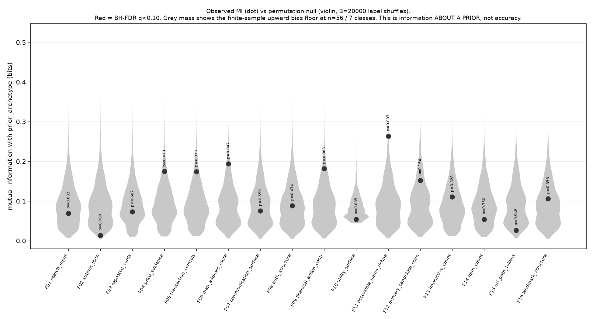
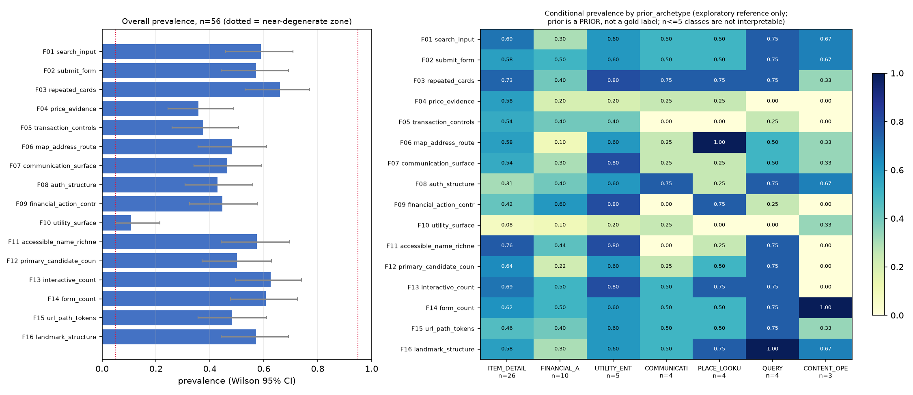
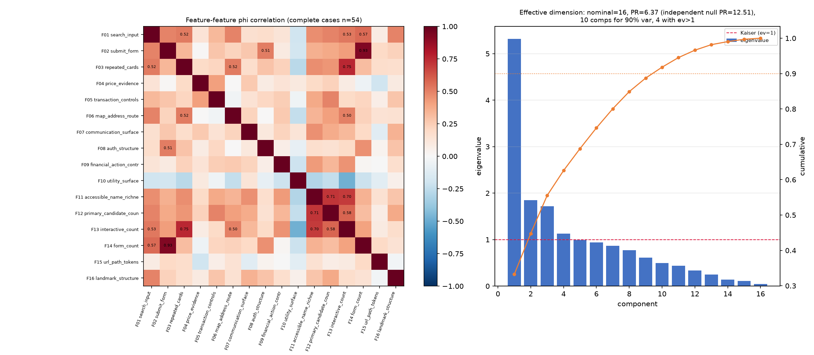
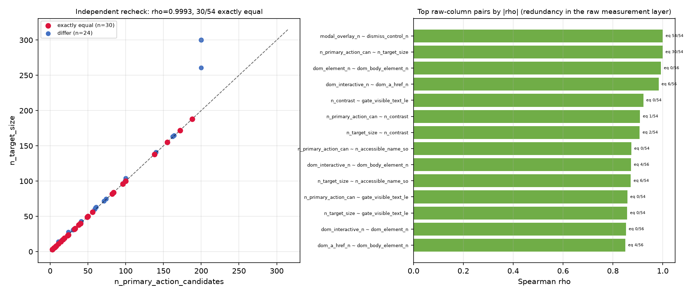

# RF2-B — Feature discriminability study

**child_id** `D-RF2-B` · **parent program** `RQ-D-RF-002` · **hypothesis_id** `H-RF2-B-FEATURE-INFORMATION`
**MLflow run_id** `6bcfe2bffbf54bab8ae3b4ba54dfed6a` (parent `ae754858ba3a4be391e5f811640d3fd8`, experiment `LA_03_RF_MAPPING`)
**model_or_rule_version** `RF2B_FEATURES_v1` · **seed** `20260827` · **permutations** `B=20000`

---

## 0. 라벨 의미 — 먼저 읽을 것

`prior_archetype` 은 **gold label 이 아니라 prior** 다. 이 연구는 그것을 **exploratory
coloring / reference** 로만 썼다. 어떤 분류기도 적합하지 않았고, prior 를 정답으로 학습하지
않았다. 아래에서 "MI" 는 feature 가 **prior 에 대해 담는 정보량**(`information_about_prior`)이고,
"조건부 prevalence" 는 `prior_agreement` 의 서술이다. **`accuracy` 라는 말은 이 문서에
쓰지 않는다** — 정답이 없기 때문에 정확도를 정의할 수 없다.

---

## 1. RQ

**존재하는 feature 와 구별력이 있는 feature 를 분리한다.**

한 feature 가 "관측된다"는 것과 "7-archetype 을 가른다"는 것은 다른 명제다. Stage 2 feature
목록(`SSOTV2/01_REPRESENTATIVE_FUNCTION_MAPPING_DT_v2.1.md` §4)은 **무엇을 추출할지**를
정하지만, 추출된 것 중 무엇이 실제로 구별정보를 갖는지는 정하지 않는다. 이 연구가 그 간극을 잰다.

## 2. 가설 판정

| 가설 | 내용 | 판정 |
|---|---|---|
| **H-B1** | 대부분 feature 가 정보 없음 | **SUPPORTED** — 16개 중 BH-FDR(q<0.10)을 통과한 feature **0개**. 8개는 관측 MI 가 permutation null 의 **평균에도 못 미친다**. |
| **H-B2** | 소수 feature 에 정보 집중 | **NOT_SUPPORTED** — 다중검정 보정 후 살아남는 feature 가 없어 "집중"이라 부를 대상이 없다. 무보정 p<0.05 는 2개(F06, F11)뿐이고 둘 다 q>=0.10 이다. |
| **H-B3** | feature 들이 서로 중복이라 실효 차원이 작다 | **SUPPORTED** — 명목 16차원, participation ratio **6.37** (독립 null 기준 12.51). Kaiser 기준 유효 성분 **4개**. |

### VERDICT: `PARTIALLY_SUPPORTED`

H-B1 과 H-B3 이 함께 성립하고 H-B2 는 성립하지 않는다. 세 경쟁가설 중 하나만 맞은 것이
아니라 두 개가 동시에 맞았으므로 단일 `SUPPORTED` 로 기록하지 않는다.

**한 줄 요약**: 이 16개 feature 는 **거의 다 존재하지만 거의 다 구별하지 못하며**, 게다가
서로 같은 것을 재고 있어 실효 차원이 명목 차원의 40% 수준이다.

---

## 3. 입력 · 분석단위 · N

| 항목 | 값 |
|---|---|
| 관측 테이블 | `research_d/results/D_OBSERVATION_TABLE_v2.csv` — sha256 `c39c10f09f7a6a76…`, 66행 × 65열 |
| 텍스트 코퍼스 | `research_d/results/D_TEXT_CORPUS_v2.csv` — sha256 `bf6bb772faa45541…`, 56행 × 23열 |
| 참고 (읽기만) | `SSOTV2/01_REPRESENTATIVE_FUNCTION_MAPPING_DT_v2.1.md` §4 Stage 2 |
| 조인 | `observation_id`, 1:1, `in_mart == 1` 필터 후 56행, 미매칭 0 |
| 분석단위 | **target** (in_mart==1) |
| N | **56** (기대 56, 관측 56) |
| prior 분포 | ITEM_DETAIL 26 · FINANCIAL_ACTION_ENTRY 10 · UTILITY_ENTRY 5 · COMMUNICATION_ENTRY 4 · PLACE_LOOKUP 4 · QUERY 4 · CONTENT_OPEN 3 |
| H(prior) | **2.311 bits** (균등 7-class 상한 2.807 bits) |

### missing N

probe 가 없는 target 2건 때문에 probe 파생 컬럼이 2건 결측이다. DOM 파생 컬럼은 56건 완전하다.

| feature | 결측 N | 결측률 | 원인 |
|---|--:|--:|---|
| `F11_accessible_name_richness` | 2 | 3.6% | `n_accessible_name_sources` 가 probe 산출물 |
| `F12_primary_candidate_count` | 2 | 3.6% | `n_primary_action_candidates` 가 probe 산출물 |
| 나머지 14개 | 0 | 0% | — |

결측은 **삭제하지 않고 feature 단위 complete-case** 로 처리했다(해당 feature 의 n_defined 가
54로 줄어든다). redundancy 행렬만 16개 feature 동시 complete case (n=54)를 쓴다.
결측을 0(=부재)으로 대치하지 않았다 — probe 부재는 "그 기능이 없다"가 아니라 "관측하지 못했다"이므로.

**방화벽**: 이 분석은 holdout label · `LABEL_SPLIT_FROZEN*` · `HOLDOUT_FOR_C*` · `RAW_L1~L4*` ·
`PACKET_L*` · `*_OVERLAP*` · `PRECEDENCE_CONTESTED*` · `CALIBRATION_FOR_B*` · `**/control/**` ·
B/C 의 target-level holdout error report 를 **하나도 열지 않았다**. 위 표의 두 CSV 와 SSOTV2
문서 한 개가 전부다. 네트워크 접속 없음. gold label 생성 없음. production/control/engine/mart
파일 수정 없음.

---

## 4. feature 조작화 정의 — 전문

임계값은 **prior 를 보지 않은 상태에서 각 변수의 주변 분포만 보고** 정했고, MI 를 한 번도
계산하기 전에 코드에 동결했다. 결과를 보고 정의를 바꾸지 않았다.

### 4.1 표면(surface) 정의

텍스트 매칭에 쓰는 세 가지 텍스트 표면. 모두 소문자화 후 `" | "` 로 이어붙인다.

| 표면 | 구성 컬럼 |
|---|---|
| `CONTROL_SURFACE` | `buttons`, `nav_links`, `aria_labels`, `form_labels`, `placeholders`, `input_names` |
| `CARD_SURFACE` | `card_texts` |
| `CONTEXT_SURFACE` | `headings`, `title`, `meta_description`, `landmarks`, `url_tokens` |
| `ALL_SURFACE` | 위 셋의 합 |

매칭 방식: **소문자화 후 부분 문자열 포함 검사**. 형태소 분석 없음. `text_blob`(본문 전체)은
쓰지 않았다 — 이 연구는 *컨트롤 표면*의 구별력을 묻기 때문이다.

### 4.2 feature 16개

| id | 재는 것 | 규칙 | 임계값 근거 |
|---|---|---|---|
| `F01_search_input` | search input | `search_inputs_n >= 1` OR `LEX[SEARCH] ∩ CONTROL_SURFACE ≠ ∅` | 존재 판정. 검색 입력은 개수가 아니라 존재가 신호 |
| `F02_submit_form` | submit form | `dom_input_n >= 1` AND (`form_labels` 비어있지 않음 OR `LEX[SUBMIT] ∩ CONTROL_SURFACE ≠ ∅`) | 입력 필드 + 제출 의미 컨트롤/라벨 동반 시에만 '폼' |
| `F03_repeated_cards` | repeated card count | `card_texts` 의 `\|` 분할 항목 수 `>= 8` | `card_texts` 는 수집기에서 **25개로 절단**. 8 = 25의 1/3, 반복구조와 단발링크의 보수적 경계 |
| `F04_price_evidence` | price evidence | `PRICE_REGEX` 매치 OR `LEX[PRICE_LEX] ∩ ALL_SURFACE ≠ ∅` | 존재 판정. 가격은 1회만 나와도 item-like 증거 |
| `F05_transaction_controls` | transaction controls | `LEX[TXN] ∩ (CONTROL_SURFACE ∪ CARD_SURFACE) ≠ ∅` | SSOT §4 Item-like: *presence evidence only* |
| `F06_map_address_route` | map/address/route | `LEX[PLACE] ∩ ALL_SURFACE ≠ ∅` | 존재 판정 |
| `F07_communication_surface` | communication vocab·control | `LEX[COMM] ∩ ALL_SURFACE ≠ ∅` | 존재 판정 |
| `F08_auth_structure` | authentication structure | `gate_password_input_n >= 1` OR `LEX[AUTH] ∩ (CONTROL_SURFACE ∪ url_tokens) ≠ ∅` | password 입력 1개면 auth gate |
| `F09_financial_action_controls` | financial action controls | `LEX[FIN] ∩ (CONTROL_SURFACE ∪ CARD_SURFACE) ≠ ∅` | 존재 판정 |
| `F10_utility_surface` | utility function surface | `LEX[UTIL] ∩ CONTROL_SURFACE ≠ ∅` AND `dom_a_href_n <= 30` | SSOT §4 Utility-like = *single-purpose tool surface*. 단일 목적성을 링크 폭으로 대리. 30 은 `dom_a_href_n` 분포에서 25%tile=19, 50%tile=65 사이 |
| `F11_accessible_name_richness` | accessible-name richness | `n_accessible_name_sources >= 100` | 이 변수는 **300에서 상한 절단**(24% 절단). 100 = 상한의 1/3 |
| `F12_primary_candidate_count` | primary candidate count | `n_primary_action_candidates >= 50` | **200에서 상한 절단**(13% 절단). 50 = 상한의 1/4 |
| `F13_interactive_count` | interactive count | `dom_interactive_n >= 50` | 절단 없음. 라운드 넘버 경계 |
| `F14_form_count` | form count | `dom_input_n >= 1` | 존재 판정. **F02 의 구조 없는 원시 버전 — 중복도 비교용으로 일부러 포함** |
| `F15_url_path_tokens` | URL tokens | `url_tokens` 공백 분할 토큰 수 `>= 5` | `https www x com` = 4토큰(호스트만). 5 이상이면 경로 존재 |
| `F16_landmark_structure` | landmark structure | `landmarks` 비어있지 않음 AND `dom_role_n >= 5` | landmark 텍스트 + ARIA role 최소 5개(header/nav/main/footer/search 급) |

`PRICE_REGEX` 전문:
```
(?:\d[\d,]{2,}\s*원)|(?:₩\s*\d)|(?:krw\s*\d)|(?:\d+\s*%\s*(?:할인|off))
```

### 4.3 어휘 사전 — 전문

- **SEARCH** (12) — `검색`, `찾기`, `찾아`, `조회`, `search`, `찾으시는`, `검색어`, `통합검색`, `keyword`, `키워드`, `query`, `쿼리`
- **SUBMIT** (17) — `확인`, `제출`, `등록`, `적용`, `완료`, `저장`, `보내기`, `전송`, `신청하기`, `submit`, `apply`, `send`, `confirm`, `ok`, `go`, `이동`, `다음`
- **PRICE_LEX** (14) — `가격`, `정가`, `판매가`, `할인`, `원가`, `특가`, `최저가`, `무료배송`, `배송비`, `price`, `won`, `sale`, `discount`, `krw`
- **TXN** (17) — `장바구니`, `담기`, `구매`, `주문`, `결제`, `바로구매`, `구입`, `쇼핑백`, `찜`, `예약하기`, `cart`, `buy`, `order`, `checkout`, `purchase`, `basket`, `add to`
- **PLACE** (23) — `지도`, `위치`, `주소`, `매장`, `지점`, `점포`, `길찾기`, `오시는`, `찾아오시는`, `영업시간`, `층`, `근처`, `주변`, `지역`, `배송지`, `map`, `location`, `address`, `store locator`, `branch`, `directions`, `nearby`, `route`
- **COMM** (28) — `댓글`, `글쓰기`, `작성`, `메시지`, `쪽지`, `채팅`, `문의`, `게시`, `게시판`, `커뮤니티`, `후기`, `리뷰`, `상담`, `톡`, `답글`, `구독`, `팔로우`, `comment`, `post`, `message`, `chat`, `write`, `reply`, `review`, `community`, `follow`, `inquiry`, `contact us`
- **AUTH** (24) — `로그인`, `로그아웃`, `회원가입`, `가입하기`, `인증`, `본인확인`, `비밀번호`, `아이디`, `인증서`, `간편인증`, `공동인증`, `마이페이지`, `내정보`, `login`, `log in`, `sign in`, `signin`, `signup`, `sign up`, `register`, `password`, `auth`, `mypage`, `account`
- **FIN** (34) — `결제`, `송금`, `이체`, `계좌`, `카드`, `대출`, `한도`, `잔액`, `납부`, `청구`, `보험`, `적금`, `예금`, `펀드`, `투자`, `환전`, `포인트`, `마일리지`, `금융`, `이자`, `상환`, `요금`, `충전`, `pay`, `payment`, `transfer`, `remit`, `account balance`, `loan`, `credit`, `banking`, `invest`, `insurance`, `billing`
- **UTIL** (25) — `계산`, `계산기`, `변환`, `발급`, `신청`, `접수`, `예약`, `등록`, `조회하기`, `확인하기`, `다운로드`, `설치`, `업로드`, `제출하기`, `예매`, `calculator`, `convert`, `issue`, `apply`, `reserve`, `booking`, `download`, `upload`, `lookup`, `tracking`

> 사전은 **`ok`, `go`, `이동`, `다음`(SUBMIT), `카드`, `요금`(FIN), `찾기`(SEARCH·PLACE 양쪽), `층`(PLACE)**
> 처럼 짧고 흔한 토큰을 포함한다. 형태소 분석을 하지 않으므로 `카드` → `카드뉴스`,
> `층` → `계층` 같은 **과탐이 구조적으로 발생한다**. 이것은 결함이 아니라 사전 설계의 선택이며
> (재현성 우선), §11 limitation 에 그 대가를 명시한다.

---

## 5. 방법

1. **조작화**: 위 16개 규칙으로 각 target 을 이진화. 각 target 별 근거(어떤 사전 항목이 맞았는지,
   어떤 숫자였는지)를 결과 JSON `per_target_evidence` 에 전량 보존.
2. **prevalence**: 전체 및 archetype 조건부. 구간은 **Wilson 95% CI**(정규근사 아님 — n<=5 class
   에서 정규근사는 무의미).
3. **entropy**: feature 의 이진 엔트로피(bits).
4. **MI**: `prior_archetype` 과의 plug-in(최대우도) 상호정보량(bits). 보조로 **Miller-Madow**
   편향보정값과 **정규화 MI**(`MI / H(prior)`), **Cramér's V** 를 병기.
5. **permutation null (필수)**: `prior_archetype` 을 **B=20000회 셔플**해 각 feature 마다 null
   MI 분포를 만들었다. feature 는 고정하고 라벨만 섞으므로 feature 의 주변분포·결측구조가 보존된다.
   `perm_p = (1 + #{MI_null >= MI_obs}) / (B + 1)`.
   16개 feature 에 대해 **Benjamini–Hochberg FDR** 로 `q` 산출.
6. **redundancy**: feature-feature φ 상관, Jaccard, 정확일치율, feature 간 MI.
7. **실효 차원**: φ 상관행렬의 고유값 → participation ratio `(Σλ)²/Σλ²`, 90% 분산 성분 수,
   Kaiser(λ>1) 성분 수. **독립 null 기준선**: 각 열을 독립적으로 섞어(주변분포 보존) 500회
   재계산한 PR 의 평균 — n=56 에서 상관행렬 자체가 갖는 잡음 하한을 보여준다.
8. **이진화 손실 점검**: 6개 count 계열 feature 를 사전 확정 경계로 3수준 순서변수로 만들어
   MI 와 permutation null 을 재계산.
9. **원시 중복 벡터 재확인**: 관측 테이블의 숫자 컬럼 16개 전체 쌍에 대해 Spearman ρ, Pearson r,
   정확일치 건수.

### permutation null 이 왜 필수인가

n=56, 7 class, 최소 class n=3 이다. 이 조건에서 **plug-in MI 는 상향 편향된다** — 독립인
변수끼리도 유한표본 잡음만으로 양의 MI 가 나온다. 실제로 이 데이터에서 null 평균은
**0.085~0.096 bits** 였다. 즉 **MI 0.09 는 "0 에 가깝다"가 아니라 문자 그대로 "정보 없음의
기댓값"이다.** permutation 없이 `MI = 0.09 bits` 를 보고했다면 정보가 있다고 오독됐을 것이다.
아래 표에서 `excess = MI − null 평균` 열이 실제 신호에 해당한다.

---

## 6. feature 별 결과표

| feature | n | k | prev | 95% CI | H(bits) | MI(bits) | MM-MI | nMI | null mean | excess | perm p | q(BH) | Cramer V | miss |
|---|--:|--:|--:|---|--:|--:|--:|--:|--:|--:|--:|--:|--:|--:|
| `F01_search_input` | 56 | 33 | 0.589 | [0.46, 0.71] | 0.977 | 0.0694 | -0.0079 | 0.030 | 0.0921 | -0.0228 | 0.6319 | 0.843 | 0.310 | 0 |
| `F02_submit_form` | 56 | 32 | 0.571 | [0.44, 0.69] | 0.985 | 0.0136 | -0.0636 | 0.006 | 0.0921 | -0.0785 | 0.9890 | 0.989 | 0.135 | 0 |
| `F03_repeated_cards` | 56 | 37 | 0.661 | [0.53, 0.77] | 0.924 | 0.0731 | -0.0042 | 0.032 | 0.0931 | -0.0200 | 0.6067 | 0.843 | 0.324 | 0 |
| `F04_price_evidence` | 56 | 20 | 0.357 | [0.24, 0.49] | 0.940 | 0.1747 | 0.1232 | 0.076 | 0.0938 | +0.0809 | 0.0725 | 0.233 | 0.451 | 0 |
| `F05_transaction_controls` | 56 | 21 | 0.375 | [0.26, 0.51] | 0.954 | 0.1741 | 0.1355 | 0.075 | 0.0930 | +0.0811 | 0.0728 | 0.233 | 0.420 | 0 |
| `F06_map_address_route` | 56 | 27 | 0.482 | [0.36, 0.61] | 0.999 | 0.1937 | 0.1293 | 0.084 | 0.0923 | +0.1015 | 0.0470 | 0.233 | 0.472 | 0 |
| `F07_communication_surface` | 56 | 26 | 0.464 | [0.34, 0.59] | 0.996 | 0.0757 | -0.0016 | 0.033 | 0.0920 | -0.0164 | 0.5589 | 0.843 | 0.317 | 0 |
| `F08_auth_structure` | 56 | 24 | 0.429 | [0.31, 0.56] | 0.985 | 0.0887 | 0.0114 | 0.038 | 0.0923 | -0.0036 | 0.4736 | 0.842 | 0.348 | 0 |
| `F09_financial_action_controls` | 56 | 25 | 0.446 | [0.32, 0.58] | 0.992 | 0.1816 | 0.1301 | 0.079 | 0.0924 | +0.0892 | 0.0633 | 0.233 | 0.449 | 0 |
| `F10_utility_surface` | 56 | 6 | 0.107 | [0.05, 0.21] | 0.491 | 0.0542 | 0.0027 | 0.023 | 0.0847 | -0.0305 | 0.8852 | 0.989 | 0.271 | 0 |
| `F11_accessible_name_richness` | 54 | 31 | 0.574 | [0.44, 0.70] | 0.984 | 0.2638 | 0.2104 | 0.113 | 0.0959 | +0.1680 | 0.0074 | 0.118 | 0.559 | 2 |
| `F12_primary_candidate_count` | 54 | 27 | 0.500 | [0.37, 0.63] | 1.000 | 0.1520 | 0.0852 | 0.065 | 0.0960 | +0.0561 | 0.1541 | 0.411 | 0.429 | 2 |
| `F13_interactive_count` | 56 | 35 | 0.625 | [0.49, 0.74] | 0.954 | 0.1106 | 0.0462 | 0.048 | 0.0928 | +0.0179 | 0.3276 | 0.716 | 0.369 | 0 |
| `F14_form_count` | 56 | 34 | 0.607 | [0.48, 0.72] | 0.967 | 0.0543 | -0.0101 | 0.023 | 0.0929 | -0.0386 | 0.7502 | 0.923 | 0.237 | 0 |
| `F15_url_path_tokens` | 56 | 27 | 0.482 | [0.36, 0.61] | 0.999 | 0.0267 | -0.0506 | 0.012 | 0.0927 | -0.0660 | 0.9479 | 0.989 | 0.190 | 0 |
| `F16_landmark_structure` | 56 | 32 | 0.571 | [0.44, 0.69] | 0.985 | 0.1063 | 0.0419 | 0.046 | 0.0931 | +0.0132 | 0.3582 | 0.716 | 0.347 | 0 |


`nMI` = `MI / H(prior)`, H(prior)=2.311 bits. `excess` = MI − permutation null 평균.
`q(BH)` = 16개 검정에 대한 Benjamini–Hochberg FDR.
**q < 0.10 을 넘는 feature 는 하나도 없다.**

### 6.1 archetype 조건부 prevalence

| feature | ITEM_DETAIL<br>n=26 | FINANCIAL_ACTI<br>n=10 | UTILITY_ENTRY<br>n=5 | COMMUNICATION_<br>n=4 | PLACE_LOOKUP<br>n=4 | QUERY<br>n=4 | CONTENT_OPEN<br>n=3 |
|---|--:|--:|--:|--:|--:|--:|--:|
| `F01_search_input` | 0.69 (18/26) | 0.30 (3/10) | 0.60 (3/5)† | 0.50 (2/4)† | 0.50 (2/4)† | 0.75 (3/4)† | 0.67 (2/3)† |
| `F02_submit_form` | 0.58 (15/26) | 0.50 (5/10) | 0.60 (3/5)† | 0.50 (2/4)† | 0.50 (2/4)† | 0.75 (3/4)† | 0.67 (2/3)† |
| `F03_repeated_cards` | 0.73 (19/26) | 0.40 (4/10) | 0.80 (4/5)† | 0.75 (3/4)† | 0.75 (3/4)† | 0.75 (3/4)† | 0.33 (1/3)† |
| `F04_price_evidence` | 0.58 (15/26) | 0.20 (2/10) | 0.20 (1/5)† | 0.25 (1/4)† | 0.25 (1/4)† | 0.00 (0/4)† | 0.00 (0/3)† |
| `F05_transaction_controls` | 0.54 (14/26) | 0.40 (4/10) | 0.40 (2/5)† | 0.00 (0/4)† | 0.00 (0/4)† | 0.25 (1/4)† | 0.00 (0/3)† |
| `F06_map_address_route` | 0.58 (15/26) | 0.10 (1/10) | 0.60 (3/5)† | 0.25 (1/4)† | 1.00 (4/4)† | 0.50 (2/4)† | 0.33 (1/3)† |
| `F07_communication_surface` | 0.54 (14/26) | 0.30 (3/10) | 0.80 (4/5)† | 0.25 (1/4)† | 0.25 (1/4)† | 0.50 (2/4)† | 0.33 (1/3)† |
| `F08_auth_structure` | 0.31 (8/26) | 0.40 (4/10) | 0.60 (3/5)† | 0.75 (3/4)† | 0.25 (1/4)† | 0.75 (3/4)† | 0.67 (2/3)† |
| `F09_financial_action_controls` | 0.42 (11/26) | 0.60 (6/10) | 0.80 (4/5)† | 0.00 (0/4)† | 0.75 (3/4)† | 0.25 (1/4)† | 0.00 (0/3)† |
| `F10_utility_surface` | 0.08 (2/26) | 0.10 (1/10) | 0.20 (1/5)† | 0.25 (1/4)† | 0.00 (0/4)† | 0.00 (0/4)† | 0.33 (1/3)† |
| `F11_accessible_name_richness` | 0.76 (19/25) | 0.44 (4/9) | 0.80 (4/5)† | 0.00 (0/4)† | 0.25 (1/4)† | 0.75 (3/4)† | 0.00 (0/3)† |
| `F12_primary_candidate_count` | 0.64 (16/25) | 0.22 (2/9) | 0.60 (3/5)† | 0.25 (1/4)† | 0.50 (2/4)† | 0.75 (3/4)† | 0.00 (0/3)† |
| `F13_interactive_count` | 0.69 (18/26) | 0.50 (5/10) | 0.80 (4/5)† | 0.50 (2/4)† | 0.75 (3/4)† | 0.75 (3/4)† | 0.00 (0/3)† |
| `F14_form_count` | 0.62 (16/26) | 0.50 (5/10) | 0.60 (3/5)† | 0.50 (2/4)† | 0.50 (2/4)† | 0.75 (3/4)† | 1.00 (3/3)† |
| `F15_url_path_tokens` | 0.46 (12/26) | 0.40 (4/10) | 0.60 (3/5)† | 0.50 (2/4)† | 0.50 (2/4)† | 0.75 (3/4)† | 0.33 (1/3)† |
| `F16_landmark_structure` | 0.58 (15/26) | 0.30 (3/10) | 0.60 (3/5)† | 0.50 (2/4)† | 0.75 (3/4)† | 1.00 (4/4)† | 0.67 (2/3)† |


**† 표시 = n<=5 class.** UTILITY_ENTRY(5) · COMMUNICATION_ENTRY(4) · PLACE_LOOKUP(4) ·
QUERY(4) · CONTENT_OPEN(3) 의 조건부 prevalence 는 **해석하지 않는다**. 예를 들어
`F06_map_address_route` 가 PLACE_LOOKUP 4/4 = 1.00 인 것은 그럴듯해 보이지만, Wilson 95% CI 는
**[0.51, 1.00]** 이다 — n=4 에서는 "항상 그렇다"와 "절반만 그렇다"를 구분할 수 없다.
`F04_price_evidence` 가 QUERY 0/4, CONTENT_OPEN 0/3 인 것도 마찬가지로 CI 상한이 각각 0.49, 0.56 이다.

---

## 7. 반드시 답할 질문

### Q1. 어떤 feature 는 7-class 구별정보가 사실상 없는가?

세 단계로 나눈다. 이 구분선(`excess<=0` / `q>=0.10` / `p<0.05`)은 표준 보고 관행이며
feature 정의를 바꾸지 않는다.

**Tier A — 관측 MI 가 permutation null 의 평균에도 못 미침 (정보량이 잡음보다 적다). 8개:**

| feature | MI | null 평균 | excess | perm p |
|---|--:|--:|--:|--:|
| `F15_url_path_tokens` | 0.0267 | 0.0927 | **−0.0660** | 0.948 |
| `F02_submit_form` | 0.0136 | 0.0921 | **−0.0785** | 0.989 |
| `F14_form_count` | 0.0543 | 0.0929 | −0.0386 | 0.750 |
| `F10_utility_surface` | 0.0542 | 0.0847 | −0.0305 | 0.885 |
| `F01_search_input` | 0.0694 | 0.0921 | −0.0228 | 0.632 |
| `F03_repeated_cards` | 0.0731 | 0.0931 | −0.0200 | 0.607 |
| `F07_communication_surface` | 0.0757 | 0.0920 | −0.0164 | 0.559 |
| `F08_auth_structure` | 0.0887 | 0.0923 | −0.0036 | 0.474 |

가장 극단은 `F02_submit_form` 과 `F15_url_path_tokens` 다. **URL 경로 토큰 유무는 archetype 에
대해 사실상 아무 정보도 담지 않는다** (perm p = 0.948). `F02_submit_form` 도 마찬가지다
(p = 0.989) — 그런데 이 feature 는 prevalence 0.571 로 절반 넘는 target 에 **존재한다**.
이것이 이 연구의 핵심 대비다: **존재 ≠ 구별력**.

**Tier B — FDR 보정 후 정보 없음: 16개 전부.** q 최솟값은 `F11_accessible_name_richness` 의
0.118 이고 나머지는 0.233 이상이다.

**Tier C — 무보정 p<0.05 이지만 FDR 실패: 2개** — `F06_map_address_route`(p=0.047, q=0.233),
`F11_accessible_name_richness`(p=0.0074, q=0.118). 16개를 동시에 검정했으므로 이 둘을
"정보 있음"으로 채택하지 않는다.

**degenerate/near-degenerate (prevalence ~0 또는 ~1): 없음.** 최소가 `F10_utility_surface`
6/56 = 0.107, 최대가 `F03_repeated_cards` 37/56 = 0.661. 즉 **정보가 없는 이유는 "다 있거나
다 없어서"가 아니다** — 잘 갈라지는데도(엔트로피 0.49~1.00 bits) archetype 과 정렬되지 않는다.
이것이 더 나쁜 종류의 정보 없음이다.

### Q2. 가장 정보가 많은 상위 5개 (그래도 FDR 은 통과 못 함)

| 순위 | feature | MI (bits) | null 평균 | excess | perm p | q(BH) | nMI | Cramér V |
|--:|---|--:|--:|--:|--:|--:|--:|--:|
| 1 | `F11_accessible_name_richness` | 0.2638 | 0.0959 | +0.1680 | **0.0074** | 0.118 | 0.113 | 0.559 |
| 2 | `F06_map_address_route` | 0.1937 | 0.0923 | +0.1015 | **0.0470** | 0.233 | 0.084 | 0.472 |
| 3 | `F09_financial_action_controls` | 0.1816 | 0.0924 | +0.0892 | 0.0633 | 0.233 | 0.079 | 0.449 |
| 4 | `F05_transaction_controls` | 0.1741 | 0.0930 | +0.0811 | 0.0728 | 0.233 | 0.075 | 0.420 |
| 5 | `F04_price_evidence` | 0.1747 | 0.0938 | +0.0809 | 0.0725 | 0.233 | 0.076 | 0.451 |

최대값조차 **정규화 MI 0.113** 이다. prior 의 불확실성 2.311 bits 중 **11%** 만 줄인다는 뜻이고,
그마저도 다중검정을 통과하지 못한다. 상위권이 domain 어휘 feature(map/finance/transaction/price)로
채워진 것은 SSOT §4 의 archetype별 어휘 설계와 방향이 맞지만, **n=56 에서는 그 방향성을 통계적으로
확증할 수 없다**.

한 가지 주의: 1위 `F11_accessible_name_richness` 는 **domain 의미가 없는 구조량**이다
(접근가능 이름 소스 개수). 그것이 domain 어휘 feature 를 앞선다는 사실은, 이 표에서 잡히는
신호의 상당 부분이 **archetype 이 아니라 페이지 규모/복잡도**일 가능성을 시사한다. §9 참조.

### Q3. 이진화 때문에 정보를 버린 것인가?

아니다. count 계열 6개를 사전 확정 경계로 3수준화해 재계산했다:

| feature | source | cuts | levels | n | MI | null mean | excess | perm p |
|---|---|---|--:|--:|--:|--:|--:|--:|
| `F03_repeated_cards` | `card_count` | [0, 1, 8] | 3 | 56 | 0.2054 | 0.1829 | +0.0225 | 0.3053 |
| `F11_accessible_name_richness` | `n_accessible_name_sources` | [0, 50, 200] | 3 | 54 | 0.2707 | 0.1967 | +0.0740 | 0.1428 |
| `F12_primary_candidate_count` | `n_primary_action_candidates` | [0, 20, 100] | 3 | 54 | 0.2248 | 0.1994 | +0.0254 | 0.3307 |
| `F13_interactive_count` | `dom_interactive_n` | [0, 20, 100] | 3 | 56 | 0.2562 | 0.1858 | +0.0703 | 0.1390 |
| `F14_form_count` | `dom_input_n` | [0, 1, 4] | 3 | 56 | 0.2370 | 0.1891 | +0.0479 | 0.2236 |
| `F15_url_path_tokens` | `url_token_count` | [0, 4, 6] | 3 | 56 | 0.1993 | 0.1872 | +0.0122 | 0.3903 |


수준을 늘리면 MI 는 올라가지만 **null 평균이 더 빨리 올라간다**(0.09 → 0.19). excess 는 오히려
줄고, perm p 는 전부 0.13 이상이다. **이진화가 신호를 죽인 것이 아니라, 애초에 신호가 없다.**

### Q4. 어떤 feature 쌍이 사실상 같은 것을 재고 있는가?

|φ| >= 0.60 인 쌍은 3개다. 아래는 |φ| 상위 12쌍 (complete cases n=54).

| a | b | φ | Jaccard | 정확일치율 | MI(bits) |
|---|---|--:|--:|--:|--:|
| `F02_submit_form` | `F14_form_count` | 0.925 | 0.941 | 0.963 | 0.772 |
| `F03_repeated_cards` | `F13_interactive_count` | 0.753 | 0.846 | 0.889 | 0.433 |
| `F11_accessible_name_richness` | `F12_primary_candidate_count` | 0.712 | 0.758 | 0.852 | 0.412 |
| `F11_accessible_name_richness` | `F13_interactive_count` | 0.699 | 0.784 | 0.852 | 0.385 |
| `F12_primary_candidate_count` | `F13_interactive_count` | 0.582 | 0.676 | 0.778 | 0.270 |
| `F01_search_input` | `F14_form_count` | 0.568 | 0.718 | 0.796 | 0.240 |
| `F01_search_input` | `F13_interactive_count` | 0.526 | 0.700 | 0.778 | 0.204 |
| `F01_search_input` | `F03_repeated_cards` | 0.523 | 0.707 | 0.778 | 0.200 |
| `F03_repeated_cards` | `F06_map_address_route` | 0.518 | 0.641 | 0.741 | 0.213 |
| `F02_submit_form` | `F08_auth_structure` | 0.514 | 0.600 | 0.741 | 0.207 |
| `F06_map_address_route` | `F13_interactive_count` | 0.504 | 0.632 | 0.741 | 0.197 |
| `F01_search_input` | `F02_submit_form` | 0.498 | 0.667 | 0.759 | 0.184 |


**최상위 3쌍 (|φ| >= 0.60):**

1. `F02_submit_form` ~ `F14_form_count` — **φ = 0.925**, Jaccard 0.941, 정확일치 52/54 (96.3%).
   이것은 **설계상 예상된 것**이다. F02 는 F14 를 부분조건으로 포함한다(`dom_input_n >= 1`).
   중복도 척도가 실제로 설계된 중복을 잡아내는지 확인하려고 일부러 넣은 대조쌍이며, 잡아냈다.
   실무 함의는 다음이다 — **F02 가 F14 에 추가로 얹는 "제출 컨트롤/라벨 동반" 조건은 54건 중 2건만
   바꾼다.** 구조 조건이 사실상 작동하지 않는다.
2. `F03_repeated_cards` ~ `F13_interactive_count` — **φ = 0.753**, 정확일치 48/54 (88.9%).
   "반복 카드 구조가 있다"와 "인터랙티브 요소가 50개 이상이다"는 거의 같은 명제다. 둘 다
   **페이지 규모**를 재고 있다.
3. `F11_accessible_name_richness` ~ `F12_primary_candidate_count` — **φ = 0.712**, 정확일치 46/54.
   `F11` ~ `F13` 도 φ = 0.699. **§7 Q2 의 1위 feature 는 독립적인 신호가 아니라 규모 축의 일부다.**

φ 0.50~0.60 대역에는 `F12`~`F13`(0.582), `F01`~`F14`(0.568), `F01`~`F13`(0.526),
`F01`~`F03`(0.523), `F03`~`F06`(0.518), `F02`~`F08`(0.514) 이 몰려 있다. `F01`(검색), `F03`(카드),
`F11`~`F13`(규모)이 하나의 덩어리를 이룬다.

### Q5. 선행 D 관측의 독립 재확인 — `n_primary_action_candidates` ~ `n_target_size`

선행 관측: *"rho 0.999, 54건 중 30건 값이 정확히 동일"*.

**독립 재확인 결과: 재현됨.**

| 항목 | 선행 관측 | 이번 독립 계산 |
|---|---|---|
| n | 54 | **54** |
| Spearman ρ | 0.999 | **0.99926** |
| 정확일치 | 30/54 | **30/54 (55.6%)** |
| Pearson r | (미보고) | 0.9693 |

두 컬럼은 순위상 거의 완전히 같은 벡터다. Pearson(0.969)이 Spearman(0.999)보다 낮은 것은
상한 절단(각각 200, 300)에서 척도가 갈라지기 때문이며, **순위 정보는 완전히 중복이다.**

**추가로 발견한, 더 심한 쌍:**

| a | b | n | Spearman ρ | 정확일치 |
|---|---|--:|--:|--:|
| `modal_overlay_n` | `dismiss_control_n` | 54 | **1.0000** | **54/54 (100%)** |

`modal_overlay_n` 과 `dismiss_control_n` 은 **54건 전부에서 값이 글자 그대로 같다.** 이름이
서로 다른 두 현상(오버레이 개수 / 해제 컨트롤 개수)을 가리키는데 관측값이 100% 동일하다는 것은,
두 지표가 같은 DOM 질의에서 파생됐거나 한쪽이 다른 쪽의 별칭임을 시사한다. 이것은 feature
선택 문제가 아니라 **수집기/마트 레이어의 문제**이므로, D 평면에서 고칠 수 없고 관측으로만 남긴다.

기타 고중복 원시 쌍: `dom_element_n`~`dom_body_element_n`(ρ=0.993),
`dom_interactive_n`~`dom_a_href_n`(ρ=0.984), `n_contrast`~`gate_visible_text_len`(ρ=0.922).

#### 원시 숫자 컬럼 중복 상위 10쌍 (관측 테이블 16개 숫자 컬럼 전체 쌍 중)

| a | b | n | Spearman ρ | Pearson r | 정확일치 |
|---|---|--:|--:|--:|--:|
| `modal_overlay_n` | `dismiss_control_n` | 54 | 1.0000 | 1.0000 | 54/54 (100.0%) |
| `n_primary_action_candidates` | `n_target_size` | 54 | 0.9993 | 0.9693 | 30/54 (55.6%) |
| `dom_element_n` | `dom_body_element_n` | 56 | 0.9929 | 0.9997 | 0/56 (0.0%) |
| `dom_interactive_n` | `dom_a_href_n` | 56 | 0.9835 | 0.9908 | 6/56 (10.7%) |
| `n_contrast` | `gate_visible_text_len` | 54 | 0.9222 | 0.8751 | 0/54 (0.0%) |
| `n_primary_action_candidates` | `n_contrast` | 54 | 0.9086 | 0.9526 | 1/54 (1.9%) |
| `n_target_size` | `n_contrast` | 54 | 0.9076 | 0.9377 | 2/54 (3.7%) |
| `n_primary_action_candidates` | `n_accessible_name_sources` | 54 | 0.8739 | 0.8600 | 0/54 (0.0%) |
| `dom_interactive_n` | `dom_body_element_n` | 56 | 0.8726 | 0.8110 | 4/56 (7.1%) |
| `n_target_size` | `n_accessible_name_sources` | 54 | 0.8715 | 0.8116 | 6/54 (11.1%) |


---

## 8. 실효 차원 추정

| 지표 | 값 |
|---|---|
| 명목 차원 | **16** |
| participation ratio `(Σλ)²/Σλ²` | **6.37** |
| 같은 주변분포·독립 열 null 의 PR (500회 평균) | 12.51 (5%tile 11.63) |
| 90% 분산에 필요한 성분 수 | **10** |
| Kaiser 기준(λ>1) 성분 수 | **4** |
| 제1성분이 설명하는 분산 | 33.3% (λ₁ = 5.32) |

관측 PR 6.37 은 독립 null 의 5%tile(11.63)보다 **한참 아래**다. 즉 이 중복은 유한표본 잡음으로
설명되지 않는다. **16개 feature 는 실질적으로 4~6개 축**이며, 눈으로 읽으면 대략:

1. **규모/복잡도 축** (λ₁ = 5.32, 33%) — F11·F12·F13·F03·F01·F14·F02·F16 이 여기 얹힌다.
2. **commerce 어휘 축** — F04·F05 (+ 부분적으로 F09)
3. **place 어휘 축** — F06
4. **utility 축** — F10 (다른 모두와 **음의** φ. 정의에 `dom_a_href_n <= 30` 이 들어가서 규모 축의 반대편에 놓인다)

가장 중요한 해석: **제1성분이 페이지 규모다.** 16개 feature 중 절반이 "이 페이지가 큰가"를
서로 다른 이름으로 되묻고 있고, 그 축은 archetype 과 정렬되지 않는다(§7 Q1 Tier A 에
F01·F02·F03·F14 가 모두 들어 있다).

---

## 9. 반례 (counter-evidence)

이 verdict 를 약화시키는 관측을 숨기지 않고 적는다.

1. **`F11_accessible_name_richness` 의 무보정 p = 0.0074 는 작다.** B=20000 permutation 중
   관측 MI 이상이 148회뿐이었다. 16개 동시검정이라는 이유로 기각했지만, **만약 이 feature 하나만
   사전에 지정하고 검정했다면 p<0.01 로 유의**했을 것이다. 사전 지정된 단일 가설이었다면
   판정이 달라진다.
2. **상위 5개가 무작위 배치처럼 보이지 않는다.** F04(price)·F05(transaction)·F06(place)·
   F09(finance)는 SSOT §4 가 각각 Item-like·Item-like·Place-like·Finance-like 로 지정한
   어휘들이다. 우연이라면 16개 중 아무 4개가 상위권에 왔어야 한다. 이 방향 일치는
   "정보가 정말 0"이라기보다 **"n=56 이 너무 작아서 있는 신호를 못 세운다"** 쪽 해석을 지지한다.
   이번 결과는 *"신호가 없다"* 가 아니라 *"n=56 에서는 신호를 null 과 구분할 수 없다"* 로
   읽어야 한다 — 이 둘은 다른 명제다.
3. **`F06_map_address_route` 는 PLACE_LOOKUP 4/4** 로 완벽히 정렬한다. 다만 n=4 이고
   ITEM_DETAIL 에서도 15/26 = 0.58 이 켜져서 특이도가 없다. 신호가 있다면 그 신호는
   "PLACE 를 켠다"가 아니라 "FINANCIAL 을 끈다"(1/10 = 0.10)에 가깝다.
4. **verdict 는 feature 설계에 조건부다.** 다른 조작화(임계값, 사전, 표면 조합)는 다른 답을 낼 수
   있다. 이 연구는 *이* 16개 정의의 구별력을 판정했지 "DOM/AX feature 일반"을 판정하지 않았다.

---

## 10. VERDICT

### `PARTIALLY_SUPPORTED`

- **H-B1 (대부분 정보 없음): SUPPORTED.** FDR 통과 0/16, null 평균 미달 8/16.
- **H-B2 (소수에 집중): NOT_SUPPORTED.** 채택 가능한 feature 가 없어 집중을 말할 수 없다.
- **H-B3 (중복으로 실효 차원 작음): SUPPORTED.** PR 6.37 vs 독립 null 12.51.

**존재하는 feature 와 구별력 있는 feature 를 분리하라는 RQ 에 대한 답:
이 16개 중 구별력이 통계적으로 확증되는 것은 0개다. 존재는 16개 전부 확인된다
(prevalence 0.107~0.661, degenerate 없음).**

---

## 11. Limitation

가장 무거운 것부터.

1. **n=56 · 7 class · 최소 class n=3 — 검정력이 근본적으로 부족하다.** 이것이 이 연구 전체를
   지배하는 한계다. permutation null 평균이 0.09 bits 라는 것은, 그보다 작은 실제 효과는
   **어떤 추정량을 써도 보이지 않는다**는 뜻이다. "정보 없음"과 "정보를 못 봄"이 이 표본에서는
   구분되지 않는다. §9-2 의 방향 일치가 그 증거다.
2. **prior_archetype 은 gold label 이 아니라 prior 다.** 여기 모든 수치는 *prior 에 대한 정보량*
   이지 어떤 종류의 정답률도 아니다. prior 자체가 틀렸다면 MI 가 낮은 것이 feature 의 결함이
   아니라 prior 의 결함일 수 있고, **이 연구는 그 둘을 구분할 수 없다.**
3. **어휘 사전이 형태소 분석 없는 부분 문자열 매칭이다.** `카드`→`카드뉴스`, `층`→`계층`,
   `ok`/`go` 의 영문 오탐이 구조적으로 발생한다. 과탐은 prevalence 를 부풀리고 MI 를 희석한다.
   재현성을 위해 사전을 전문 공개했으나, 정밀도의 대가를 치렀다.
4. **절단(censoring)이 여러 겹이다.** `card_texts` 25개, `n_accessible_name_sources` 300,
   `n_primary_action_candidates` 200, `n_target_size` 300, `gate_visible_text_len` 4000.
   절단된 변수의 상단 정보는 이미 소실된 상태로 들어왔다.
5. **임계값 이진화는 사전 확정했지만 임의적이다.** 주변 분포만 보고 정했고 결과를 보고 바꾸지
   않았으나, 다른 경계가 다른 답을 줄 수 있다. §7 Q3 의 3수준 검사가 부분적 방어이지 완전한
   방어는 아니다.
6. **실효 차원 추정 자체가 n=56 에서 편향된다.** 그래서 독립 null PR 을 같이 보고했다.
   관측 PR 이 null 보다 훨씬 작다는 **비교**는 유효하지만, PR 6.37 이라는 **절대값**은 신뢰구간이 없다.
7. **probe 결측 2건을 부재로 대치하지 않았다.** 옳은 처리지만 F11·F12 의 n 이 54로 줄어
   그 둘의 검정력이 나머지보다 약간 낮다.
8. **feature 간 MI 는 계산했으나 조건부 MI / 상호작용은 계산하지 않았다.** 단독으로 정보가 없는
   feature 조합이 결합해서 정보를 가질 가능성은 이 연구가 배제하지 못한다.

---

## 12. Production implication

**이것은 D 평면의 NON_CANONICAL 관측이다. 아무것도 자동으로 채택되지 않는다.** 아래는 B/C/A
평면이 검토할 후보 함의일 뿐이다.

1. **Stage 2 feature 목록을 "구별 근거"로 취급하면 안 된다.** SSOT §4 는 *무엇을 추출하는가*를
   정의하며, 이번 결과는 그 추출물이 n=56 규모에서 7-class 를 가르지 못함을 보인다. Stage 3
   branch tree 가 이 feature 들의 조합에 의존한다면, **그 분기 규칙의 근거는 이 데이터가 아니라
   도메인 지식**이라는 점을 명시적으로 기록해야 한다.
2. **`modal_overlay_n` 과 `dismiss_control_n` 이 54/54 완전 동일한 것은 수집기 레이어에서
   확인이 필요하다.** 둘이 같은 질의의 별칭이라면 하나는 제거되거나 재정의돼야 하고, 정말 다른
   현상인데 값이 같다면 그것은 수집 결함이다. **D 평면은 이것을 고칠 권한이 없다 — 관측만 인계한다.**
3. **`n_primary_action_candidates` / `n_target_size` 중복이 독립 재확인됐다.** 두 지표를 독립
   증거로 나란히 세우는 어떤 규칙도 같은 증거를 두 번 세는 것이다.
4. **feature 를 늘리는 방향은 수익이 없어 보인다.** 실효 차원이 이미 명목의 40% 이고 제1성분이
   페이지 규모다. 새 feature 를 추가하기 전에 **기존 feature 가 규모 축과 직교하는지**를 먼저 봐야 한다.
5. **n 을 늘리는 것이 유일하게 확실한 개선 경로다.** 어떤 추정량 개선(Miller-Madow, 순서변수화)도
   이 표본에서는 null 평균을 넘지 못했다.

---

## 13. 추가 연구질문

1. **RQ-a**: `F11_accessible_name_richness` 를 **사전 지정 단일 가설**로 두고 독립 표본에서
   검정하면 유의한가? (이번엔 16개 동시검정 때문에 기각됐다.)
2. **RQ-b**: 제1성분(페이지 규모)을 회귀로 제거한 뒤 domain 어휘 feature 의 잔차 MI 는 얼마인가?
   규모를 통제하면 F04·F05·F06·F09 의 신호가 살아나는가, 사라지는가?
3. **RQ-c**: prior_archetype 을 7-class 가 아니라 **2-class 대비**(예: PLACE vs 나머지,
   FINANCIAL vs 나머지)로 축소하면 어떤 feature 가 살아나는가? 최소 class n=3 문제를 우회하는 경로.
4. **RQ-d**: feature 쌍/삼중의 **조건부 MI** — 단독 무정보 feature 들이 결합해 정보를 갖는가?
5. **RQ-e**: `modal_overlay_n` ≡ `dismiss_control_n` 의 출처는 무엇인가? (수집기 코드 계보 추적 —
   D 평면 밖의 질문)
6. **RQ-f**: 어휘 사전을 형태소 분석 기반으로 바꾸면 과탐이 얼마나 줄고 MI 가 얼마나 오르는가?
   **새 정의는 새 hypothesis_id · 새 run 으로 간다** — 이번 run 의 정의는 동결이다.
7. **RQ-g**: prior 를 셔플하는 대신 **feature 를 셔플**하는 null 과 비교하면 결론이 바뀌는가?
   (결측 구조가 보존되지 않으므로 이번엔 쓰지 않았다.)

---

## 14. 산출물

| 파일 | 내용 |
|---|---|
| `research_d/tools/rf2_b_feature_discriminability.py` | 분석 코드 (sha256 `0c1aeef0216c62fb…`) |
| `research_d/results/RF2_B_feature_discriminability.json` | 전체 결과 + target별 근거 + 사전 전문 |
| `research_d/results/RF2_B_FINDINGS.md` | 이 문서 |
| `research_d/figures/RF2_B_prevalence.png` | 전체 prevalence(Wilson CI) + archetype 조건부 히트맵 |
| `research_d/figures/RF2_B_mi_permutation.png` | 관측 MI vs permutation null (핵심 그림) |
| `research_d/figures/RF2_B_redundancy.png` | φ 상관행렬 + 고유값 스크리 + 실효 차원 |
| `research_d/figures/RF2_B_duplicate_vectors.png` | 중복 벡터 독립 재확인 |
| `notebooks/d_research/RF2_B_feature_discriminability.ipynb` | 재현 노트북 (Restart→Run All 검증) |





