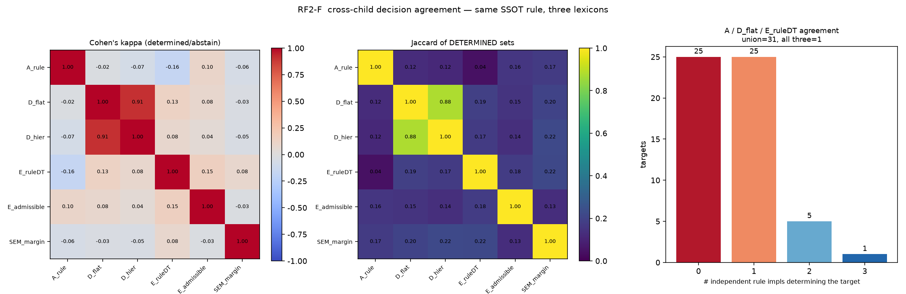
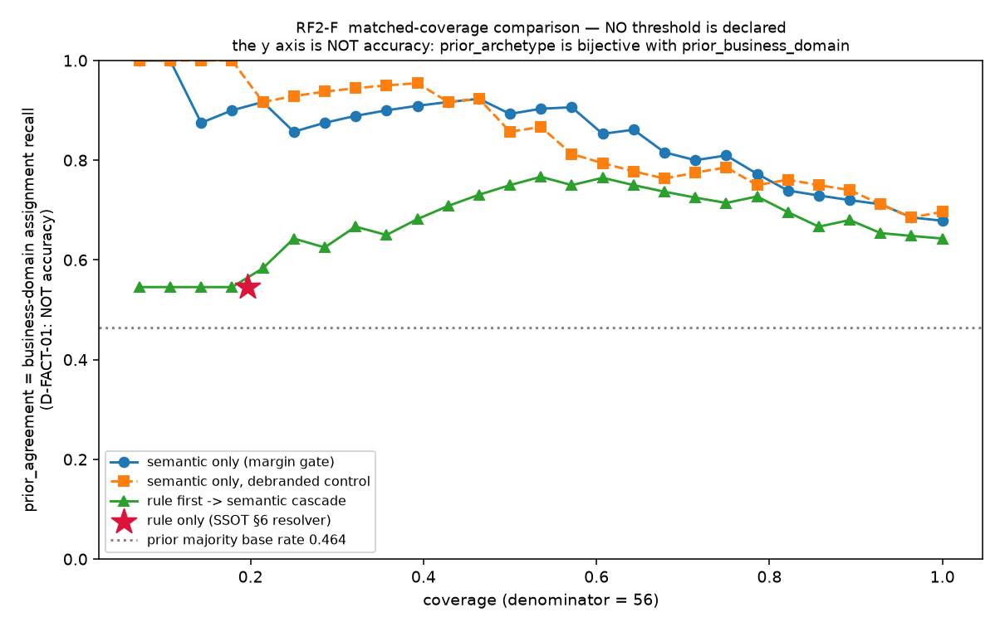
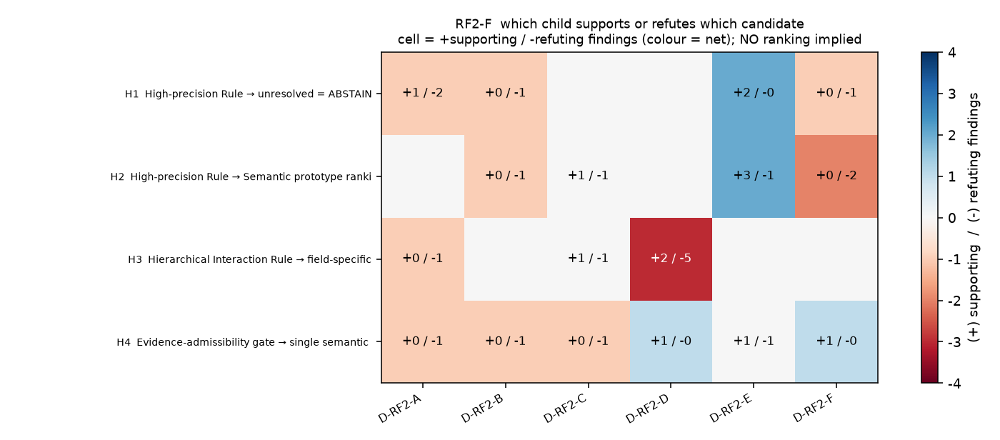
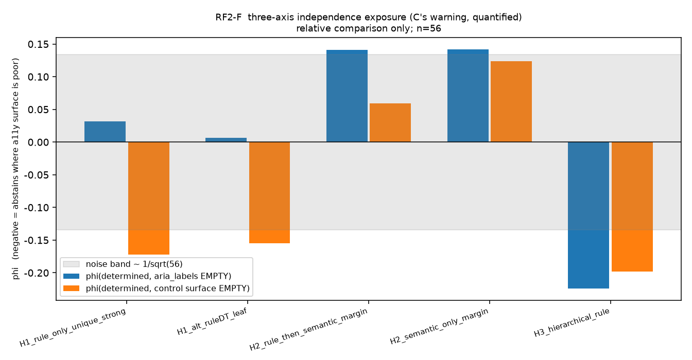
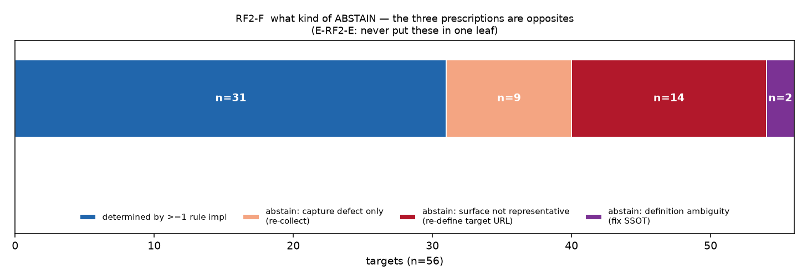

# D-RF2-F — Hybrid cascade candidate synthesis

| | |
|---|---|
| child_id | `D-RF2-F` |
| parent program | `RQ-D-RF-002` (parent run `ae754858ba3a4be391e5f811640d3fd8`) |
| hypothesis_id | `H-RF2-F-CASCADE-SYNTHESIS` |
| **VERDICT** | **`PARTIALLY_SUPPORTED`** |
| output_kind | **`RECOMMENDED_EXPERIMENTAL_CANDIDATES`** — best model 선정 아님, threshold 선언 아님, GO/NO-GO 아님 |
| plane / authority | D / `NON_CANONICAL` · claim_kind `ANALYSIS` · split `none` |
| MLflow run_id | `3aa6b7dfb6c8444d8187c0c8f43e186b` (experiment `LA_03_RF_MAPPING`) |
| code | `tools/rf2_f_cascade_synthesis.py` · sha256 `4de9f2e7290a02ae…` |
| result | `results/RF2_F_cascade_candidates.json` · sha256 `c6ac3e61a1e219bf…` |
| notebook | `notebooks/d_research/RF2_F_cascade_synthesis.ipynb` |
| seed | `20260827` · permutation B=20000 |

> **firewall.** holdout label · `LABEL_SPLIT_FROZEN*` · `HOLDOUT_FOR_C*` · `RAW_L1~L4*` ·
> `PACKET_L*` · `*_OVERLAP*` · `PRECEDENCE_CONTESTED*` · `CALIBRATION_FOR_B*` · `**/control/**` ·
> B/C 의 target-level holdout error report — **이 중 어느 것도 열지 않았다.** 입력은 §3 의 7개 파일이
> 전부다. 네트워크 없음. gold label 생성 없음. **A~E 의 산출물을 읽기만 했고 수정하지 않았다.**
> production/control/engine/mart/raw evidence 수정 없음. threshold 선언 없음.

---

## 0. 먼저 읽을 것 — D-FACT-01 프레이밍

이 56 target 표본에서 `prior_archetype` 과 `prior_business_domain` 은 **완전 전단사**다.

```
H(archetype) = H(domain) = MI = 2.311 bits
정규화 MI = 1.000        domain 이 archetype 을 유일하게 결정하는 target = 56/56
```

> **따라서 A~E 와 이 문서가 보고하는 모든 `prior_agreement` 는 "업종 배정 재현율" 이지
> 대표기능 정확도가 아니다.** 두 라벨은 같은 변수를 다르게 부른 것이다.
> 이 문서는 어떤 후보의 기대성능도 **"정확도"로 서술하지 않는다.**
> 근거: `results/D_FACT_01_prior_domain_bijection.md`.

이 사실은 이 문서 전체에서 반복된다. 특히 §7 의 "semantic-only 가 cascade 를 이긴다" 는
**업종을 더 잘 되찾는다**는 뜻이며, 대표기능에 대해 어느 후보가 나은지는 이 표본으로
**원리적으로** 말할 수 없다 (§13 limitation 1).

---

## 1. Master RQ — A~E 를 합치면 "무엇을 관측하면 무엇을 안다고 말할 수 있는가"

**L0 landing snapshot 하나를 관측하면 (a) 그 페이지가 지금 무엇을 하게 해 주는지에 대한
약한 증거와 (b) 그 서비스가 어느 업종인지에 대한 비교적 강한 증거를 얻는다.
대표기능은 얻지 못한다.**

이 구분이 가능한 이유는 세 개의 독립 관측이 같은 방향을 가리키기 때문이다.

1. **D-RF2-D §11.2** — Level 1 이 확정한 16건 중 7건이 `L1_QUERY_SUBMISSION` 인데
   그 중 prior 가 `QUERY` 인 것은 **1건(Google)** 뿐이다. 나머지는 코스트코·CJ온스타일·
   메가커피·11번가(ITEM_DETAIL), Netflix·YouTube(CONTENT_OPEN)다. 이유는 명확하다 —
   **랜딩에서 가장 완결된 interaction affordance 가 검색창이기 때문이다.**
   쇼핑·콘텐츠 서비스의 첫 화면은 상품/콘텐츠 카드를 다 갖추지 못한 브랜드 페이지인 반면,
   검색 input + submit 은 거의 항상 있다.
2. **D-RF2-A §14** — 규칙이 **유일 STRONG 후보 = prior** 를 낸 target 은 56건 중 **1건**이다.
   prior 는 후보 집합 안에는 대체로 들어오지만(WEAK+ 0.768) 규칙이 그것을 유일하게 지목하지 못한다.
3. **D-RF2-C §8** — 브랜드 문자열을 지우면 1위 `title` 이 0.559 → 0.357 로 무너지고
   `url_tokens` 는 0.361 → 0.138 로 사실상 전부 사라진다. 즉 "as collected" 신호의 상당 부분은
   **브랜드 식별 → 업종 → archetype 의 역추적**이다.

그리고 D-FACT-01 때문에 2·3의 "맞았다/틀렸다"는 전부 업종에 대한 것이다.

### 말할 수 있는 것

| 주장 | 근거 |
|---|---|
| 이 URL 이 렌더된 공개 web surface 를 갖는가 | Stage-0 로 결정적. 56 중 5건이 NO (E: T07) |
| 이 관측이 손상됐는가 | 인코딩·절단·오버레이·렌더희소는 결정적으로 관측된다 (E: CAPTURE_QUALITY 계열) |
| 이 페이지가 어느 업종인가 | semantic 순위로 상당 부분 되찾힌다 — **그리고 그것이 전부다** |
| 이 페이지가 지금 어떤 affordance 를 제공하는가 | 부분적으로. 규칙 술어가 발화한 것만 |

### 말할 수 없는 것

| 주장 | 왜 못 하는가 |
|---|---|
| 이 서비스의 대표기능이 무엇인가 | prior 가 업종과 전단사라 이 표본으로 원리적 검증 불가 (D-FACT-01) |
| 어느 detector 가 더 나은가 | 세 rule 구현의 확정집합 Jaccard 가 **0.043~0.190** 이다 (§5). 비교 기준선이 없다 |
| 어떤 threshold 가 옳은가 | calibration split 이 방화벽 밖이다 (SSOT 01 §7) |

---

## 2. A~E 요약 — 각 child 의 verdict 와 인용 수치

| child | verdict | 이 종합이 쓰는 핵심 수치 |
|---|---|---|
| **D-RF2-A** rule firing | `SUPPORTED` | STRONG multi **30/56** > single 13/56 · WEAK+ multi 50/56 · **exclusivity 7개 중 6개가 0.000** · WEAK+ Jaccard 가 0.364 아래인 쌍 **없음**(비분리성 전역) · 유일 STRONG = prior **1/56** · UTILITY STRONG 32/56, WEAK+ 52/56 (residual) |
| **D-RF2-B** feature | `PARTIALLY_SUPPORTED` | 16 feature 중 BH-FDR(q<0.10) 통과 **0개** · 8개는 permutation null 평균 미달 · 실효차원 **6.37**(독립 null 12.51) · 상위는 구조량 `accessible_name_richness` MI 0.264 · 제1성분(33%)이 **페이지 규모** |
| **D-RF2-C** field ablation | `PARTIALLY_SUPPORTED` | `primary_controls` **0.254** · `accessibility_text` 0.224 vs `text_blob` **0.509** — 절반 이하 · 브랜드 마스킹 후 `title` 0.559→0.357, `text_blob` 0.478 로 1위 · blob vs controls 갈린 25건에서 **23 : 2** · margin 중앙값이 22개 전부 0.016~0.036 (field 구분 불가) |
| **D-RF2-D** hierarchical | `NOT_SUPPORTED` | 계층 이득 **0** (McNemar **b=0, c=0**) · coverage 14→16 인데 prior_agreement 5/56 → 5/56 불변 · **병목은 L1**(40건 손실), L2 손실 **0** · L1 일치 9/16 < 다수결 13/16 · L1 후보제한이 semantic 을 9/16 → 6/16 으로 **낮춤** |
| **D-RF2-E** abstention | `PARTIALLY_SUPPORTED` | `NO_STRONG_CANDIDATE` 는 **증상** — 무발화 12 중 11 설명됨 · force-map 불일치 rule **0.750** / first-match **0.775** / semantic 0.375 · margin 5분위 2~3분위 사이 꺾임(0.455 → 0.727) · 표면부재 22 / 관측손상 22 / 둘 다 10 (abstain 40 기준) |

---

## 3. 입력 · 분석단위 · N

| 파일 | sha256 (앞 16) |
|---|---|
| `results/D_OBSERVATION_TABLE_v2.csv` | `c39c10f09f7a6a76` |
| `results/D_TEXT_CORPUS_v2.csv` | `bf6bb772faa45541` |
| `results/RF2_A_rule_firing.json` | `189a1ba7232cd589` |
| `results/RF2_B_feature_discriminability.json` | `61f5df5e356cc20e` |
| `results/RF2_C_field_ablation.json` | `1ad4bdec4cc72208` |
| `results/RF2_D_hierarchical.json` | `306557bfa4289e61` |
| `results/RF2_E_abstention_taxonomy.json` | `eaab14e60ea5b7e3` |

- **분석단위**: target (`wtg`), `in_mart == 1`. **N = 56** (n_expected 56, n_observed 56).
- prior class: ITEM_DETAIL 26 · FINANCIAL_ACTION_ENTRY 10 · UTILITY_ENTRY 5 ·
  COMMUNICATION_ENTRY 4 · PLACE_LOOKUP 4 · QUERY 4 · CONTENT_OPEN 3 — **5개 class 가 n ≤ 5.**
- 이 문서는 **새 실험을 하지 않았다.** A~E 의 산출물을 교차 종합한 2차 분석이며
  각 child 의 조작화를 그대로 상속한다.
- semantic 축 수치는 E 가 독립 재계산한 `bge-m3 × A_SSOT_DEF prototype × text_blob` 하나에 의존한다.
- 이 문서가 쓴 semantic gate `0.016677` 은 **이 코호트 margin 분포의 40% 분위수**이며
  **운영 threshold 가 아니다.** 곡선 대조를 위한 기술적 절단점일 뿐이다.

---

## 4. 판정 일치·불일치 행렬

그림: `figures/RF2_F_agreement_matrix.png` · `figures/RF2_F_decision_matrix.png`

각 컬럼은 **그 child 자신의 결정규칙**을 그대로 적용한 것이다.

| 컬럼 | 결정규칙 | DETERMINED |
|---|---|---:|
| `A_rule` | `RF2A_FIRING_v1` + SSOT §6 (유일 STRONG) | 13/56 |
| `D_flat` | `RF2D_HIER_v1` flat branch, MAPPED | 14/56 |
| `D_hier` | `RF2D_HIER_v1` 계층, MAPPED | 16/56 |
| `E_ruleDT` | RF001-A rule DT leaf (제3의 독립 lexicon) | 11/56 |
| `E_admissible` | 표면부재·관측손상 유형이 하나도 없음 | 9/56 |
| `SEM_margin` | semantic margin ≥ 40% 분위수 | 34/56 |

### 4.1 pairwise (raw agreement / Cohen κ / DETERMINED 집합 Jaccard)

| pair | 둘 다 확정 | 둘 다 abstain | 불일치 | raw | **κ** | **Jaccard** |
|---|---:|---:|---:|---:|---:|---:|
| `A_rule` × `D_flat` | 3 | 32 | 21 | .625 | **−0.024** | **0.125** |
| `A_rule` × `E_ruleDT` | **1** | 33 | 22 | .607 | **−0.165** | **0.043** |
| `D_flat` × `E_ruleDT` | 4 | 35 | 17 | .696 | 0.128 | 0.191 |
| `A_rule` × `D_hier` | 3 | 30 | 23 | .589 | −0.066 | 0.115 |
| `D_flat` × `D_hier` | 14 | 40 | 2 | .964 | **0.909** | 0.875 |
| `A_rule` × `SEM_margin` | 7 | 16 | 33 | .411 | −0.057 | 0.175 |
| `D_flat` × `SEM_margin` | 8 | 16 | 32 | .429 | −0.032 | 0.200 |
| `E_ruleDT` × `SEM_margin` | 8 | 19 | 29 | .482 | 0.084 | 0.216 |
| `E_ruleDT` × `E_admissible` | 3 | 39 | 14 | .750 | 0.150 | 0.177 |

> **이 표가 이 종합의 첫 번째 결과다.** `D_flat` × `D_hier` (κ 0.909) 만 높은데, 이 둘은
> **같은 코드 안의 두 구조**라 lexicon 이 동일하다. **서로 다른 lexicon 으로 같은 SSOT §5·§6 를
> 구현한 세 쌍은 전부 우연 수준(κ −0.165 ~ +0.128)이다.**

### 4.2 세 독립 rule 구현의 확정 다중도

| 몇 개 구현이 확정하는가 | 0 | 1 | 2 | 3 |
|---|---:|---:|---:|---:|
| target 수 | **25** | **25** | 5 | **1** |

- 합집합 = **31/56**, 교집합 = **1/56**.
- 2개 이상이 확정한 6건 중 5건이 같은 leaf 를 낸다. 그런데 **그 5건 중 4건이 `QUERY` 이고
  prior 는 ITEM_DETAIL/CONTENT_OPEN 이다** — D-RF2-D §11.2 의 "검색창 흡수" 현상이
  세 구현에서 독립적으로 재현된다.
- 구현별 업종 재현율(확정 구간 조건부, Wilson 95%):
  `A_rule` 1/13 = 0.077 [.014, .333] · `D_flat` 5/14 = 0.357 [.163, .612] ·
  `E_ruleDT` 6/11 = 0.545 [.280, .787]. **CI 가 전부 겹친다.**

### 4.3 갈리는 target 과 갈리는 이유

6개 컬럼이 만장일치가 아닌 target은 **46/56** 이다. 전량은 JSON `split_targets` 에 있고
사유가 각 target 에 붙어 있다. 사유 유형은 다섯 가지다.

| 사유 | 성격 |
|---|---|
| **rule lexicon 조작화 차이** (같은 SSOT §5, 다른 어휘·임계) | 가장 흔함. §4.1 의 낮은 κ 가 target 수준에서 이렇게 나타난다 |
| 계층 L1 이 flat 이 못 닫은 것을 닫음 | 2건. 둘 다 prior 불일치 (GS25 · 이마트, D-RF2-D §11.1) |
| archetype 이 primitive 2개 소속이라 L1 다중후보 | S2s 에서 flat 확정 3건 손실 (밴드 · 신세계백화점 · CU) |
| **semantic margin 은 높은데 어떤 rule 도 발화 안 함** | §8 의 semantic confidence trap 으로 이어진다 |
| rule 은 유일 후보를 냈으나 semantic top1-top2 가 붙어 있음 | 규칙 확정 ≠ semantic 확신 |

**전량 abstain(6컬럼 모두)인 target 은 10건**이다: V3 Mobile Plus · 카카오톡 · 네이버 ·
현대카드 · 농협하나로마트 · 하나은행 · 에이닷 전화 · 배달의민족 · 내 파일 · 모니모.
이 10건의 E 유형을 보면 무발화·인코딩 손상·오버레이·브랜드면·로그인 지배·다중강후보가 섞여
있다 — **원인이 하나가 아니다.**

**퇴화 컬럼 (행렬에서 제외)**

- **D-RF2-B**: target-level 결정을 내지 않는다. B 의 결론(FDR 통과 0/16)을 결정규칙으로 옮기면
  **56/56 ABSTAIN** 인 퇴화 컬럼이 되어 κ 를 계산할 수 없다.
- **D-RF2-C (`text_blob`)**: C 의 사전등록 규약은 "빈 representation = ABSTAIN" 인데
  `text_blob` 은 56/56 이 비어있지 않아 역시 퇴화한다. C 가 per-target 으로 남긴 유일한 판정은
  **blob 예측과 control 표면 예측이 갈린 25건(blob 맞음 23 : controls 맞음 2)** 이며,
  그것은 결정 컬럼이 아니라 **representation 선택의 대가**를 재는 관측이다.

---

## 5. 종합질문 2 — deterministic evidence 만으로 식별 가능한 target 은 어떤 성질을 갖는가

**가장 두드러진 성질은 "그 성질이 target 이 아니라 lexicon 에 있다" 는 것이다.**

세 독립 구현의 합집합 31, 교집합 1, Jaccard 0.043~0.190, κ −0.165~+0.128.
**같은 SSOT §5·§6 를 어휘만 바꿔 구현하면 다른 target 집합이 열린다.**
"결정 가능한 target" 은 이 표본에서 안정된 개념이 아니다.

그 위에서 관측되는 부차적 성질:

| 지표 (중앙값) | ≥1 구현 확정 (31) | 세 구현 모두 실패 (25) |
|---|---:|---:|
| blob 토큰 | 177 | 101 |
| E `n_fired` (발화 술어 수) | 2 | 1 |
| semantic margin | 0.0327 | 0.0190 |

> **즉 규칙이 닫는 target 은 semantic 도 이미 닫는 target 이다.** 이것이 §9 의 답으로 이어진다.

교차 확인 (A 의 유일 STRONG · D 의 flat 확정 14 · E 의 mapped 11):

- A 의 유일 STRONG 13건 중 prior 일치 **1건**.
- D flat 14건 중 5건, E 11건 중 6건.
- 세 구현이 모두 확정한 **유일한 1건**은 CJ온스타일이고, 셋 다 `QUERY` 로 닫았는데
  prior 는 `ITEM_DETAIL` 이다 → §11 반례 1.

prior class 분포: 확정 31건은 ITEM_DETAIL 18 · PLACE_LOOKUP 4 · CONTENT_OPEN 3 ·
FINANCIAL 3 · COMMUNICATION 2 · QUERY 1 · UTILITY **0**.
**UTILITY_ENTRY 5건은 어느 구현으로도 확정되지 않는다** — C 의 "22개 representation 중
18개에서 UTILITY recall 0/5" 와 같은 방향이다.

---

## 6. 종합질문 3 — semantic evidence 를 더해야 하는 target 은 어떤 성질인가

**표면이 관측됐고 손상도 없는데 술어가 배타적으로 발화하지 못한 target** 이다.
E 의 유형으로는 `T02_WEAK_ONE_SIDED_EVIDENCE`(abstain 40 중 22 — 최대 유형)와
`T03_MULTI_STRONG_CANDIDATE`(6)다.

| 유형 | force-map 불일치 rule | semantic | 판정 |
|---|---:|---:|---|
| T02 한쪽 신호만 | 0.68 | **0.23** | semantic 이 실제로 보탠다 |
| T03 다중 강후보 | 0.50 | **0.67** | **semantic 이 더 나쁘다** |

> **T03 이 중요하다.** SSOT §6 은 다중 강후보를 §7 NLP fallback 으로 보내라고 규정하는데,
> 이 표본에서 §7 이 그 6건을 **rule 보다 못 가른다.** n=6 이라 결론은 아니지만
> **"semantic 이 ambiguity 를 푼다"는 전제가 검증되지 않았다는 사실 자체가 결과다.**

### 6.1 그리고 이 답은 §8 에서 크게 좁아진다

§8 의 semantic confidence trap 을 반영하면: 규칙이 전부 실패했는데 semantic margin 이 높은
14건 중 **10건이 표면부재 target** 이고, 진짜로 정의상 애매해서 semantic 이 필요한 것은
**2건(G마켓 · 당근)** 뿐이다.
**"semantic evidence 를 더해야 하는 target" 은 이 코호트에서 극소수다.**

---

## 7. 정량 종합 — cascade vs semantic-only (coverage 를 맞춘 대조)

그림: `figures/RF2_F_coverage_tradeoff.png`

> **y축은 정확도가 아니다.** `prior_agreement` = 업종 배정 재현율 (D-FACT-01).
> **이 절은 threshold 를 선언하지 않는다.**

| coverage n | semantic only | semantic only (debranded) | rule-first cascade | Δ(cascade − sem) |
|---:|---:|---:|---:|---:|
| 56 | 0.679 | 0.696 | 0.643 | −0.036 |
| 48 | 0.729 | 0.750 | 0.667 | −0.062 |
| 40 | 0.800 | 0.775 | 0.725 | −0.075 |
| 36 | 0.861 | 0.778 | 0.750 | −0.111 |
| 32 | **0.906** | 0.812 | 0.750 | −0.156 |
| 24 | 0.917 | 0.917 | 0.708 | −0.209 |
| 16 | 0.875 | 0.938 | 0.625 | −0.250 |

**모든 대조점에서 Δ ≤ 0 이다. rule-first cascade 가 semantic-only 를 한 번도 이기지 못한다.**

짝지은 대조 — rule 이 **실제로 확정한 11건**에서:

| | prior 일치 |
|---|---:|
| rule leaf | 6/11 |
| 같은 11건의 semantic top1 | **8/11** |
| rule 만 맞음 (b) | **0** |
| semantic 만 맞음 (c) | 2 |
| McNemar exact p | 0.5 (n=2, 유의하지 않음) |

> **b = 0.** 규칙이 맞고 semantic 이 틀린 target 이 **하나도 없다.**
> 이 표본에서 rule stage 는 semantic 이 이미 되찾는 업종 배정 위에 아무것도 얹지 못한다.
> **다시 강조 — 이것은 업종 배정에 대한 진술이다.** 대표기능에 대해 rule 이 무가치하다는
> 뜻이 아니며, 이 표본으로는 그것을 물을 수 없다.

---

## 8. semantic confidence trap — 이 종합에서 가장 불편한 관측

규칙이 **전부 실패**했는데 semantic margin 이 상위 60% 안에 드는 target 은 14건이다.
그 14건을 원인별로 가르면:

| 성격 | n | 서비스 |
|---|---:|---|
| **표면부재** (브랜드면·앱설치면·미렌더) | **10** | Chrome · GS25 · NH스마트뱅킹 · NH콕뱅크 · emart24 · 디바이스 케어 · 롯데하이마트 · 마켓컬리 · 신한 SOL뱅크 · 캐시워크 |
| 관측손상만 | 2 | — |
| 진짜 정의 애매 | **2** | G마켓 · 당근 |

E 가 이미 같은 것을 다른 각도에서 보고했다 — *"표면부재 유형을 먼저 abstain 시킨 캐스케이드는
같은 coverage 에서 prior_agreement 가 오히려 낮다. 브랜드면의 텍스트가 그 서비스의 업종을
강하게 말해주기 때문이다."*

> **따라서 "규칙이 실패한 곳에 semantic 을 붙이면 coverage 가 는다" 는 처방은
> 정확히 붙이면 안 되는 곳에 붙는다.** §7 에서 semantic-only 가 이기는 이유의 상당 부분이
> 이것이다. 이 관측이 §12 의 "가장 작은 충분구조" 를 추천으로 만들지 않는 이유다.

---

## 9. 종합질문 4 — 원칙적으로 ABSTAIN 이 정직한 target 은 몇 건이고 왜인가

그림: `figures/RF2_F_abstain_partition.png`

세 rule 구현이 모두 확정에 실패한 **25건**을 원인으로 가르면:

| 성격 | n | 처방 | 이 abstain 은 정직한가 |
|---|---:|---|---|
| **표면부재** (T05/T06/T07) | **14** | **target URL 재정의** | **예 — 원칙적 미결정** |
| 관측손상만 (T09/T10A/T10B/T11/T12) | **9** | 재수집 | **아니오 — 지금은 잘못된 종류의 abstain** |
| 둘 다 아님 (정의 문제) | **2** | SSOT §5 술어 상호배타화 / §6 precedence | 정의를 안 고치면 예 |

### 답: **14건(하한)**, SSOT 정의를 고치지 않는 한 못 푸는 것까지 포함하면 **16건**.

**왜 detector 문제가 아닌가.** 14건 중 5건은 아예 렌더된 표면이 없거나 error 면이고(T07),
나머지는 브랜드 소개면·앱 설치 유도면이다. E 가 든 사례 — 탑마트 → `seowon.com`,
카카오T → `kakaomobility.com/service-kakaot` — 처럼 **요청 URL 이 서비스의 기능면이 아니라
그 서비스를 설명하는 면**으로 해석된 사례가 반복된다. 같은 URL 을 더 정교하게 관측해도
없는 표면은 생기지 않는다. 14건 중 **10건은 관측손상까지 겹쳐** 있어서 재수집으로도 안 된다.

prior 분포: ITEM_DETAIL 5 · UTILITY_ENTRY 4 · FINANCIAL 3 · COMMUNICATION 1 · QUERY 1.
**UTILITY_ENTRY 는 5건 중 4건이 여기 있다.**

> **caveat (E limitation 4).** 해결가능성 판정은 **반사실 주장**이다. "관측손상 9건이 풀린다"도
> "표면부재 14건이 안 풀린다"도 재수집 실험 전에는 가설이다. 이 14건은 그 가설 위에 서 있다.

---

## 10. RECOMMENDED_EXPERIMENTAL_CANDIDATES

그림: `figures/RF2_F_candidate_evidence.png` · `figures/RF2_F_leakage_exposure.png`

> **순위를 매기지 않는다.** 조건과 대가만 병기한다.
> **반증된 후보를 목록에서 지우지 않는다** — 지우면 다음 사람이 같은 설계를 다시 제안한다.
> 4개 후보 전부 이 코호트에서 각각 다른 child 에게 반증당했다.

### 10.0 네 후보가 공유하는 abstention semantics (E 의 결론)

`AMBIGUOUS_UNRESOLVED` 단일 leaf 는 **금지**다. 최소 네 갈래가 필요하다.

| leaf | 의미 | 처방 | 이 코호트 n/56 |
|---|---|---|---:|
| `SURFACE_NOT_REPRESENTATIVE` | 관측된 표면이 대표기능면이 아니다 (T05/T06/T07) | **target URL 감사** | 28 |
| `EVIDENCE_DEFECT` | 관측 자체가 손상됐다 (T09/T10A/T10B/T11/T12) | **재수집 큐** | 34 |
| `GENUINELY_AMBIGUOUS` | 표면 있고 손상 없는데 정의상 후보가 갈린다 (T02/T03/T04) | **SSOT §5/§6 수정** | 30 |
| `PRIOR_CONFLICT_UNRESOLVABLE_WITHOUT_LABEL` | 구조와 business prior 가 어긋난다 (T13) | **독립 gold label** | 17 |

(유형은 중복 보유가 허용되므로 합이 56을 넘는다.)
**표면부재와 관측손상을 같은 leaf 로 묶으면 처방이 정반대인 케이스가 한 통에 들어가
coverage 통계가 무의미해진다.** 이것이 E 의 한 줄 결론이다.

모든 후보의 **공통 calibration requirement**:

1. gold label 이 붙은 **독립 calibration split** — D 는 열지 않았고, 이것 없이는 어떤 threshold 도 못 정한다.
2. **평가 지표를 `prior_agreement` 로 두면 안 된다** — D-FACT-01. prior 로 튜닝하면 업종 분류기가 만들어진다.
3. abstention leaf 4종의 판정식 — 현재 전부 D 의 조작화다.
4. **재수집 반사실 검증** — E 의 RESOLVABLE 판정은 가설이지 결과가 아니다.

---

### H1 — High-precision Rule → unresolved = ABSTAIN

`status: RETAINED_WITH_KNOWN_REFUTING_EVIDENCE`

| 항목 | 내용 |
|---|---|
| **deterministic / semantic 경계** | **전부 deterministic.** semantic 단계 없음 |
| **필요 evidence** | slot: L0 landing snapshot (DOM+AX). field: buttons · aria_labels · nav_links · form_labels · placeholders · input_names · card_texts · landmarks · title · headings · url_tokens + 구조 카운터(search_inputs_n · article_present · gate_password_input_n · n_primary_action_candidates · dom_body_text_len) |
| **관측된 coverage** | A 조작화 13/56 = 0.232 [.141, .358] · E 조작화 11/56 = 0.196. **두 수치의 차이가 곧 이 후보의 최대 취약점이다** |
| **operational complexity** | **LOW** — 학습 없음, 모델 없음, 결정론적 |
| **explainability** | **HIGH** — 어느 술어가 어느 field 의 어느 어휘로 발화했는지 target 마다 남는다 |
| **cost** | coverage 0.20~0.25. SSOT §10 의 `holdout coverage >= 0.75` 도달 불가 |

**지지 증거**

- **D-RF2-E** — force-map 비용이 이 후보의 존재이유다. abstain 40건에 rule argmax 를 강제하면
  prior 불일치 **0.750**, SSOT §6 이 금지한 first-match 는 **0.775**. 기저율 0.46 보다 나쁘다.
- **D-RF2-E** — `rule_conf = 0` 인 17건의 구간별 prior_agreement 는 **0.000**. 강제로 넣으면 한 건도 안 맞는다.
- **D-RF2-A** — 증거 부재는 지배적 실패가 아니다(STRONG 13/56, WEAK+ 4/56). H-A3 `REFUTED`.

**반증 증거**

- **D-RF2-A** — 유일 STRONG 후보가 나오는 target 은 **13/56** 뿐이고 STRONG multi 30/56 이 압도한다.
  **exclusivity 7개 중 6개가 0.000** — WEAK+ 수준에서 어떤 archetype 도 혼자 켜지지 못한다.
  즉 "유일 후보" 조건 자체가 이 증거에서 거의 성립하지 않는다.
- **D-RF2-A** — 유일 STRONG 후보 = prior 는 **1/56**. 유일성이 타당성을 뜻하지 않는다.
- **D-RF2-B** — 규칙이 딛고 선 16개 feature 중 **FDR 통과 0개**, 8개는 null 평균 미달.
  규칙 술어의 근거는 이 데이터가 아니라 도메인 지식이다.
- **D-RF2-F** — 세 독립 구현이 모두 확정한 target 은 **1/56**, Jaccard 0.043~0.190, κ −0.165~+0.128.
  **"결정 가능한 target" 은 target 의 성질이 아니라 lexicon 의 성질이다.**

**expected failure mode** (E taxonomy) — T03 다중강후보 / T02 한쪽 신호만(최대 유형, 22) /
T01 무발화(단 증상) / T10A 인코딩 손상(force-map 불일치 1.00).

**leakage risk = MEDIUM.** 규칙의 `CTRL()` 술어가 buttons·aria_labels·form_labels 를 직접 읽는다.
측정: φ(확정, aria_labels 빈칸) = **+0.031** (perm p .88), φ(확정, control 표면 빈칸) = **−0.172** (p .27).
확정률 aria 빈칸 5/20 vs 있음 8/36.

**추가 calibration** — lexicon 을 SSOT 에 명문화해야 한다(세 구현의 어휘 차이가 확정집합을 지배한다) ·
endpoint 강등 유지 여부 · `UTILITY_ENTRY` 의 endpoint 는 56 중 52건에서 참이라 재정의 없이는 residual.

---

### H2 — High-precision Rule → Semantic prototype ranking → margin low = ABSTAIN

`status: RETAINED_WITH_PARTIAL_REFUTATION_OF_ITS_RULE_STAGE`

| 항목 | 내용 |
|---|---|
| **deterministic 부분** | 1단계 규칙(H1 과 동일) + Stage-0 게이트 + abstention leaf 배정 |
| **semantic 부분** | 2단계 — **하나의** 텍스트 representation × 7 frozen prototype 코사인, top1−top2 margin 게이트. 학습 없음 |
| **필요 evidence** | semantic 단계 입력은 C 가 상위군으로 잰 `text_blob`(12 field) 또는 `identity`(title+meta+url). **`primary_controls` / `accessibility_text` 를 주 입력으로 쓰면 안 된다** (0.254 / 0.224 vs blob 0.509) |
| **관측된 coverage** | rule 단계만 13/56 · 선언 gate 에서 cascade 40/56 · 같은 gate 의 semantic-only 34/56 |
| **operational complexity** | **MEDIUM** — 임베딩 모델 1개 + prototype 7문장 + 게이트 1개 |
| **explainability** | **MEDIUM** — 1단계는 provenance 가 남지만 2단계는 코사인 순위라 field 수준 역추적 불가 |
| **cost** | coverage 를 얻는 대신 "무엇을 관측했는가" 가 흐려진다. 그리고 관측된 이득은 **업종 배정 재현율의 이득**으로만 확인됐다 |

**지지 증거**

- **D-RF2-E** — margin 5분위에서 하위 2분위(0.364 / 0.455)와 상위 3분위(0.727 / 0.909 / 0.917)
  사이가 꺾인다. margin 은 이 코호트에서 확정 가능성과 단조 관계를 갖는다.
- **D-RF2-E** — 규칙이 침묵하는 구간에서 semantic force-map 불일치 0.375 vs rule 0.750.
- **D-RF2-E** — debranded 대조군에서도 곡선이 거의 안 움직인다(coverage 1.00: 0.679 → 0.696).
- **D-RF2-C** — field 간 정보량 차이가 prototype 문구 노이즈의 3.3~4.9배. 입력 선택은 실재하는 설계 결정이다.

**반증 증거**

- **D-RF2-F — 이 후보의 1단계가 반증된다.** 같은 coverage 로 맞추면 rule-first cascade 가
  semantic-only 를 **한 번도 이기지 못하고**(모든 대조점 Δ ≤ 0), rule 이 확정한 11건에서
  McNemar **b=0**, c=2 다. 규칙 단계는 이 표본에서 순수 비용이다.
  (단 지표가 업종 배정 재현율이므로 "규칙이 대표기능에 무가치" 라는 뜻은 아니다.)
- **D-RF2-C** — **margin 을 게이트로 쓰는 것이 반증된다.** 22개 representation 전부 margin
  중앙값이 0.016~0.036 의 좁은 띠라 margin 은 field 를 구분하지 못하고, `form_labels` 는
  39/56 이 비었는데 margin 은 평균보다 **높다** — **정보가 없을수록 margin 이 커지는 역전**이 있다.
- **D-RF2-E** — SSOT §6 이 §7 로 보내라고 한 T03 6건에서 semantic 불일치(0.67)가 rule(0.50)보다
  **높다**. 2단계가 1단계의 실패 유형을 실제로 가른다는 증거가 없다.
- **D-RF2-B** — prior 를 되찾는 신호의 상당 부분이 **페이지 규모 축**일 수 있다(제1성분 33%,
  상위 feature 가 의미 없는 구조량).
- **D-RF2-F — semantic confidence trap.** 규칙이 전부 실패했는데 semantic margin 이 높은 14건 중
  **10건이 표면부재 target** 이다. 2단계가 열어 주는 coverage 는 **정확히 열면 안 되는 곳에서** 열린다.

**expected failure mode** — T05 브랜드면(semantic 이 잘 맞지만 업종을 맞힌 것) / T03 다중강후보 /
T10A 인코딩(semantic 불일치 0.57) / T06 앱설치면(0.55).

**abstention semantics 추가** — margin 이 낮아서 abstain 한 것(`LOW_CONFIDENCE_SEMANTIC`)과
표면이 없어서 abstain 한 것(`SURFACE_NOT_REPRESENTATIVE`)을 같은 leaf 로 묶으면 안 된다.

**leakage risk = LOW~MEDIUM.** semantic 단계가 `text_blob`/`identity` 를 쓰면 접근성 텍스트 의존도가
낮다 — C 의 LOO ablation 에서 `aria_labels` 기여 Δ+0.035, `form_labels` Δ+0.030 이고
`input_names`(Δ−0.072)·`placeholders`(Δ−0.088)는 blob 안에서 오히려 노이즈다.
측정: φ(확정, aria 빈칸) = **+0.141** (p .30) — **부호가 양수다**(접근성 나쁜 페이지에서 오히려
더 확정한다). 대신 **브랜드/업종 어휘 순환이라는 다른 종류의 누출**이 남는다.

**추가 calibration** — margin threshold(**D 는 정하지 않는다**) · prototype 세트 동결과 provenance ·
embedding 모델 고정(e5-small 에서는 field 효과가 문구 노이즈에 묻힌다: 0.098 vs 0.103) ·
representation 은 **brand-masked 조건에서 다시** 재야 한다 · 인코딩 검증을 파이프라인 게이트로
(C §10: mojibake 8/56 이 짧은 field 를 12.5%p 떨어뜨렸는데 blob 지표로는 1.2%p 로만 보였다).

---

### H3 — Hierarchical Interaction Rule → field-specific semantic ranking → conflict = ABSTAIN

`status: RETAINED_BUT_ALREADY_PARTIALLY_REFUTED` — **목록에서 지우지 않는다.**

> **왜 남기는가.** 반증된 후보를 지우면 다음 사람이 같은 설계를 다시 제안한다.
> 반증 사실과 함께 남기는 것이 이 문서의 산출물이다.

| 항목 | 내용 |
|---|---|
| **deterministic 부분** | L1 primitive 판정 + L2 후보 제한 + 충돌 게이트 |
| **semantic 부분** | L2 — primitive member 로 제한된 후보 위의 **field-specific** 유사도 순위 |
| **필요 evidence** | L1: 20개 atomic predicate(SEARCH_INPUT / ITEM_CARDS / PRICE / TXN_CTRL / LOGIN_GATE / FIN_HEAD / TOOL_PRIMARY …). L2: **field 별로 분리된** 텍스트 표면 |
| **관측된 coverage** | hier 16/56 = 0.286 [.184, .415] vs flat 14/56. **prior_agreement 는 5/56 → 5/56 불변** |
| **operational complexity** | **HIGH** — 2층 규칙 + field 별 임베딩 + 충돌 게이트. 네 후보 중 가장 비싸다 |
| **explainability** | L1 은 MEDIUM-HIGH, L2 는 LOW. 다만 실패 지점 특정은 쉽다 — D 가 "병목은 L1" 이라고 말할 수 있었던 것이 이 구조 덕이다 |
| **cost** | **가장 비싼 구조에 대해 관측된 이득이 정확히 0.** 게다가 제대로 만들려면 SSOT 의 archetype 정의를 먼저 손대야 한다 |

**어떤 증거가 이 후보를 지지하는가** (드물다)

- **D-RF2-D** — L2 에서 손실이 **0**(16/16). 일단 L1 이 닫히면 그 안에서는 후보가 갈리지 않는다.
- **D-RF2-D** — 계층이 flat 을 잃지 않고 감싼다(S2): 같이 매핑한 14건에서 예측 100% 동일, flat 만 매핑 0건.
- **D-RF2-C** — field 마다 정보량이 실제로 다르다(macro F1 0.030~0.559, field sd 가 prototype 노이즈의 3.3배).
  **field-specific 이라는 발상 자체는 근거가 있다.**

**어떤 증거가 이 후보를 지지하지 않는가** (이것이 핵심이다)

- **D-RF2-D — 핵심 반증.** 계층 이득이 **0** 이다. flat 과 hier 의 prior 일치 여부가 target 단위로
  완전히 같다 — **McNemar b=0, c=0.** 늘어난 coverage 2건(GS25 · 이마트)은 둘 다 prior 불일치라
  prior_agreement 는 5/56 → 5/56 으로 불변이다.
- **D-RF2-D** — **병목은 L1 이다.** Stage0 6 / L1 무후보 19 / L1 다중후보 15 로 40건을 L1 에서 잃고
  L2 에서는 0건을 잃는다. 계층을 넣어도 손실 구조가 바뀌지 않는다.
- **D-RF2-D** — L1 은 쉽지 않다. L1 이 닫은 16건의 prior primitive 일치 9/16 = 0.5625 는
  같은 16건의 다수결 기준선 13/16 = 0.8125 **보다 낮다.**
- **D-RF2-D** — L1 의 후보 제한이 semantic arm 에서 정보를 **뺀다**: 동일 16건에서
  제한 없는 7-way argmax 9/16 → 제한 후 6/16 (McNemar p=0.375, 방향은 음).
- **D-RF2-D** — SSOT §5 branch tree 는 primitive 위의 **분할이 아니다** — `PLACE_LOOKUP` 과
  `COMMUNICATION_ENTRY` 가 primitive 2개에 걸친다. 엄격히 강제하면(S2s) flat 이 확정하던
  3건(밴드 · 신세계백화점 · CU)을 **그 이유만으로** 잃는다.
- **D-RF2-C — field-specific semantic 이 반증된다.** `primary_controls` 0.254 ·
  `first_screen_interaction` 0.257 · `accessibility_text` 0.224 로 `text_blob` 0.509 의 절반 이하이며
  **세 모델 모두에서 하위권**이다. blob 예측과 controls 예측이 갈린 25건 중 blob 이 맞은 것이
  **23**, controls 가 맞은 것이 **2** 다.
- **D-RF2-A** — L1 이 겨냥한 list-family 얽힘은 **국소 문제가 아니다.** family 6쌍의 평균 Jaccard
  (STRONG 0.145 / WEAK+ 0.548)가 나머지 15쌍(0.213 / 0.581)보다 오히려 **낮다**.
  최강 얽힘 쌍은 F–U, Q–U 로 family 를 가로지른다.

**expected failure mode** — T04 공유 list 신호(L1 이 없애려던 바로 그 유형인데 primitive 층이 그대로
재생산) / T03 다중강후보(L1 다중후보 15건의 최빈 충돌이 "검색창 + 반복 카드") / T02 / T09 렌더희소
(field 를 쪼갤수록 빈 field 가 늘고 C 규약상 빈 representation 은 abstain).

**abstention semantics 추가** — **L1 abstain 과 L2 abstain 을 구분하는 leaf 가 추가로 필요하다.**
`L1_MULTI`(정의 문제)와 `L1_NONE`(증거 문제)은 원인이 다르고, L2 손실은 0 이라 사실상 발생하지 않는다.

**leakage risk = HIGH — 네 후보 중 최대.** field-specific semantic 의 "좋은 field" 후보가
정확히 접근성 표면(aria_labels / form_labels / placeholders / input_names)이다.
C 가 지적한 위험이 여기서 최대가 된다: **접근성이 나쁜 페이지에서 Axis A 와 RF detector 가
함께 무너져 SSOT 의 "세 축 독립" 이 통계적으로 깨진다.**

측정: φ(확정, aria_labels 빈칸) = **−0.224** (perm p **0.087**), φ(확정, control 표면 빈칸) = **−0.198** (p .29).
확정률 **aria 빈칸 3/20 (0.15) vs 있음 13/36 (0.36).**
네 후보 중 두 φ 가 모두 음수이고 잡음 대역(±0.134) 밖으로 나가는 유일한 후보다.
**n=56 이므로 정량 확증이 아니라 후보 간 상대 노출도로만 읽어야 한다** — 다만 방향이
C 의 정성 경고와 일치한다.

**선행조건** — SSOT §5 를 primitive 분할이 되도록 재정의해야 한다. **7 archetype 변경이므로
A 결정 사항이고 D 는 제안만 한다.**

---

### H4 — (추가) Evidence-admissibility gate → single semantic ranking → margin low = ABSTAIN

`status: NEW_CANDIDATE_ADDED_BY_SYNTHESIS` — **추천이 아니라 대조군이다.**

**왜 추가했는가.** 최소 후보 3개는 전부 "규칙 먼저" 를 공유한다. A~E 를 합치면 그 공유 전제
자체가 이 표본에서 지지되지 않는다(§7). 그래서 전제를 뺀 대조 후보를 하나 세운다.

- **deterministic 부분**: evidence admissibility 만 — Stage-0, 표면부재/관측손상 유형 판정, 인코딩 검증.
  **archetype 선택에는 규칙을 쓰지 않는다.**
- **semantic 부분**: 단일 representation × 7 frozen prototype × margin 게이트.
- **coverage**: 선언 gate 에서 34/56. complexity **LOW-MEDIUM**. explainability **LOW**.

**지지** — D-RF2-F(semantic-only 가 모든 대조점에서 cascade 이상) · D-RF2-D(계층 없는 7-way
semantic argmax 강제매핑 29/56 = 0.518 vs 어떤 규칙 구조도 overall 6/56 = 0.107) ·
D-RF2-E(표면부재/관측손상 별도 leaf 처방을 구조의 1단계로 승격).

**반증** — **가장 무겁다: D-RF2-E** — 표면부재를 먼저 abstain 시키면 같은 coverage 에서
prior_agreement 가 **오히려 낮다.** 즉 이 후보의 게이트는 지표를 떨어뜨리는데 **그것이 오히려
옳을 수 있다** — 지표가 D-FACT-01 때문에 잘못된 것을 재고 있기 때문이다.
**이 후보는 현재 지표로는 평가 자체가 불가능하다.**
그 외 — D-RF2-C(규칙을 빼면 identity 순환을 견제할 구조가 없다) · D-RF2-A(provenance 상실) ·
D-RF2-B(텍스트 손상 시 대안 없음).

**leakage** — 접근성 축 결합은 가장 약하다(φ +0.142). 대신 **identity 순환이 견제 없이 남는다.**
**abstention 맹점** — `GENUINELY_AMBIGUOUS` 를 관측할 수단이 구조적으로 없다.

---

## 11. 반례

1. **세 구현이 모두 확정한 유일한 target 이 prior 와 불일치한다.**
   CJ온스타일 — A/D/E 셋 다 `QUERY` 로 닫았고 prior 는 `ITEM_DETAIL` 이다.
   "세 구현이 합의하면 믿을 만하다" 는 직관의 반례다. 합의는 타당성이 아니라
   **"랜딩에서 검색창이 가장 완결된 affordance" 라는 같은 편향의 공유**일 수 있다.
2. **이 종합 자신의 결론에 대한 반례** — §8. semantic-only 가 이기는 구간의 상당 부분이
   브랜드면이다. **이것이 이 문서가 semantic-only 를 추천하지 않는 이유다.**
3. **semantic 이 규칙보다 항상 나은 것은 아니다** — T03 6건에서 semantic 0.67 > rule 0.50 (불일치율).
   SSOT §6 → §7 캐스케이드의 핵심 전제가 반증 방향이다.
4. **올바른 처방이 지표를 떨어뜨린다** — 표면부재를 먼저 걸러내면 같은 coverage 에서
   prior_agreement 가 낮아진다. **이 반례는 지표 자체를 반증한다.**
5. **control 표면이 이기는 2건** — TikTok(prior CONTENT_OPEN: blob 은 COMMUNICATION_ENTRY,
   controls 는 CONTENT_OPEN), 네이버(prior QUERY: blob 은 ITEM_DETAIL, controls 는 QUERY).
   H3 의 field-specific 발상이 23:2 로 졌지만 0:25 는 아니다. 네이버 첫 화면 전체 텍스트는
   쇼핑·뉴스 카드로 덮여 ITEM_DETAIL 로 끌려가는데 검색 버튼 aria-label 은 QUERY 를 정확히 가리킨다.
   **"controls 가 무의미하다" 는 반대 극단도 틀렸다.**
6. **어떤 유형으로도 설명되지 않는 잔여** — 컴포즈커피 1건. blob 19토큰, `dom_body_empty=0`,
   인코딩 정상인데 E 의 14개 유형 어디에도 안 걸린다. taxonomy 완결성의 상한.

---

## 12. 종합질문 5 — 가장 작은 충분구조

**두 단계면 된다.**

| stage | 내용 | kind | 왜 |
|---|---|---|---|
| 1 | Stage-0 renderability | deterministic | SSOT §2 가 이미 확정을 금지한다. 56 중 5건이 여기서 걸린다 |
| 2 | evidence-defect gate (인코딩 · cap · 오버레이 · 렌더희소) | deterministic | 강제선택 불일치율이 인코딩 손상에서 **1.00**. 없으면 수집 결함이 연구결과로 세탁된다 |
| 3 | **하나의** 텍스트 representation × 7 frozen prototype × margin 게이트 | semantic | coverage 를 얻는 유일한 단계. 학습 없음, 모델 1개 |

**archetype 을 고르는 규칙 트리는 이 표본에서 그 위에 아무것도 얹지 못한다** —
같은 coverage 로 맞추면 rule-first cascade 가 semantic-only 를 한 번도 이기지 못하고,
rule 이 확정한 11건에서 McNemar **b=0** 이다.
evidence 쪽 최소치도 작다: C 에 따르면 `identity`(title+meta+url, 중앙값 **29토큰**)가
`text_blob`(**498토큰**)과 같은 prior_agreement 38/56 을 내고 macro F1 은 더 높다.
**토큰을 17배 줄여도 손해가 없다.**

### 12.1 그런데 — the catch

이 "최소 충분구조" 가 충분한 것은 **업종 배정 재현율**에 대해서다(D-FACT-01).
그리고 identity 로 좁힐수록 C 가 경고한 순환이 강해진다(`url_tokens` 0.361→0.138,
`title` 0.559→0.357 under brand masking).
**최소 충분구조는 "가장 작다" 와 "가장 순환적이다" 가 같은 방향이다.**
게다가 §8 에서 봤듯 semantic 단계가 벌어들이는 coverage 의 상당 부분이
**대표 기능면이 아닌 페이지에서** 나온다.
독립 label 없이 이 구조를 채택하면 **업종 분류기를 대표기능 detector 라고 부르게 된다.**

### 12.2 그럼 규칙 트리는 버리는가 — 아니다

규칙은 이 표본에서 archetype 선택에는 기여하지 않았지만 세 가지를 준다.

1. **provenance** — 어느 field 의 어느 어휘가 발화했는지(A 의 `per_target.firing`).
2. **반증 가능성** — D 가 "병목은 L1" 이라고 말할 수 있었던 것은 규칙이 있었기 때문이다.
3. **prior 와 구조의 불일치 관측** — E 의 T13 17건.

**semantic-only 구조에는 이 세 가지가 전부 없다.** 이것이 "지표상 손해가 없다" 와
"관측력에서 손해가 없다" 가 다른 명제인 이유다 (§15 RQ-f3).

---

## 13. VERDICT

### `PARTIALLY_SUPPORTED`

A~E 를 합치면 master RQ 에 **부분적으로만** 답할 수 있다.

**확실히 답할 수 있는 것**

- 현재 L0 landing 증거로 **업종 배정**은 상당 부분 되찾을 수 있다 (semantic-only, coverage 0.57 에서 0.906).
- **대표기능을 안다고 말할 근거는 이 표본 안에 없다** — 두 라벨이 전단사라 구분이 원리적으로 불가능하다.
- **abstain 이 정직한 target 은 14건(하한)** 이고 그 이유는 detector 결함이 아니라 target URL 정의다.
- **"결정 가능한 target" 은 lexicon 의 성질이다** — 세 독립 구현의 교집합이 1/56 이다.

**답하지 못한 것**

- 어느 후보가 대표기능을 더 잘 재는가. 현재 지표로는 **원리적으로** 물을 수 없다.
- 세 후보 architecture 는 모두 제출 가능하지만 **셋 다 각각 다른 child 에게 반증당했고,
  셋이 공유하는 "규칙 먼저" 전제는 이 표본에서 지지되지 않는다.**

---

## 14. Limitation — 가장 무거운 것부터

1. **가장 무겁다 — 이 종합의 모든 정량 대조가 prior 를 기준으로 한다.** D-FACT-01 에 따라
   모든 수치는 업종 배정 재현율이다. "semantic-only 가 cascade 를 이긴다" 는
   **업종을 더 잘 되찾는다**는 뜻이며, 대표기능에 대해서는 어느 후보가 나은지
   이 표본으로 원리적으로 말할 수 없다. **후보 선택은 gold label 없이 닫히지 않는다.**
2. **새 실험을 하지 않았다.** A~E 의 조작화(어휘사전·임계·prototype·유형 판정식)를 그대로
   상속하므로, 그 조작화가 틀렸다면 이 종합도 같이 틀린다.
3. **세 rule 구현의 낮은 일치도는 "규칙이 나쁘다" 가 아니라 "세 구현이 서로 다르다" 는 관측이다.**
   어느 구현이 SSOT §5 를 더 충실히 조작화했는지 D 는 판정할 수 없다 — SSOT 해석의 권위는 A 에 있다.
4. **n=56, 7 class 중 5개가 n≤5.** 모든 하위집합 수치의 Wilson CI 가 넓고, 후보 간 coverage 차이는
   대부분 CI 가 겹친다.
5. **semantic 축이 단일 config 에 의존한다** (bge-m3 × A_SSOT_DEF × text_blob).
   C 는 e5-small 에서 field 효과가 prototype 노이즈에 묻힌다고 보고했다 — 모델을 바꾸면 결론이 흔들린다.
6. **leakage φ 는 잡음 규모 ±0.134 와 겹친다.** "H3 가 위험하다" 는 정량 확증이 아니라
   C 의 정성 경고에 방향이 일치한다는 관측이다. **후보 간 상대 비교로만** 읽어야 한다.
7. **E 의 해결가능성 판정은 반사실 주장**이며 재수집 실험 전에는 가설이다.
   §9 의 "원칙적 ABSTAIN 14건" 은 그 가설 위에 서 있다.
8. **endpoint 를 정적 presence 로 강등한 것이 A·D·E 세 구현에 공통**으로 들어 있다.
   coverage 를 낙관적으로 올리는 강등이며, 상호작용 기반 endpoint 로는 세 구현 모두
   coverage 가 줄고 no-evidence 가 는다.
9. 이 문서는 **production threshold 를 정하지 않았고, GO/NO-GO 를 내지 않았으며,
   best model 을 고르지 않았다.**

---

## 15. 추가 연구질문

| id | 질문 | 왜 |
|---|---|---|
| `RQ-D-RF-002-f1` | 세 rule 구현의 확정집합이 거의 안 겹친다(J 0.043~0.190). 세 구현의 **어휘 교집합만**으로 규칙을 다시 세우면 확정집합은 어떻게 되는가 | "결정 가능한 target" 이 lexicon 의 성질인지 target 의 성질인지를 가르는 직접 실험 |
| `RQ-D-RF-002-f2` | prior 가 아닌 기준으로 후보를 비교할 수 있는가 — representation·모델·prototype 을 바꿔도 예측이 안 바뀌는 target 집합(stability)을 기준으로 삼으면 D-FACT-01 을 우회할 수 있는가 | 후보 비교의 유일한 prior-free 경로일 수 있다 (D-SUP-01 이 이미 이 방향) |
| `RQ-D-RF-002-f3` | 규칙 단계를 뺐을 때 실제로 잃는 것(provenance · 반증가능성 · prior-구조 불일치 관측)을 정량화할 수 있는가 | §12 의 최소 충분구조는 지표상 손해가 없지만 관측력에서는 손해다. 그 손해를 안 쟀다 |
| `RQ-D-RF-002-f4` | **업종 어휘까지** 마스킹한 조건에서 semantic 이 남기는 신호는 무엇인가 | "semantic 인가 identity 인가" 를 닫는 유일한 D-내부 경로 (C 의 최우선 후속질문) |
| `RQ-D-RF-002-f5` | 표면부재 14건의 target URL 을 재정의하면 몇 건이 확정 가능해지는가 | coverage 를 올리는 첫 시도가 detector 개선이 아니라 모집단 정의라는 주장의 검증 |
| `RQ-D-RF-002-f6` | 접근성 표면을 분류 feature 에서 완전히 배제한 detector 와 포함한 detector 를 같은 코호트에서 돌리면 KWCAG 축 점수와 detector abstention 의 상관이 실제로 갈리는가 | 세 축 독립 위반은 현재 φ 관측(잡음 대역과 겹침)뿐이다. 설계된 대조가 필요하다 |

---

## 16. 산출물

| 파일 | 내용 |
|---|---|
| `tools/rf2_f_cascade_synthesis.py` | 종합 코드 (새 실험 없음, A~E 교차 종합) |
| `results/RF2_F_cascade_candidates.json` | 전체 결과 · `verdict` · `recommended_experimental_candidates` · per_target 56행 |
| `results/RF2_F_FINDINGS.md` | 이 문서 |
| `figures/RF2_F_decision_matrix.png` | 56 × 6 target-level DETERMINED/ABSTAIN |
| `figures/RF2_F_agreement_matrix.png` | κ · Jaccard · 확정 다중도 |
| `figures/RF2_F_candidate_evidence.png` | 후보 × child 지지/반증 지도 |
| `figures/RF2_F_coverage_tradeoff.png` | coverage 맞춘 cascade vs semantic-only |
| `figures/RF2_F_leakage_exposure.png` | 세 축 독립 노출도 (C 의 경고 정량화) |
| `figures/RF2_F_abstain_partition.png` | abstain 의 세 가지 정반대 처방 |
| `notebooks/d_research/RF2_F_cascade_synthesis.ipynb` | 재현 노트북 (Restart→Run All 검증) |






