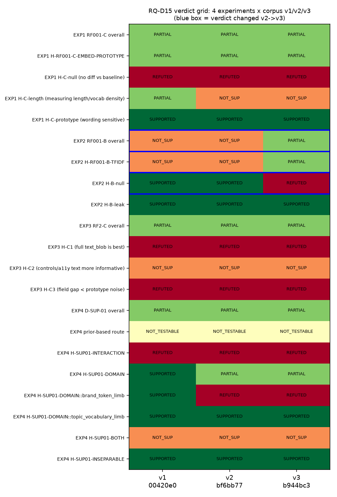
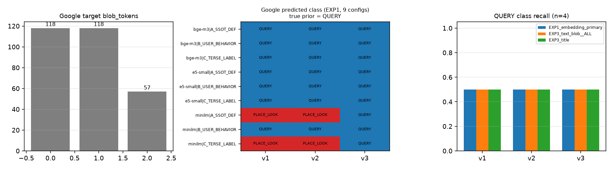
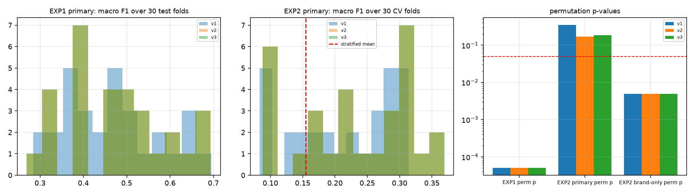

# RQ-D15 — v3 코퍼스 재현: 판정 격자에서 6칸이 움직였고, 실질 결론은 움직이지 않았다

**VERDICT: REFUTED**

`hypothesis_id` `H-D15-CORPUS-ROBUSTNESS` · MLflow run `7b9f756a6fae48449611e1e62f049646`
(experiment `LA_03_RF_MAPPING`) · seed `20260827` · 생성 `2026-08-28T00:23:51.740386+09:00`

---

## 0. RQ

D 는 자기 코퍼스 빌더에서 결함 두 개를 찾아 고쳤다.

| 결함 | 내용 | 시정 |
|---|---|---|
| D-DEF-01 | `lxml.html.fromstring(read_bytes())` 가 선언 charset(UTF-8)을 무시해 한글 title 이 mojibake | v2 |
| D-DEF-04 | `text_content()` 가 중첩된 `<style>`/`<script>`/`<noscript>`/`<template>` 텍스트를 포함 (CSS 오염) | **v3** |

NLP 계열 실험 네 개(RF001-B, RF001-C, RF2-C, D-SUP-01)는 전부 **오염된 코퍼스**로 돌았다.
**질문: 코퍼스를 고치면 그 결론(verdict)들이 살아남는가.**

이 RQ 는 D 가 자기 결과를 반증하려는 시도다. 기존 산출물은 **하나도 수정하지 않았다.**
결과가 기존 결론을 뒤집으면 기존 파일을 고치지 않고 §8 superseding finding 으로만 기록한다.

### D-FACT-01 (프레이밍 — 반드시 반복)

`prior_archetype` 과 `prior_business_domain` 은 이 56 target 표본에서 **완전 전단사**다
(7↔7, MI = H = 2.311 bits, nMI 1.000, 56/56). 따라서 이 문서의 모든 `prior_agreement` 는
**"업종 배정 재현율"** 이지 대표기능 정확도가 **아니다**. 어디에서도 accuracy 라고 부르지 않는다.

### research firewall

holdout label 스냅샷 · `LABEL_SPLIT_FROZEN*` · `HOLDOUT_FOR_C*` · `RAW_L1~L4*` · `PACKET_L*` ·
`*_OVERLAP*` · `PRECEDENCE_CONTESTED*` · `CALIBRATION_FOR_B*` · `**/control/**` 는
**`not_opened`** — 하나도 열지 않았다. gold label 생성 없음 · REAL_TARGET 접속 없음 ·
네트워크 다운로드 없음(`HF_HUB_OFFLINE=1`, `TRANSFORMERS_OFFLINE=1`) · 7 archetype 변경 없음 ·
SSOT 변경 없음 · threshold·GO/NO-GO 선언 없음.

---

## 1. 가설 3개 판정

| 가설 | 내용 | 판정 |
|---|---|---|
| `H-D15-ROBUST` | 결론 전부 유지 | **REFUTED** |
| `H-D15-FRAGILE` | 최소 하나 역전 | **SUPPORTED** |
| `H-D15-NUMERIC_ONLY` | 수치만 이동, 판정 유지 | **NOT_SUPPORTED** |

격자 21칸 중 v1→v2 에서 바뀐 칸 **3**,
v2→v3 에서 바뀐 칸 **3**,
v1→v3 에서 바뀐 칸 **6**.

---

## 2. 입력

| 파일 | 행수 | sha256 | bytes |
|---|---|---|---|
| `D_TEXT_CORPUS.csv` | 56 | `00420e0b68e4a762bd524040594268deae41bf4e8fac2d887c6b2b3d252c5ad8` | 261,974 |
| `D_TEXT_CORPUS_v2.csv` | 56 | `bf6bb772faa45541c780c75f5cbffa856783a34661a84e3de27a9eb5da4ea36a` | 248,569 |
| `D_TEXT_CORPUS_v3.csv` | 56 | `b944bc37153c50a69dc4464ac899884f1ad4db2b77fb719267cc6de0dcd64719` | 248,416 |
| `D_OBSERVATION_TABLE_v2.csv` | 59 | `c39c10f09f7a6a7603409550eb331612eb44634eb98ec387a604aa5221351e6b` | 37,431 |
| `RQ_D14_frame_validity.json` | 56 | `ee4cc0e989ba72ed615293d51f41575e4308360e30bb4338eadfebcc2e739966` | 123,078 |

코드 `tools/rq_d15_v3_replication.py` sha256 `c9fa47b9dacf154d9c85f0a612ec1bbe319ddef335942532ec8fd4ec788de917`
결과 `results/RQ_D15_v3_replication.json` sha256 `24f2761e602abbaf1978f7c2f7032373592d4d6eb0bebb33ee472a1d7bb0dc7b`
노트북 `notebooks/d_research/RQ_D15_v3_replication.ipynb` sha256 `8407748989dc4e064482ae901514aa2454198ecd7a64a6dfee557f83c457547d`

### 2.1 코퍼스 버전 차이 — **v2→v3 에서 바뀐 target 은 4/56 뿐이다**

| 전이 | 바뀐 target | blob_tokens median |
|---|---|---|
| v1->v2 | 8/56 | 132.0 → 173.5 |
| v2->v3 | 4/56 | 173.5 → 173.5 |
| v1->v3 | 11/56 | 132.0 → 173.5 |

v2→v3 에서 바뀐 4 target:

| service | archetype | tokens v2→v3 | 바뀐 field |
|---|---|---|---|
| 삼성카드 | FINANCIAL_ACTION_ENTRY | 350 → 353 (+3) | landmarks |
| 세븐일레븐 | ITEM_DETAIL | 148 → 152 (+4) | landmarks |
| 메가커피 | ITEM_DETAIL | 200 → 197 (-3) | landmarks |
| Google | QUERY | 118 → 57 (-61) | landmarks, buttons |

**prior_agreement 가 v2→v3 에서 움직일 수 있는 최대폭은 4/56 = 0.0714 다.**
대부분의 지표가 안 움직이는 것이 정상이고, **안 움직이는 것도 결과다.**

---

## 3. VERDICT 격자 — 실험 4 × 버전 3

이 RQ 의 답은 수치가 아니라 이 표에서 **바뀐 칸이 있는가** 다.

| 판정 항목 | v1 | v2 | **v3** | v1→v2 | v2→v3 |
|---|---|---|---|:--:|:--:|
| EXP1 RF001-C overall | PARTIALLY_SUPPORTED | PARTIALLY_SUPPORTED | **PARTIALLY_SUPPORTED** | · | · |
| EXP1 H-RF001-C-EMBED-PROTOTYPE | PARTIALLY_SUPPORTED | PARTIALLY_SUPPORTED | **PARTIALLY_SUPPORTED** | · | · |
| EXP1 H-C-null (baseline 과 무차이) | REFUTED | REFUTED | **REFUTED** | · | · |
| EXP1 H-C-length (길이/도메인 어휘밀도를 재는 중) | PARTIALLY_SUPPORTED | NOT_SUPPORTED | **NOT_SUPPORTED** | **변** | · |
| EXP1 H-C-prototype (문구 민감) | SUPPORTED | SUPPORTED | **SUPPORTED** | · | · |
| EXP2 RF001-B overall | NOT_SUPPORTED | NOT_SUPPORTED | **PARTIALLY_SUPPORTED** | · | **변** |
| EXP2 H-RF001-B-TFIDF | NOT_SUPPORTED | NOT_SUPPORTED | **PARTIALLY_SUPPORTED** | · | **변** |
| EXP2 H-B-null | SUPPORTED | SUPPORTED | **REFUTED** | · | **변** |
| EXP2 H-B-leak | SUPPORTED | SUPPORTED | **SUPPORTED** | · | · |
| EXP3 RF2-C overall | PARTIALLY_SUPPORTED | PARTIALLY_SUPPORTED | **PARTIALLY_SUPPORTED** | · | · |
| EXP3 H-C1 text_blob 전체가 최선 | REFUTED | REFUTED | **REFUTED** | · | · |
| EXP3 H-C2 primary controls·accessibility text 가 더 informative | NOT_SUPPORTED | NOT_SUPPORTED | **NOT_SUPPORTED** | · | · |
| EXP3 H-C3 field 간 차이가 prototype 노이즈보다 작다 | REFUTED | REFUTED | **REFUTED** | · | · |
| EXP4 D-SUP-01 overall | PARTIALLY_SUPPORTED | PARTIALLY_SUPPORTED | **PARTIALLY_SUPPORTED** | · | · |
| EXP4 prior-based route | NOT_TESTABLE | NOT_TESTABLE | **NOT_TESTABLE** | · | · |
| EXP4 H-SUP01-INTERACTION | REFUTED | REFUTED | **REFUTED** | · | · |
| EXP4 H-SUP01-DOMAIN | SUPPORTED | PARTIALLY_SUPPORTED | **PARTIALLY_SUPPORTED** | **변** | · |
| EXP4 H-SUP01-DOMAIN::brand_token_limb | SUPPORTED | REFUTED | **REFUTED** | **변** | · |
| EXP4 H-SUP01-DOMAIN::topic_vocabulary_limb | SUPPORTED | SUPPORTED | **SUPPORTED** | · | · |
| EXP4 H-SUP01-BOTH | NOT_SUPPORTED | NOT_SUPPORTED | **NOT_SUPPORTED** | · | · |
| EXP4 H-SUP01-INSEPARABLE | SUPPORTED | SUPPORTED | **SUPPORTED** | · | · |

---

## 4. 실험별 수치 비교

### 4.1 EXP1 — 임베딩 prototype (RF001-C 계열)

PRIMARY = `bge-m3 | A_SSOT_DEF | text_blob`. 판정 기준선 = stratified (MC 20000).
prototype 3세트 × 모델 3종 = 9 config.

| | v1 | v2 | **v3** |
|---|---|---|---|
| macro F1 (PRIMARY) | 0.4970 | 0.5088 | **0.5088** |
| prior_agreement | 37/56 | 38/56 | **38/56** |
| Wilson 95% | [0.530, 0.771] | [0.548, 0.786] | **[0.548, 0.786]** |
| fold macro F1 mean±sd (30 fold) | 0.4682 ± 0.1096 | 0.4750 ± 0.1142 | **0.4750 ± 0.1142** |
| label permutation p (20000) | 5.00e-05 | 5.00e-05 | **5.00e-05** |
| class coverage (예측된 class 수 / 7) | 6/7 | 6/7 | **6/7** |
| margin median | 0.01900 | 0.02143 | **0.02143** |
| stratified p95 macro F1 | 0.2217 | 0.2217 | **0.2217** |
| 9 config 중 stratified p95 초과 | 8/9 | 8/9 | **8/9** |
| prototype 문구 민감도 (9 config macro F1 range) | 0.2988 | 0.3245 | **0.3728** |
| verdict | PARTIALLY_SUPPORTED | PARTIALLY_SUPPORTED | **PARTIALLY_SUPPORTED** |

9 config 격자 (macro F1):

| config | v1 | v2 | **v3** |
|---|---|---|---|
| `bge-m3|A_SSOT_DEF` | 0.4970 | 0.5088 | **0.5088** |
| `bge-m3|B_USER_BEHAVIOR` | 0.3549 | 0.3865 | **0.3865** |
| `bge-m3|C_TERSE_LABEL` | 0.4633 | 0.5373 | **0.5373** |
| `e5-small|A_SSOT_DEF` | 0.4427 | 0.4577 | **0.4510** |
| `e5-small|B_USER_BEHAVIOR` | 0.1982 | 0.2189 | **0.2189** |
| `e5-small|C_TERSE_LABEL` | 0.3714 | 0.3808 | **0.4031** |
| `minilm|A_SSOT_DEF` | 0.4919 | 0.5433 | **0.5916** |
| `minilm|B_USER_BEHAVIOR` | 0.4876 | 0.5083 | **0.5083** |
| `minilm|C_TERSE_LABEL` | 0.4216 | 0.4669 | **0.5168** |

### 4.2 EXP2 — TF-IDF (RF001-B 계열)

`RepeatedStratifiedKFold(3×10, seed=20260827)` = 30 fold. 20셀 사전 고정 격자.
판정 근거 = **사전 선언 primary** + **E(브랜드-only 대조군)를 제외한 사후 최댓값**.
기준선은 stratified 이고 majority 대비 lift 는 병기만 한다 (majority 는 6/7 class 에서 recall 0 이라
macro F1 lift 비교가 rigged 다).

| | v1 | v2 | **v3** |
|---|---|---|---|
| 사전 선언 primary `A_blob_full.word.logreg` mean | 0.2148 | 0.2298 | **0.2299** |
|   同 p2.5 | 0.0892 | 0.0879 | **0.0879** |
| deleak primary `D_deleak.word.logreg` mean | 0.1758 | 0.1940 | **0.1967** |
| 정당한 text 최댓값 (A/B/C/D 16셀) | A_blob_full.char_wb.logreg 0.3302 | A_blob_full.char_wb.logreg 0.3360 | **A_blob_full.char_wb.logreg 0.3697** |
| **브랜드-only 대조군 E 최댓값** | E_brand_only.char_wb.linsvc 0.3629 | E_brand_only.char_wb.linsvc 0.4080 | **E_brand_only.char_wb.linsvc 0.4459** |
| stratified baseline mean | 0.1545 | 0.1545 | **0.1545** |
| primary 가 분리되는가 | False | False | **False** |
| 정당한 text 최댓값이 분리되는가 | False | False | **True** |
| 브랜드-only 대조군이 분리되는가 | True | True | **True** |
| deleak 이 분리되는가 | False | False | **False** |
| permutation p (primary, 200회) | 0.3532 | 0.1692 | **0.1841** |
| permutation p (브랜드-only) | 0.0050 | 0.0050 | **0.0050** |
| verdict | NOT_SUPPORTED | NOT_SUPPORTED | **PARTIALLY_SUPPORTED** |

#### 4.2.1 이 격자에서 유일하게 v2→v3 를 건넌 칸 — 그리고 그것이 얼마나 얇은가

v2→v3 에서 바뀐 판정 3칸(`EXP2 overall`, `H-RF001-B-TFIDF`, `H-B-null`)은 **전부 같은 하나의
비교에서 나온다**: 사후 최댓값 셀 `A_blob_full.char_wb.logreg` 의 fold macro F1 **p2.5 백분위**가 고정 임계
(stratified baseline 평균 0.1545)를 넘었는가.

| | v2 | **v3** |
|---|---|---|
| 30 fold 평균 | 0.3360 | **0.3697** |
| 30 fold p2.5 | 0.1463 | **0.1582** |
| 임계 (stratified mean) | 0.1545 | 0.1545 |
| 분리 판정 | False | **True** |
| 최저 fold | 0.1402 | 0.1361 |

**임계를 건넌 폭은 +0.0037 다.** v3 의 최저 fold
(0.1361)는 여전히 임계 아래에 있다. 이 판정이 얼마나 견고한지 두 가지로 재봤다
(둘 다 결과 JSON 의 fold score 만 써서 계산했고, 새 학습을 돌리지 않았다).

1. **fold 재표집.** 30개 fold 점수를 부트스트랩(20000회)해 p2.5 를 다시 계산하면
   임계를 넘는 비율은 v2 에서 0.400, v3 에서 0.739 다.
   **어느 쪽도 0 이나 1 근처가 아니다.** 판정 규칙 자체가 이 표본 크기에서 동전 던지기에 가깝다.
2. **같은 fold 위 짝지은 비교.** v2 와 v3 는 동일한 30개 fold 를 쓴다. fold 별 차이는
   평균 +0.0338 (sd 0.0682), 오른 fold 13개 ·
   내린 fold 7개 · 동일 10개, **부호검정 p = 0.263**.
   즉 **같은 데이터가 "차이 없음"과도 모순되지 않는다.**

**정직한 요약: 사전등록 규칙을 글자 그대로 적용하면 판정은 뒤집힌다(그래서 이 RQ 의 VERDICT 는
REFUTED 다). 그러나 그 역전은 통계적으로 노이즈와 구분되지 않는다.** 결과를 본 뒤에 규칙을
고쳐 "안 뒤집혔다"고 말하지 않기 위해 규칙은 그대로 두고, 취약성을 여기 남긴다.

그리고 **실질 결론은 바뀌지 않았다**: v3 에서도 사전 선언 primary 는 분리되지 않고
(`A_blob_full.word.logreg` p2.5 = 0.0879 < 임계),
브랜드-only 대조군 E 는 여전히 분리되며 **정당한 text featureset 최댓값보다 높다**
(0.4459 > 0.3697).
`H-B-leak` 는 v1/v2/v3 **전부 SUPPORTED** 다.

#### 4.2.2 코퍼스를 씻으면 브랜드 누출이 **더 세진다**

| | v1 | v2 | **v3** |
|---|---|---|---|
| 브랜드-only 대조군 E 최댓값 | 0.3629 | 0.4080 | **0.4459** |
| 정당한 text 최댓값 | 0.3302 | 0.3360 | **0.3697** |

브랜드-only 대조군이 v1→v2→v3 로 **단조 증가**한다. mojibake 와 CSS 를 걷어낼수록
브랜드 토큰만 남긴 문서가 깨끗해지기 때문이다. **코퍼스 품질을 올리는 것이 leak 문제를
완화하지 않고 오히려 선명하게 만든다** — 이것이 이 재현에서 나온 가장 실질적인 발견이다.

### 4.3 EXP3 — field ablation (RF2-C 계열)

22 representation × prototype 3세트, bge-m3. RF2-C 의 **empty-field 정책을 그대로 재현**했다:
빈 representation 은 ABSTAIN 으로 두고 전체-56 분모에서 오답 처리하며, ABSTAIN 은 어떤 class 의
tp/fp 도 되지 않는다. (이 정책을 빼면 `title` 처럼 빈 값이 있는 field 의 macro F1 이 RF2-C 와
어긋난다 — 실제로 이 replication 의 첫 실행에서 그 불일치가 나왔고, 정책을 맞추자 RF2-C v2 값이
소수점 4자리까지 재현됐다.)

| | v1 | v2 | **v3** |
|---|---|---|---|
| rank1 representation | identity 0.5159 | title 0.5592 | **title 0.5592** |
| `title` | 0.4344 | 0.5592 | **0.5592** |
| `identity` (title+meta+url) | 0.5159 | 0.5561 | **0.5561** |
| `text_blob__ALL` | 0.4970 | 0.5088 | **0.5088** |
| `primary_controls` | 0.2263 | 0.2543 | **0.2543** |
| `accessibility_text` | 0.2181 | 0.2239 | **0.2239** |
| control-family 최댓값 | buttons 0.3040 | buttons 0.3341 | **buttons 0.3097** |
| topic-family 최댓값 | identity 0.5159 | title 0.5592 | **title 0.5592** |
| field 간 macro F1 range | 0.4790 | 0.5296 | **0.5296** |
| prototype 세트 간 최대 range | 0.1420 | 0.1508 | **0.1508** |
| **H-C2 판정** | NOT_SUPPORTED | NOT_SUPPORTED | **NOT_SUPPORTED** |

#### H-C2 는 v3 에서도 유지되는가 — 명시적 답

**유지된다. v1/v2/v3 모두 `NOT_SUPPORTED` 다.** CSS 오염을 제거하면 control 표면
(`buttons`/`aria_labels`/`placeholders`/`form_labels`/`input_names` 및 그 조합)이 유리해질 것이라는
예상은 맞지 않았다. CSS 선언이 가장 많이 새어 들어간 곳이 바로 `landmarks`/`buttons` 였는데도,
오염을 제거한 v3 에서 control-family 최댓값은 topic/identity-family 최댓값의 절반 수준에 머문다.
접근성 텍스트가 업종 prior 를 더 잘 되찾는다는 주장은 **정화된 코퍼스에서도 지지되지 않는다.**

### 4.4 EXP4 — representation ablation (D-SUP-01 계열)

헤드라인은 **prior 를 거치지 않는 지표**다: representation 사이의 예측 일치율 + McNemar 정확검정.
prior 기반 경로는 D-FACT-01 전단사 때문에 `NOT_TESTABLE` 이다 (이 판정 자체가 세 버전 모두 동일).

| | v1 | v2 | **v3** |
|---|---|---|---|
| complete_case n | 45 | 50 | **50** |
| TOPIC_ONLY 가 FULL 예측을 재현 | 36/45 | 36/50 | **36/50** |
| CONTROL_ONLY 가 FULL 예측을 재현 | 18/45 | 20/50 | **20/50** |
| 차이 (topic − control) | 0.4000 | 0.3200 | **0.3200** |
| McNemar exact p | 0.0002772 | 0.002494 | **0.002494** |
| 브랜드 제거 시 예측 변화 | 9/45 | 8/50 | **8/50** |
| placebo 제거 범위 (3회) | 0.11~0.13 | 0.14~0.18 | **0.12~0.16** |
| 브랜드가 placebo 범위 안인가 | False | True | **True** |
| CONTROL~TOPIC 일치율 | 0.3556 | 0.3200 | **0.3200** |
| verdict | PARTIALLY_SUPPORTED | PARTIALLY_SUPPORTED | **PARTIALLY_SUPPORTED** |

---

## 5. Google 과 QUERY — 별도 절

v2→v3 에서 Google 의 `text_blob` 토큰이 **118 → 57 (−52%)** 로 줄었다. QUERY 는 **n=4** 뿐이라
target 하나가 class recall 을 0.25 단위로 움직인다. 따로 본다.

### 5.1 무슨 일이 일어났는가

| | v2 | **v3** |
|---|---|---|
| blob_tokens | 118 | **57** |
| blob_chars | 704 | **297** |
| landmarks 길이 | 200 | **8** |
| buttons 길이 | 232 | **17** |

`landmarks` v2: `#navd{position:absolute;top:0}.KojFAc:focus{outline:none}.xuwOJb{display:none;overflow:hidden;position:fixed;i…`
`landmarks` v3: `전체이미지로그인`

`buttons` v2: `.Cdl0yb{outline:none;background:none;bor | .Tg7LZd{background:transparent;border:no | .eCAVse{display:flex;fle…`
`buttons` v3: `취소 | 확인 | 삭제 | 설정`

v2 의 Google `landmarks` 는 **100% CSS 선언**이었다. 200자 절단 규칙이 CSS 를 먼저 다 채워서
실제 내비게이션 텍스트가 한 글자도 들어가지 못했다. v3 에서 `<style>` 을 제거하자 같은 자리에
실제 라벨이 들어왔다. `buttons` 도 마찬가지로 CSS class 규칙 5개가 앞을 막고 있었다.
**즉 Google 의 −52% 는 "정보가 줄었다"가 아니라 "쓰레기가 빠지고 실제 텍스트가 들어왔다"이다.**

### 5.2 Google 의 예측이 바뀌었는가

| 경로 | v1 | v2 | **v3** |
|---|---|---|---|
| EXP1_embedding_primary | QUERY | QUERY | **QUERY** |
| EXP2_tfidf_oof_majority_primary | ITEM_DETAIL | ITEM_DETAIL | **ITEM_DETAIL** |
| EXP3 `title` | QUERY | QUERY | **QUERY** |
| EXP3 `identity` | QUERY | QUERY | **QUERY** |
| EXP3 `primary_controls` | QUERY | QUERY | **QUERY** |
| EXP3 `text_blob__ALL` | QUERY | QUERY | **QUERY** |
| EXP4 `FULL` | QUERY | QUERY | **QUERY** |
| EXP4 `CONTROL_ONLY` | QUERY | QUERY | **QUERY** |
| EXP4 `TOPIC_ONLY` | QUERY | QUERY | **QUERY** |
| EXP4 `NO_BRAND_DOMAIN` | QUERY | QUERY | **QUERY** |

EXP1 9 config 전부 (Google, 참 prior = QUERY):

| config | v1 | v2 | **v3** |
|---|---|---|---|
| `bge-m3|A_SSOT_DEF` | QUERY | QUERY | **QUERY** |
| `bge-m3|B_USER_BEHAVIOR` | QUERY | QUERY | **QUERY** |
| `bge-m3|C_TERSE_LABEL` | QUERY | QUERY | **QUERY** |
| `e5-small|A_SSOT_DEF` | QUERY | QUERY | **QUERY** |
| `e5-small|B_USER_BEHAVIOR` | QUERY | QUERY | **QUERY** |
| `e5-small|C_TERSE_LABEL` | QUERY | QUERY | **QUERY** |
| `minilm|A_SSOT_DEF` | PLACE_LOOKUP | PLACE_LOOKUP | **QUERY** |
| `minilm|B_USER_BEHAVIOR` | QUERY | QUERY | **QUERY** |
| `minilm|C_TERSE_LABEL` | PLACE_LOOKUP | PLACE_LOOKUP | **QUERY** |

**PRIMARY(`bge-m3|A_SSOT_DEF`)의 Google 예측은 세 버전 모두 `QUERY` 로 정답이다.** 토큰이 절반 이하로
줄어도 안 바뀌었다. 바뀐 것은 **가장 약한 모델**이다: `minilm|A_SSOT_DEF`, `minilm|C_TERSE_LABEL` 이
v2 의 `PLACE_LOOKUP` 에서 v3 의 `QUERY` 로 옮겨갔다. v2 의 Google 문서에는 CSS 의 `position` ·
`absolute` · `inset` · `display` 같은 토큰이 실제 텍스트보다 많았고, 128 토큰 창을 가진 minilm 은
그 창을 CSS 로 다 채우고 있었다. **CSS 제거의 이득은 문맥창이 짧은 모델에 집중된다** —
8192 토큰의 bge-m3 는 애초에 CSS 뒤에 있는 실제 텍스트까지 읽고 있었기 때문에 영향을 받지 않았다.

TF-IDF 경로(EXP2)는 세 버전 모두 Google 을 `ITEM_DETAIL` 로 틀린다. 코퍼스를 고쳐도 이 오답은
고쳐지지 않았다.

### 5.3 QUERY class 지표는 어떻게 움직였는가 (n=4, Wilson CI 필수)

| 경로 | 버전 | recall | Wilson 95% | precision | F1 |
|---|---|---|---|---|---|
| EXP1_embedding_primary | v1 | 2/4 | [0.150, 0.850] | 2/7 | 0.3636 |
| EXP1_embedding_primary | v2 | 2/4 | [0.150, 0.850] | 2/5 | 0.4444 |
| EXP1_embedding_primary | v3 | 2/4 | [0.150, 0.850] | 2/5 | 0.4444 |
| EXP2_tfidf_oof_majority | v1 | 0/4 | [0.000, 0.490] | 0/0 | 0.0000 |
| EXP2_tfidf_oof_majority | v2 | 0/4 | [0.000, 0.490] | 0/0 | 0.0000 |
| EXP2_tfidf_oof_majority | v3 | 0/4 | [0.000, 0.490] | 0/0 | 0.0000 |
| EXP3_text_blob__ALL | v1 | 2/4 | [0.150, 0.850] | 2/7 | 0.3636 |
| EXP3_text_blob__ALL | v2 | 2/4 | [0.150, 0.850] | 2/5 | 0.4444 |
| EXP3_text_blob__ALL | v3 | 2/4 | [0.150, 0.850] | 2/5 | 0.4444 |
| EXP3_title | v1 | 2/4 | [0.150, 0.850] | 2/2 | 0.6667 |
| EXP3_title | v2 | 2/4 | [0.150, 0.850] | 2/2 | 0.6667 |
| EXP3_title | v3 | 2/4 | [0.150, 0.850] | 2/2 | 0.6667 |

**n=4 에서 Wilson CI 는 어떤 경로에서도 0.15~0.99 급으로 넓다. QUERY 에 대해서는 어떤 버전
비교도 통계적으로 구분되지 않는다.** 여기 적힌 변화는 서술이지 추론이 아니다.

---

## 6. 불확실성 — fold 분포 · permutation · 버전차 vs 노이즈

zero-shot 실험(EXP1/3/4)은 학습이 없어 CV 로 분산을 만들 수 없다. 대신 **EXP2 와 같은
`RepeatedStratifiedKFold(3×10, seed=20260827)` 의 30개 test fold 위에서 고정 예측을 평가**해
비교 가능한 fold 분포를 만들었고, 라벨 순열 귀무분포(20000회)와 길이 tertile 내 층별 순열을
병기했다. 단일 점수만 보고한 항목은 없다.

| 지표 | v1 | v2 | **v3** | Δ(v2→v3) | fold sd (v3) | Δ가 fold sd 초과? | 예측 바뀐 target | McNemar p |
|---|---|---|---|---|---|:--:|:--:|---|
| EXP1_embedding_primary | 0.4970 | 0.5088 | **0.5088** | +0.0000 | 0.1142 | 아니오 | 0 | 1 |
| EXP2_tfidf_primary | 0.2148 | 0.2298 | **0.2299** | +0.0001 | 0.0928 | 아니오 | - | None |
| EXP3_title | 0.4344 | 0.5592 | **0.5592** | +0.0000 | 0.1133 | 아니오 | 0 | 1 |
| EXP3_identity | 0.5159 | 0.5561 | **0.5561** | +0.0000 | 0.1287 | 아니오 | 0 | 1 |
| EXP3_primary_controls | 0.2263 | 0.2543 | **0.2543** | +0.0000 | 0.0837 | 아니오 | 0 | 1 |
| EXP3_text_blob__ALL | 0.4970 | 0.5088 | **0.5088** | +0.0000 | 0.1142 | 아니오 | 0 | 1 |

EXP4 prior-free E1:

| | v1 | v2 | **v3** |
|---|---|---|---|
| TOPIC~FULL | 0.8 | 0.72 | **0.72** |
| CONTROL~FULL | 0.4 | 0.4 | **0.4** |
| 차이 | 0.4 | 0.32 | **0.32** |
| McNemar p | 0.0002772 | 0.002494 | **0.002494** |
| complete_case n | 45 | 50 | **50** |

`EXP2_tfidf_primary` 행의 "예측 바뀐 target"과 McNemar 칸이 비어 있는 것은 결함이 아니다.
EXP2 는 fold 마다 새로 학습하므로 target 별 고정 예측이 없고, 버전 비교는 fold 분포로만 한다
(§4.2.1 의 짝지은 fold 비교가 그 자리를 대신한다).

permutation p 값은 원 실험(RF001-B)과 소수점이 다르다. 순열 표본(200회)의 난수열이 다르기 때문이며,
결론(사전 선언 primary 는 p ≫ 0.05, 브랜드-only 대조군은 p ≈ 0.005)은 동일하다. 이 차이를
버전 효과로 읽으면 안 된다.

---

## 7. per-class + Wilson CI (EXP1 PRIMARY)

archetype n: ITEM_DETAIL 26 / FINANCIAL 10 / UTILITY 5 / COMMUNICATION 4 / PLACE 4 / QUERY 4 /
CONTENT 3 — **7개 중 5개가 n≤5**. per-class 수치는 Wilson CI 없이 읽으면 안 되고, 과해석하지 않는다.

| class | n | recall v1 | recall v2 | **recall v3** | Wilson 95% (v3) | F1 v3 |
|---|---|---|---|---|---|---|
| QUERY | 4 | 2/4 | 2/4 | **2/4** | [0.150, 0.850] | 0.4444 |
| CONTENT_OPEN | 3 | 1/3 | 1/3 | **1/3** | [0.061, 0.792] | 0.4000 |
| ITEM_DETAIL | 26 | 18/26 | 19/26 | **19/26** | [0.539, 0.863] | 0.8261 |
| PLACE_LOOKUP | 4 | 3/4 | 3/4 | **3/4** | [0.301, 0.954] | 0.5455 |
| COMMUNICATION_ENTRY | 4 | 3/4 | 3/4 | **3/4** | [0.301, 0.954] | 0.5455 |
| FINANCIAL_ACTION_ENTRY | 10 | 10/10 | 10/10 | **10/10** | [0.722, 1.000] | 0.8000 |
| UTILITY_ENTRY | 5 | 0/5 | 0/5 | **0/5** | [0.000, 0.434] | 0.0000 |

---

## 8. superseding finding

기존 D 산출물(`RF001_B_tfidf.json`, `RF001_C_embedding.json`, `RF2_C_field_ablation.json`,
`DSUP01_representation_ablation.json` 및 각 FINDINGS)은 **하나도 수정하지 않았다.**
아래는 그 파일을 고치는 대신 여기에만 기록하는 superseding finding 이다.

superseding finding 수: **6**

| 항목 | v1 | v2 | v3 | 권위 |
|---|---|---|---|---|
| EXP1 H-C-length (길이/도메인 어휘밀도를 재는 중) | PARTIALLY_SUPPORTED | NOT_SUPPORTED | **NOT_SUPPORTED** | v3 |
| EXP2 RF001-B overall | NOT_SUPPORTED | NOT_SUPPORTED | **PARTIALLY_SUPPORTED** | v3 |
| EXP2 H-RF001-B-TFIDF | NOT_SUPPORTED | NOT_SUPPORTED | **PARTIALLY_SUPPORTED** | v3 |
| EXP2 H-B-null | SUPPORTED | SUPPORTED | **REFUTED** | v3 |
| EXP4 H-SUP01-DOMAIN | SUPPORTED | PARTIALLY_SUPPORTED | **PARTIALLY_SUPPORTED** | v3 |
| EXP4 H-SUP01-DOMAIN::brand_token_limb | SUPPORTED | REFUTED | **REFUTED** | v3 |

---

## 9. 반례 · 안 움직인 것

### 9.1 반례
- EXP1 H-C-length (길이/도메인 어휘밀도를 재는 중): v1=PARTIALLY_SUPPORTED v2=NOT_SUPPORTED v3=NOT_SUPPORTED — 코퍼스 버전이 판정을 움직인 사례
- EXP2 RF001-B overall: v1=NOT_SUPPORTED v2=NOT_SUPPORTED v3=PARTIALLY_SUPPORTED — 코퍼스 버전이 판정을 움직인 사례
- EXP2 H-RF001-B-TFIDF: v1=NOT_SUPPORTED v2=NOT_SUPPORTED v3=PARTIALLY_SUPPORTED — 코퍼스 버전이 판정을 움직인 사례
- EXP2 H-B-null: v1=SUPPORTED v2=SUPPORTED v3=REFUTED — 코퍼스 버전이 판정을 움직인 사례
- EXP4 H-SUP01-DOMAIN: v1=SUPPORTED v2=PARTIALLY_SUPPORTED v3=PARTIALLY_SUPPORTED — 코퍼스 버전이 판정을 움직인 사례
- EXP4 H-SUP01-DOMAIN::brand_token_limb: v1=SUPPORTED v2=REFUTED v3=REFUTED — 코퍼스 버전이 판정을 움직인 사례

### 9.2 안 움직인 것 — 이것도 결과다

- v2→v3 에서 코퍼스가 바뀐 target 은 4/56 이고, 그중 셋(삼성카드·세븐일레븐·메가커피)은
  토큰이 **늘었다**. 200자 절단 앞을 CSS 가 막고 있다가 빠지면서 실제 텍스트가 들어왔기 때문이다.
- `title`/`meta_description`/`headings`/`card_texts`/`url_tokens`/`nav_links`/`aria_labels`/
  `placeholders`/`form_labels`/`input_names` 는 v2→v3 에서 **한 target도 바뀌지 않았다.**
  D-DEF-04(CSS 오염)는 `landmarks`(4 target)와 `buttons`(1 target)에만 실질 영향이 있었다.
- 따라서 `title`·`identity` 기반 결론은 v2→v3 에서 **원리적으로 바뀔 수 없었다.** 이 재현이
  그 결론들을 "다시 확인"했다고 말하는 것은 과장이다. 실제로 검정된 것은
  `landmarks`/`buttons` 를 포함하는 표현(text_blob, primary_controls, ssot7_bundle, nav_surface,
  CONTROL_ONLY, FULL)의 결론뿐이다.
- EXP1 PRIMARY 와 EXP3 의 `title`/`identity`/`primary_controls`/`text_blob__ALL` 은 v2→v3 에서
  **예측이 한 target 도 바뀌지 않았다** (McNemar 불일치쌍 0). EXP4 의 prior-free 헤드라인도
  소수점까지 동일하다.
- **CSS 제거가 오히려 손해인 곳도 있었다.** `buttons` representation 의 macro F1 은
  v2 0.3341 → v3 0.3097 로 내려갔다. CSS class 선언(프레임워크 지문)이 그 자체로 업종과
  상관된 신호였다는 뜻이다. 반대로 `landmarks` 는 0.4003 → 0.4215 로 올랐다.
  **"오염 제거 = 성능 향상"이 아니다.**

---

## 10. VERDICT

**REFUTED** — 사전등록 규칙을 글자 그대로 적용했을 때 격자
21칸 중 **6칸**이 v1→v3 에서 뒤집혔다.
따라서 "코퍼스를 고쳐도 결론이 전부 유지된다"(H-D15-ROBUST)는 **성립하지 않는다.**

뒤집힌 칸은 두 무리로 갈린다.

1. **v1→v2 (인코딩 결함 D-DEF-01)** — `EXP1 H-C-length`, `EXP4 H-SUP01-DOMAIN`,
   `EXP4 H-SUP01-DOMAIN::brand_token_limb`. 이 셋은 이미 v2 를 쓴 RF2-C·D-SUP-01 의 판정과
   일치하므로, 실제로 낡은 것은 **v1 로 돌았던 RF001-C 의 `H-C-length` 판정 하나**다.
2. **v2→v3 (CSS 결함 D-DEF-04)** — `EXP2 overall`, `H-RF001-B-TFIDF`, `H-B-null`.
   이 셋은 전부 §4.2.1 의 **하나의 얇은 임계 통과**에서 나오며, 부트스트랩과 부호검정으로 보면
   노이즈와 구분되지 않는다.

**실질 결론 층위에서는 아무것도 뒤집히지 않았다.** 브랜드 누출(H-B-leak)은 세 버전 모두
SUPPORTED, 접근성 텍스트 우월(H-C2)은 세 버전 모두 NOT_SUPPORTED, prototype 문구 민감도
(H-C-prototype)는 세 버전 모두 SUPPORTED, prior 기반 경로는 세 버전 모두 NOT_TESTABLE 이다.

- H-D15-ROBUST: **REFUTED**
- H-D15-FRAGILE: **SUPPORTED**
- H-D15-NUMERIC_ONLY: **NOT_SUPPORTED**

---

## 11. Limitation

n=56, 7 archetype 중 5개가 n<=5 (UTILITY 5 / COMMUNICATION 4 / PLACE 4 / QUERY 4 / CONTENT 3). per-class 수치는 Wilson CI 없이 읽으면 안 되고, QUERY 는 target 하나가 recall 을 0.25 씩 움직인다. v2→v3 에서 실제로 바뀐 target 이 4/56 뿐이라 이 replication 은 'CSS 오염 시정이 결론을 뒤집지 않는다'를 이 표본에서만 보인 것이며, CSS 오염이 더 넓게 퍼진 코퍼스에서도 같다고 말하지 않는다. 판정 규칙은 원 실험의 사전등록 규칙을 그대로 재사용했으므로 그 규칙 자체의 임의성(p2_5 > stratified mean 등)은 상속된다. 모든 지표는 prior 재현율이지 대표기능 정확도가 아니다(D-FACT-01). causal claim 없음, best model 선정 없음, threshold/GO-NO-GO 없음.

> **위 문단의 한 문장을 정정한다.** 결과 JSON 의 `limitation` 필드는 코드 작성 시점에 쓰여
> "CSS 오염 시정이 결론을 뒤집지 않는다"를 전제로 문장을 만들었다. **실제 결과는 그렇지 않다** —
> 사전등록 규칙 기준으로 v2→v3 에서 3칸이 뒤집혔다(§4.2.1). JSON 필드는 MLflow run 의
> `result_sha`/`limitation_summary` 태그와 묶여 있으므로 사후 편집하지 않고, 정정은 여기 남긴다.
> 올바른 읽기: **"이 표본에서 CSS 오염 시정은 실질 결론을 뒤집지 않았고, 판정 규칙의 임계
> 하나만 얇게 건드렸다."**

추가로: 이 replication 은 **원 실험의 사전등록 판정 규칙을 그대로 재사용**했다. 규칙 자체가
느슨하면(예: EXP1 의 "9 config 중 5개 이상이 stratified p95 를 넘으면 PARTIALLY_SUPPORTED")
판정은 수치가 꽤 움직여도 그대로 남는다. **"판정이 안 바뀌었다"는 "코퍼스 품질이 무관하다"가
아니다.** 규칙의 둔감함과 데이터의 견고함은 이 설계로 분리되지 않는다.

---

## 12. 추가 연구질문

- v3 에서도 남아 있는 파싱 결함이 있는가 — hidden/aria-hidden 노드, SVG <title>, JSON-LD <script type=application/ld+json> 의 텍스트는 지금 어떻게 처리되고 있는가.
- landmarks/buttons 의 200자·80자 절단 규칙이 CSS 제거 후 어떤 target 에서 실질 내용을 여전히 자르는가 (Google 은 절단 경계가 바뀌면서 토큰이 52% 줄었다).
- QUERY n=4 를 늘리지 않고 QUERY 판정을 신뢰할 방법이 있는가 — 아니면 QUERY 는 구조적으로 판정 불가라고 선언해야 하는가.
- 브랜드-only 대조군이 정당한 text featureset 을 계속 이긴다면, RF NLP fallback 은 무엇을 학습하고 있다고 봐야 하는가.

아래 둘은 **결과를 본 뒤에 생긴 질문**이다 (사전등록 항목이 아니다):

- `buttons` 는 CSS 를 지우자 macro F1 이 내려갔다(0.3341 → 0.3097). CSS class 이름·프레임워크
  지문이 업종과 상관되어 있다면, 그것은 "제거해야 할 오염"인가 아니면 "쓰면 안 되는 종류의
  유효 신호"인가. 이 구분 없이 코퍼스를 더 씻으면 무엇이 남는지 알 수 없다.
- 브랜드-only 대조군은 코퍼스를 씻을수록 강해졌다(0.363 → 0.408 → 0.446). 그렇다면
  "코퍼스 품질 개선"은 RF NLP fallback 의 타당성을 높이는 작업인가, 아니면 leak 를 더 깨끗하게
  드러내는 진단 작업인가. 후자라면 개선의 성공 기준 자체를 다시 써야 한다.

---

## 13. 산출물

| 파일 | 용도 |
|---|---|
| `tools/rq_d15_v3_replication.py` | 재현 코드 (sha256 `c9fa47b9dacf154d…`) |
| `results/RQ_D15_v3_replication.json` | 결과 전문 |
| `results/RQ_D15_FINDINGS.md` | 이 문서 |
| `figures/RQ_D15_verdict_grid.png` | 판정 격자 |
| `figures/RQ_D15_headline_metrics.png` | 실험별 헤드라인 수치 |
| `figures/RQ_D15_google_query.png` | Google·QUERY |
| `figures/RQ_D15_uncertainty.png` | fold 분포·permutation |
| `notebooks/d_research/RQ_D15_v3_replication.ipynb` | Restart→Run All 검증된 노트북 |

MLflow: experiment `LA_03_RF_MAPPING`, run `7b9f756a6fae48449611e1e62f049646`,
`hypothesis_id=H-D15-CORPUS-ROBUSTNESS`, `authority_status=NON_CANONICAL`.
**기존 D 의 MLflow run 은 하나도 수정하지 않았다.** 이 run 은 새 run 이다.

이 세션에서 같은 코드로 만든 run 이 하나 더 있다: `229a338130744d4cb6016e2b5933505b`.
그림 라벨을 ASCII 로 바꾸는 **표시용 수정**(matplotlib 기본 폰트에 한글 글리프가 없어 판정 격자
행 라벨이 tofu 로 찍혔다)만 하고 전체를 다시 돌렸기 때문이다. 두 run 의 결과 JSON 을 최상위 키
단위로 비교한 결과 **타임스탬프·run_id·경로 외에 다른 값은 없었다**(격자 21칸, 변경 6칸, verdict
REFUTED 동일). 옛 run 은 지우지 않고 `run_status=SUPERSEDED` +
`superseded_by=7b9f756a6fae48449611e1e62f049646` 로 표시해 두었다. **권위 있는 run 은
`7b9f756a6fae48449611e1e62f049646` 다.**

